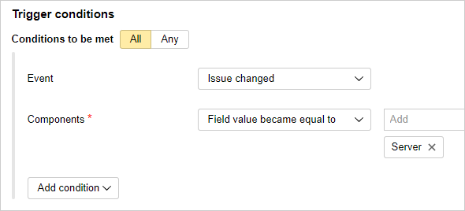
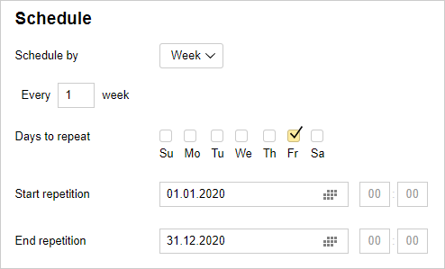

# Automating recurring actions

You can automate common actions related to {{ tracker-name }} issues using [triggers, auto actions, and macros](automation.md). You can update issue parameters based on events, either periodically or on a command, as well as create new issues by schedule.

Let's look at some examples of how you can automate certain actions in {{ tracker-name }}:

### Picking assignees automatically {#auto-assign-executor}

If a certain issue falls under the responsibility of a specific employee, you can automatically make them an assignee for that issue using [triggers](user/trigger.md). When the conditions are met, the trigger automatically updates the issue parameters.

For example, the tester should start testing a new product feature once the developer changes the issue status to <q>{{ ui-key.startrek-backend.presets.advancedDevelopment.board.column.ready.for.test }}</q>. To automatically assign a tester as an issue assignee, set up the trigger as follows:

- Trigger conditions: The issue status has changed to <q>{{ ui-key.startrek-backend.presets.advancedDevelopment.board.column.ready.for.test }}</q>.

- Trigger action: Specify the tester in the <q>Assignee</q> field.


Let's take another example, when one developer focuses on the server part of your product, and another developer works on its client part.  Whenever any new errors relating to the server or client part arise, you can automatically set the responsible developer as an assignee using components and triggers:

1. In your queue, [configure the components](manager/components.md) that correspond to the <q>Server</q> and <q>Client</q> sides of the product. When creating a new error, add a relevant component to it right away.

1. Set up a trigger for server part errors:

   - Trigger conditions: The value in the <q>Components</q> field changed to <q>Server</q>.

   - Trigger action: Specify the server side developer in the <q>Assignee</q> field.

   

1. Set up a similar trigger for errors in the client part:

   - Trigger conditions: The value in the <q>Components</q> field changed to <q>Client</q>.

   - Trigger action: Specify the client side developer in the <q>Assignee</q> field.

For a detailed example of how to set up a trigger, see [{#T}](manager/trigger-examples.md#assign_ticket).

### Reminding the assignee about the deadline {#auto-remind-deadline}

To make sure that your assignees adhere to deadlines, you can send them reminders using automatic actions. An automatic action triggers automatically and updates the parameters of issues that meet your criteria.

Say, for example, that you need to check all issues in your queue once a day. If the issue is not solved and the date specified in the <q>Deadline</q> field is less than 3 days away, the issue must be updated with a comment and the assignee must be invited. For this, set up the following automatic action:

- Auto action type: **Issue update**.

- Frequency: Once per day.

- Filter parameters: A query written using the [query language](user/query-filter.md):

   ```
   Resolution: empty() AND Deadline: <= today() + 3d
   ```

   

- Issue action: Send a comment and invite the user specified in the <q>Assignee</q> field.

For a detailed example of how to set up auto actions, see [{#T}](user/create-autoaction.md#autoaction_example).

### Creating recurring issues {#auto-create-task}

If you need to create issues by a template from time to time, you can use actions for this. For example, every week you can create an issue for data backup.

For this, set up the following automatic action:

- Auto action type: **Issue creation**.

- Frequency: Once a week on Fridays.

   You can set the start and end dates of the interval within which the issues will be created automatically. It's no such interval is set, the issues will be created indefinitely.

   

- Queue action: Create an issue. Fill in the fields of the automatic issue creation template.

For a detailed example of how to set up auto actions, see [{#T}](user/create-autoaction.md#autoaction_example).