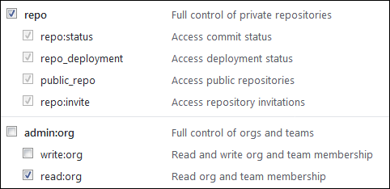

# Connecting repositories to {{ tracker-name }}



Only the [administrator](../role-model.md) can link new repositories.



Connecting your repositories to {{ tracker-name }} lets you link commits to issues. You can link any number of repositories hosted on GitHub, GitLab, and Bitbucket.

Follow the instructions in this section to enable repositories hosted on cloud services. To link a Git repository hosted on your own server to {{ tracker-name }}, consult [technical support]({{ link-tracker-support}}).

## GitHub {#section_mhj_yrk_m2b}

To connect your repository on [GitHub](https://github.com) to {{ tracker-name }}:



- Public repository

    1. Make sure you are logged in to {{ tracker-name }} as an [administrator](../role-model.md).

    1. On the {{ tracker-name }} top panel, select  → **Configure {{ tracker-name }}**.

    1. Go to the [**Repositories**]({{ link-repositories }}) tab and click **Connect repository**.

    1. Choose GitHub in the **Platform** field.

    1. Enter the public repository's address using the format `https://github.com/<repository owner login>/<repository name>`. Leave the **Token** field blank.

    1. Click **Connect**.

    1. Make sure that the repository status in {{ tracker-name }} is **Connected**.

- Private repository

    1. Make sure you are logged in to {{ tracker-name }} as an [administrator](../role-model.md).

    1. On the {{ tracker-name }} top panel, select  → **Configure {{ tracker-name }}**.

    1. Go to the [**Repositories**]({{ link-repositories }}) tab and click **Connect repository**.

    1. Choose GitHub in the **Platform** field.

    1. Go to GitHub and receive an OAuth token for your repository:

        - Log in to GitHub. If your repository is connected to a GitHub organization, make sure you have admin rights.

        - Click on your picture in the upper-right corner and choose **Settings**.

        - Select **Developer settings** → **Personal access token** on the left-hand panel.

        - Click **Generate new token**.

        - Choose a name for your token.

        - Configure access rights for your token. To make sure {{ tracker-name }} operates properly, enable the **repo** and **read:org** options:

            

        - Click **Generate token**.

        - Copy the token to the clipboard.

            

            Your token will only be displayed once. You won't be able to see it again after closing the page.

            

    1. Enter the repository address using the format `https://github.com/<repository owner login>/<repository name>` and specify the access token.

    1. Click **Connect**.

    1. Make sure that the repository status in {{ tracker-name }} is **Connected**.



To link a commit to an issue in {{ tracker-name }}, specify the issue key in the comments for the commit. You can view linked commits the following ways:

- On the **Commits** tab on the issue page.
- On the **Commits** tab on the queue page.

If you don't see the **Commits** tab, make sure it's enabled in your [queue settings](edit-queue-general.md#ul_gcz_xlp_m2b).

## GitLab {#section_kjw_cy2_ggb}

To connect your repository on [GitLab](https://gitlab.com) to {{ tracker-name }}:



- Public repository

    1. Make sure you are logged in to {{ tracker-name }} as an [administrator](../role-model.md).

    1. On the {{ tracker-name }} top panel, select  → **Configure {{ tracker-name }}**.

    1. Go to the [**Repositories**]({{ link-repositories }}) tab and click **Connect repository**.

    1. Choose GitLab in the **Platform** field.

    1. Enter the public repository's address using the format `https://gitlab.com/<repository owner login>/<repository name>`. Leave the **Token** field empty.

    1. Click **Connect**.

    1. Make sure that the repository status in {{ tracker-name }} is **Connected**.

- Private repository

    

    Private repositories can only be accessed by users logged in to GitLab (**Internal project**) or the project team (**Private project**).

    

    1. Make sure you are logged in to {{ tracker-name }} as an [administrator](../role-model.md).

    1. On the {{ tracker-name }} top panel, select  → **Configure {{ tracker-name }}**.

    1. Go to the [**Repositories**]({{ link-repositories }}) tab and click **Connect repository**.

    1. Choose GitLab in the **Platform** field.

    1. Go to GitLab and receive an OAuth token for your repository:

        - Log in to GitLab.

        - Click on your picture in the upper-right corner and choose **Settings**.

        - On the left-hand panel, select **Access Tokens**.

        - Enter a name for the token in the **Name** field.

        - Set the token expiration date in the **Expires at** field.

        - Configure the token's access rights. For {{ tracker-name }} to operate properly, make sure to enable the **api** option.

            

        - Click **Create personal access token**.

        - Copy the token to the clipboard.

            

            Your token will only be displayed once. You won't be able to see it again after closing the page.

            

    1. Enter the public repository's address using the format `https://gitlab.com/<repository owner login>/<repository name>` and specify the access token.

    1. Click **Activate**.

    1. Make sure that the repository status in {{ tracker-name }} is **Connected**.



To link a commit to an issue in {{ tracker-name }}, specify the issue key in the comments for the commit. You can view linked commits the following ways:

- On the **Commits** tab on the issue page.
- On the **Commits** tab on the queue page.

If you don't see the **Commits** tab, make sure it's enabled in your [queue settings](edit-queue-general.md#ul_gcz_xlp_m2b).

## Bitbucket {#section_u5z_zxk_m2b}

To connect your repository on [Bitbucket](https://bitbucket.org) to {{ tracker-name }}:

1. Make sure you are logged in to {{ tracker-name }} as an [administrator](../role-model.md).

1. On the {{ tracker-name }} top panel, select  → **Configure {{ tracker-name }}**.

1. Go to the [**Repositories**]({{ link-repositories }}) tab and click **Connect repository**.

1. Choose Bitbucket in the **Platform** field.

1. Create a {{ tracker-name }} password in Bitbucket. {{ tracker-name }} will use this password to connect to your repositories.

    - Log in to Bitbucket.

    - Click on your picture in the lower-left corner and select **Bitbucket settings**.

    - Choose **App passwords** under **Access management**.

    - Click **Create app password**.

    - Think up a name for your password, such as `Tracker integration password`.

    - Set access rights for your password. For {{ tracker-name }} to operate properly, make sure to enable the **read** option under **Repositories**:

    - Click **Create**.

    - Copy the password to clipboard.

        

        Your password will only be displayed once. You won't be able to see it again after closing the page.

        

1. Enter the repository's address using the format `https://bitbucket.org/<repository owner's login/repository name` and specify your Bitbucket login.

1. Enter the password you used when linking {{ tracker-name }} to Bitbucket. You cannot use your personal Bitbucket password.

1. Click **Connect**.

1. Make sure that the repository status in {{ tracker-name }} is **Connected**.

To link a commit to an issue in {{ tracker-name }}, specify the issue key in the comments for the commit. You can view linked commits the following ways:

- On the **Commits** tab on the issue page.
- On the **Commits** tab on the queue page.

If you don't see the **Commits** tab, make sure it's enabled in your [queue settings](edit-queue-general.md#ul_gcz_xlp_m2b).

