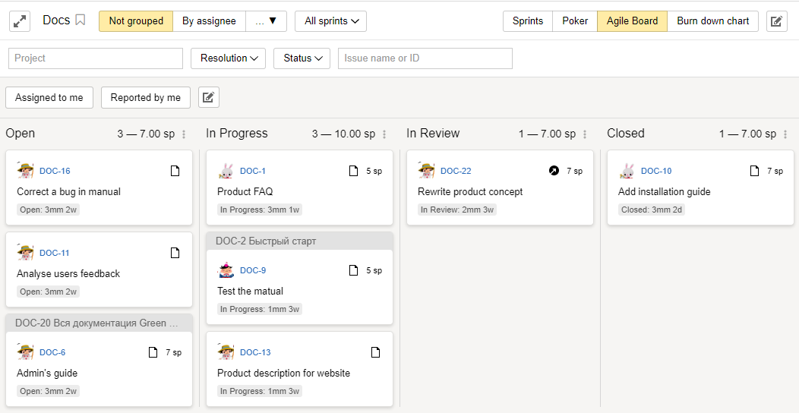

# Old boards



This section guides you through the old {{ tracker-name }} boards. Any new board is created using [new technologies](agile-new.md). You can switch your boards to our new technologies by [migrating](boards-convertor.md) or [creating a new board](agile-new-create).



To manage your issues and projects in {{ tracker-name }}, you can use Agile tools and methodologies: issue boards, sprints, burnout charts, and planning pocker.

[Agile development methodologies]({{ link-wiki-agile-en }}) were created for managing software development processes. Nowadays, they are successfully employed in a variety of domains. There are several agile development approaches, such as [Scrum]({{ link-wiki-scrum }}) and [Kanban]({{ link-wiki-kanban }}).

For more information, see [{#T}](agile.md#sec_basics).

## Issue boards in {{ tracker-name }} {#sec_boards}

In {{ tracker-name }}, agile tools are grouped on issue boards.

Managing issue boards in {{ tracker-name }} is similar to [working with a regular sticker board](#dlen_board). Use boards of different types to plan and track your Agile workflow:

- **{{ ui-key.startrek.blocks-desktop_agile-form-modal.board-type--default }}** boards allow you to arrange issues in columns based on their status.

- **{{ ui-key.startrek.blocks-desktop_onboarding-form.template-1 }}** boards allow you to display statuses and offer [sprint](#dlen_sprint) management tools, [issue estimation](planning-poker.md), and [burn down charts](#dlen_burndown).

- **{{ ui-key.startrek.blocks-desktop_agile-form-modal.board-type--kanban }}** boards are similar to basic boards, but all issues with the **{{ ui-key.startrek.blocks-desktop_b-page-agile-admin-tab_type_card-settings.issue-status-open }}** status are automatically moved to the [**{{ ui-key.startrek.ui_components_agile_backlog_BacklogIssue.backlog-default-column }}**](#dlen_backlog) column.

For more information about working with an issue boards:

- [{#T}](create-agile-board.md)
- [{#T}](../user/agile.md)
- [{#T}](create-agile-sprint.md)
- [{#T}](planning-poker.md)
- [{#T}](burndown.md)

## Basic concepts of agile development {#sec_basics}

{{ tracker-name }} uses the following terms and concepts from the [Scrum]({{ link-wiki-scrum }}) methodology:

Backlog {#dlen_backlog}
:   List of issues or product requirements that must be completed in the project. Backlog issues are usually sorted by priority.

Sprint{#dlen_sprint}
:  Project cycle, usually lasting from one to four weeks. It is assumed that, under each sprint, a team should develop a set of new features (also known as increment) and make it release-ready.

Planning poker
:   A method for [collaboratively estimating issue complexity](planning-poker.md) using cards, where team members each rate complexity in [Story Points](#dlen_sp).

Issue board {#dlen_board}
:   A board for tracking the status of issues in the current sprint. Columns on the board correspond to issue statuses. Cards with issue descriptions are pinned to the board and [moved between columns as the issue status updates](../user/agile.md).

Burn down chart {#dlen_burndown}
:  A chart that [shows the completion speed of planned issues](burndown.md) during a sprint and the amount of work remaining.

User Story
:  A <q>User Story</q> is a description of a feature that needs to be implemented in a product as a result of previous experiences or issues faced by users. User Story is broken down into individual issues. You can use Story issues to [group any issues](../user/links.md) based on a common topic in {{ tracker-name }}.

Story Point {#dlen_sp}
:   Relative rating that describes the effort needed to complete an issue. The Story Point unit is not usually measured in terms of man-hours. [The team rates issues collectively](planning-poker.md) by comparing them to a simple task.

Epic
:  A larger feature or requirement that can't be implemented within a single sprint. It's usually broken down into several User Stories or issues. You can use Epics to [group any issues](../user/links.md) based on a common topic in {{ tracker-name }}.

Sub-epic
:  An issue that is included in an epic.

