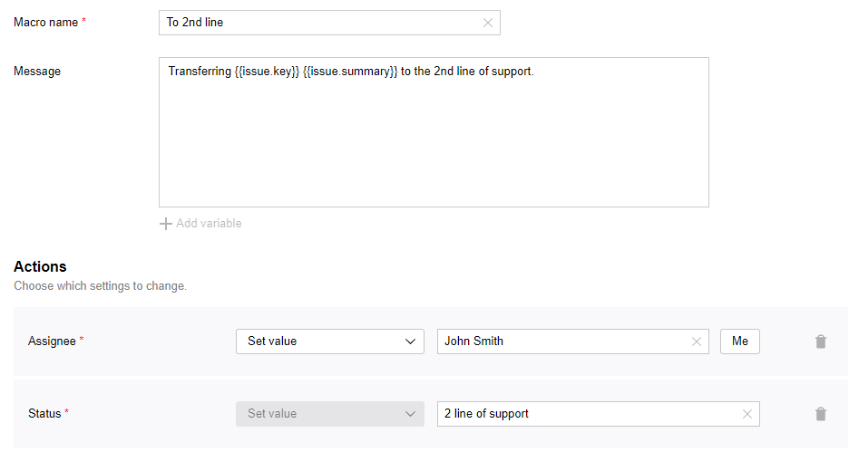

# Macros

In {{ tracker-name }}, macros are scripted algorithms that can be executed on the issue page. Use macros to automate routine actions. Macros run in one click, allowing you to change issue parameters, create typical commands.

## Creating a macro {#section_inq_5b1_x2b}



By default, [only the queue owner](queue-access.md) can configure a queue.



Each {{ tracker-name }} queue has its own set of macros. To create a new macro for the queue:

1. 

1. In the top-right corner, click  **{{ ui-key.startrek.ui_components_PageQueue_header.settings }}**.

1. On the left-hand panel, select **Automation** → **Macros** and click **Create macro**.

1. Set up the parameters for the new macro:
   - **Macro name**.
   - **Message**: Text of the message (comment) to be created when the macro is run. If you do not want your macro to create any messages, leave this field empty.
      You can insert [issue field values](../user/vars.md) into the message text. To do this, click **Add variable** and select one or more values. The **Message** field will show a sequence like `not_var{{issue.field_key}}`.
   - **Actions**: Select the issue fields your macro will change and specify their new values.

1. Click **Create**.

## Editing and deleting macros {#section_swl_sdb_x2b}



By default, [only the queue owner](queue-access.md) can configure a queue.



1. 

1. In the top-right corner, click  **{{ ui-key.startrek.ui_components_PageQueue_header.settings }}**.

1. On the left-hand panel, select **Automation** → **Macros** and hover over the macro you need.

1. To edit the macro, click .
To delete the macro, click .

## Running a macro {#section_ekq_22b_x2b}

We can use macros to change issue parameters, create comments,. Any user who has access to changing the issue can run a macro on it.

To execute the macro:

1. Open the issue page.

1. Go to the comment field.

1. Click  **Macros** and select a macro from the drop-down list.
   You can select multiple macros at the same time. If the macros affect the same parameter, the last selected macro will be applied to the parameter.

1. To execute the macro, click **{{ ui-key.startrek.ui_components_entity-page_macros_MacrosExecutor.apply-button-label }}**.

## Example of a macro {#macro_example}

Let's say a member of the first line of support wants to transfer a user request in {{ tracker-name }} to the second line of support. Let's set up a macro that will execute this action:

1. Open the queue.

1. In the **Macros** section, click [**Create macro**](#section_inq_5b1_x2b).

1. Name the macro.

1. Write the text of a message to be added to a comment in the issue. You can add issue fields by clicking **Add variable**.

1. To make sure that the macro assigns the issue to a specific Line 2 support engineer, select the **{{ ui-key.startrek-backend.fields.issue.fields.system }}** → **{{ ui-key.startrek-backend.fields.issue.assignee-key-value }}** field under **Actions** and specify the name of the employee.

1. If you want your macro to change the issue status, go to **Actions**, choose **{{ ui-key.startrek-backend.fields.issue.fields.system }}** → **Status**, and set it to **Support line 2**.

   If the list of values doesn't include a proper status, [set up the workflow](add-workflow.md).

   

1. Save the macro.

To execute the created macro:

1. Open the issue page.

1. Go to the comment field.

1. Click  **Macros** and select a macro from the drop-down list.

1. Click **{{ ui-key.startrek.ui_components_entity-page_macros_MacrosExecutor.apply-button-label }}**. The issue will be forwarded to Tier 2 support.