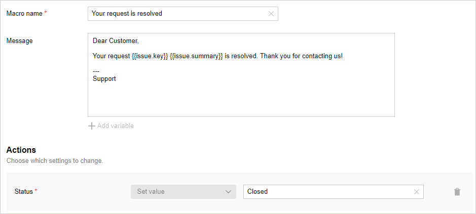

# Macros

In {{ tracker-name }}, macros are scripted algorithms that can be executed on the issue page. You can use macros to automate repeating actions. Macros allow you to change issue fields, create automated comments and send messages in just one click.

## Creating a macro {#section_inq_5b1_x2b}



By default, [only the queue owner](queue-access.md) can configure a queue.



Each {{ tracker-name }} queue has its own set of macros. To create a new queue macro, do the following:

1. Open the [queue page](../user/queue.md).

1. To the left of the queue name, select  → **Administration**.

1. On the left-hand panel, select **Automation** → **Macros** and click **Create macro**.

1. Set up your macro parameters:
    - **Macro name**.
    - **Message**: Message body (comment or email) created when executing a macro. If you don't want your macro to leave any messages, leave this field empty.
You can insert field values into your comments. To do this, click **Add variable** and select one or more values. The **Message** field will show a sequence like `not_var{{issue.fieldKey}}`.
    - **Actions**: Choose the issue fields a macro should change and specify their values after the change.

1. Click **Create macro**.

## Edit and delete macros {#section_swl_sdb_x2b}



By default, [only the queue owner](queue-access.md) can configure a queue.



1. Open the [queue page](../user/queue.md).

1. To the left of the queue name, select  → **Administration**.

1. On the left-hand panel, select **Automation** → **Macros** and hover the cursor over the macro you need.

1. To edit the macro, click .
To delete a macro, click .

## Run a macro {#section_ekq_22b_x2b}

Macros allow you to change issue fields, create automated comments and email messages. Any user with access rights to issue editing can execute macros.

To run a macro:

1. Open the issue page.

1. Go to the comment field.

1. Select a macro from the drop-down **Macros** list.
You can select multiple macros at the same time. If multiple macros change the same field, only the last executed change will be applied.

1. To send a message using a macro, go to the **Message** tab and [configure its fields](../user/comments.md#section_zpd_ph5_wdb).

1. To execute the macro, click **Send**.



## Example of a macro {#macro_example}

Let's say the support team is processing user requests in {{ tracker-name }}. After the request is processed, the issue must be closed and the requester must be notified that their request has been resolved. Let's set up a macro that's going to do exactly that:

1. Choose the queue you want to create the macro for and open the settings.

1. In the **Macros** section, click [**Create macro**](#section_inq_5b1_x2b).

1. Set the macro name.

1. Write the email. You can add issue fields to your message by clicking **Add variable**.

1. If you want to use your macro to close issues, find the **Actions** section and select **Status** → **Set value** → **Closed**.

   

1. Save your macro.

To run a macro you created:

1. Open any issue from the queue you made the macro in.

1. Click **Macro** in the comment box and choose a name for your macro.

1. Turn on the **Email** option above the comment box and specify the recipient's address. If the issue was [generated from a user email](../user/create-ticket-by-mail.md), the requester's email address will be automatically added to the **To** field.

1. Click **Submit**. The user will receive an email and the issue status will be updated to **Closed**.





[Contact support](../troubleshooting.md)



