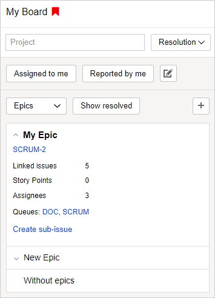

# Epics

An epic is an issue type that allows you to group issues that share the same subject. Epics can include issues from different queues and sprints.

Epics are especially effective with **{{ ui-key.startrek.components_QueuePresetOnboarding.preset-name--scrum-development-preset }}** boards to help you [plan your team's workload](create-agile-sprint.md#section_sjg_111_2gb). You can distribute issues of an epic between different sprints. This way you can predict effort and deadlines.



An issue can belong to only one epic.



#### Filtering issues by epic

1. In the {{ tracker-name }} top panel, click **{{ ui-key.startrek.blocks-desktop_m-head.menu-agile }}** and select your board.

1. Click **{{ ui-key.startrek.blocks-desktop_b-page-agile-board.sprints }}** in the top-right corner of the page.

1. In the left part of the page, select grouping issues by epics.

   

   The list will display epics [added to the board](../user/agile.md#add-tasks) or created there.

1. Click the issue card. The backlog and sprints will show issues from the selected epic.

1. To view the epic's properties, click an arrow to the left of its name.

   An epic card displays the total number of issues within the epic, the total [Story Points](agile.md#dlen_sp) for all issues, the total number of assignees, and the queues whose issues are included in the epic.

#### Creating an epic on the board

1. At the top of the epic list, click .

1. Specify the queue, name, and owner for the epic.

1. Click **{{ ui-key.startrek.blocks-desktop_b-page-agile-sprints.create-epic }}**.

#### Adding an issue to the epic

On the sprint page, drag an issue from the backlog or any sprint to the epic card.

You can also add issues to epics using [links](../user/ticket-links.md):

1. On the issue page, click **{{ ui-key.startrek.ui_components_IssueMenu.title }}** → **{{ ui-key.startrek.ui_components_CreateIssueLinkButton.add-relation }}**.

1. Select the **{{ ui-key.startrek-backend.fields.issue.links.relationship.has.epic }}** link type.

1. Specify the [epic key](../user/create-ticket.md#key).

#### Creating a new issue in an epic

1. Expand the epic card by clicking the arrow to the left of its name.

1. Click **{{ ui-key.startrek.blocks-desktop_epic-card.create-subtask }}** at the bottom.

1. Fill in the issue fields and click **{{ ui-key.startrek.blocks-desktop_agile-create-issue.create }}**. The new issue will be added to the epic.

#### Removing an issue from an epic

You can remove an issue from an epic on the sprint page or the issue page.

- Open the sprint page on the board and drag your issue to the **{{ ui-key.startrek.blocks-desktop_b-page-agile-sprints.without-epics }}** card.

- Open the issue page, hover over the epic's field in the **{{ ui-key.startrek.ui_components_IssueLinks.links-group-title--relates }}** section, and click .
