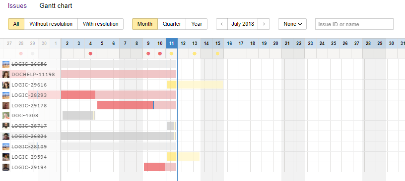
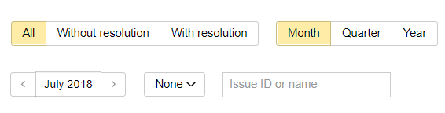

# Gantt charts

A Gantt chart in {{ tracker-name }} is a calendar tool for planning your workflow. You can create a Gantt chart for an issue list within a queue or a filtered list of issues.

Deadlines for issues are marked on the chart as bars along the time axis. The beginning of each bar corresponds to the start date for working on the issue, and the end of the bar is the end date or deadline.

The bar color indicates the status of the issue:

- Yellow: the deadline hasn't passed yet.
- Red: the deadline has already passed, but the issue is not closed.
- Grey: the issue is closed.

## Creating a chart for a filter {#section_pwy_tgx_tdb}

To create a Gantt chart:

1. Choose a [system issue filter](../user/default-filters.md) or [create a new one](../user/create-filter.md).

1. Configure filter parameters to find the issues you want to create a Gantt chart for.

1. On the top panel, click .

A Gantt chart will be created for the selected issues. If there are too many issues on the chart, use the quick filters or issue grouping:

## Creating a queue chart {#sec_queue}

1. Open the [queue issue list](../user/queue.md).

1. Use [quick filters](quick-filters.md#section_y5w_chh_11b) to select the issues you want to create a Gantt chart for.

1. Go to the **Gantt Chart** tab.

The Gantt chart is created using the filters set up in the **Issues** tab. If there are too many issues on the chart, use the quick filters or grouping:

## Managing deadlines {#section_yz2_xgx_tdb}

If no start or end dates are set, select an appropriate time interval on the chart with the mouse.

To change the start or end date of an issue, drag the end of the bar.

You can also click an issue name and change the following field values on the issue card to the right: **Start date**, **End date**, and **Deadline**. Refresh the page for changes to appear on the chart.

## Unsorted issues {#section_p5k_ygx_tdb}

Issues that have no start and end dates set are grouped under **Unsorted issues**. Quick filters and grouping settings are not applied to these issues.

If you want to set deadlines using the chart, do the following:

1. Use your mouse to select an appropriate time interval on the chart.

1. In the window that appears, edit the field values for **Start date**, **End date**, and **Deadline** if necessary.

1. Click **Save**.

You can also click the issue name and set deadlines using the issue card to the right. Refresh the page for changes to appear on the chart.

