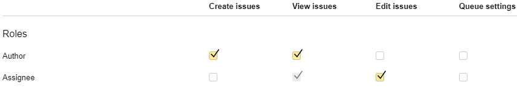

# Setting up access rights for queues



By default, only the queue owner can configure a queue.



## Setting access rights for queues {#set-access}

By default, users are not restricted from accessing queue issues.By default, access to queue issues is granted to all Yandex employees except [Business support team members and External consultants](#outsource_access).

If you restrict access to your queue, only the users specified in the following fields will have access to its issues by default: **Author**, **Assignee**, **Followers**, and **Access**.





To create and edit issues, you need [full access](../access.md) to {{ tracker-name }} along with queue access. For more information, see [{#T}](../role-model.md).





You can change access settings for individual users, groups, or roles:

1. Open the [queue page](../user/queue.md).

1. To the left of the queue name, select  → **Configure**.

1. Go to **Access** → **All issues**.

1. Add users and groups to configure access for:
    - **Users and robots**: Individual settings for individual users. To add a user to this category, enter the login or the user's name in the search bar at the top of the table.
    - **Groups**: Settings for all employees.Settings for departments and teams. To add a new department, enter its name in the search bar at the top of the table.



        
    
        To add all Yandex employees, select the `Yandex` group.
    
        



    - **Roles**: Settings for users who have specific roles in queue issues:
        - **Access**: Users listed in the **Access** field of an issue.
        - **Follower**: Users who subscribed to the issue.
        - **Reporter**: The person who created the issue.
        - **Assignee**: The person assigned to the issue.
        - **Queue owner**.
        - **Queue team members**: Users added to the [queue team](queue-team.md). This role isn't on the list by default, but you can add it via the search bar at the top of the table.

1. Set permissions for queue actions:

    - **Create issues**: Users are allowed to create new issues in this queue.

    - **View issues**: Users are allowed to add comments to an issue and change its status, but not to edit issue field values.

        

        To [bulk change multiple issues' statuses](bulk-change.md#section_kkf_tjr_fgb), view permissions are not sufficient. This requires permission to edit issues.

        

    - **Edit issues**: Users are allowed to comment on an issue, change its status, and edit issue fields (such as changing its deadline, adding followers, and so on).

    - **Queue settings**: Users are allowed to edit [queue settings](edit-queue-general.md).

1. Click **Save**.

If a user has multiple roles, they gain all access rights associated with each role.

> **Example**
>
>
>
>If a user is both the reporter and assignee, they are allowed to **Create issues**, **View issues**, and **Edit issues**.

## Adding a message for users who can't access issues {#deny-message}

When a user is trying to open an issue from a queue that they don't have access to, a message saying <q>Contact the queue owner</q> pops out with the owner's name specified.

This message can be changed. For instance, you can specify another user with queue admin rights who can give access to issues. You can also specify the reason for restricting access to the queue.

To edit the message displayed to users with no access to the queue, do the following:

1. Open the [queue page](../user/queue.md).

1. To the left of the queue name, select  → **Configure**.

1. Go to **Access** → **All issues**.

1. Under **Message for users without access**, click **Edit**.

1. Write your message and click **Save**.

   
    If you want to add a link to a user profile in your message, enter their username followed by the `@` symbol, such as `login@`.
    

## Setting access rights to issues with components {#section_tbh_cs5_qbb}

You can configure access to various [components](components.md) of the queue. This lets you create separate setups for issues that have components and those that do not.



The rules for component access take priority over the rules for queue access.



To configure access to issues by component:

1. Open the [queue page](../user/queue.md).

1. [Add to the queue components](components.md#section_zrt_szk_xz) to control access to issues with.

1. To the left of the queue name, select  → **Configure**.

1. Go to **Access** → **Issues with component**.

1. Add users and groups to configure access for:

    - **Users and robots**: Individual settings for individual users. To add a user to this category, enter the login or the user's name in the search bar at the top of the table.

    - **Groups**: Settings for all employees.Settings for departments and teams. To add a new department, enter its name in the search bar at the top of the table.

        
        

        To add all Yandex employees, select the `Yandex` group.

        
        

    - **Roles**: Settings for users who have specific roles in queue issues:
        - **Access**: Users listed in the **Access** field of an issue.
        - **Follower**: Users who subscribed to the issue.
        - **Reporter**: The person who created the issue.
        - **Assignee**: The person assigned to the issue.
        - **Queue owner**.
        - **Queue team members**: Users added to the [queue team](queue-team.md). This role isn't on the list by default, but you can add it via the search bar at the top of the table.

1. Click **Save**.



To disable special access rights for a component, click **Clear**.



1. To configure access to an individual issue that differs from the access settings for the entire queue, add a component to the issue.

If an issue has several associated components, all users with access to at least one of them will be able to access the issue.

If an issue has the **Hardware** and **Software** components, it can be accessed by users from both the <q>Product development</q> and <q>Application development</q> groups.



## Configuring access for external employees {#outsource_access}

By default, [Business support team members](https://staff.yandex-team.ru/departments/outstaff) and [External consultants](https://staff.yandex-team.ru/departments/ext) can't access queue issues. You can't invite them to comment on an issue or specify them in the **Author**, **Assignee**, **Followers**, and **Access** fields.

#### Configuring access

To grant access to the queue for individual external employees or groups:

1. Enable **Allow access for external users** in the queue access settings.

1. Add employees and groups to the [**Access rights** list](#set-access).

Selecting **Allow access for external users** without adding specific users to the **Access rights** list allows inviting external staff to comment on issues and specifying them in the **Author**, **Assignee**, **Followers**, and **Access** fields.

#### Allowing inviting Yandex employees

External employees with queue or issue access permissions can invite Yandex staff members to comments only if they have access to their Staff profiles.

To allow external staff to invite employees from your department to comments, [request for them a Staff role](https://idm.yandex-team.ru/system/staff/roles#rf=1,rf-role=dOY3rEJ0%23staff/department_roles/EXT_WITH_STAFF_PROFILE_ACCESS(fields:()),f-status=all,f-role=staff,sort-by=-updated,rf-expanded=dOY3rEJ0). For more information about access to Staff, see [Wiki](https://wiki.yandex-team.ru/staff/vodstvo/zapros-dostupa-na-staff-dlja-vneshnix-sotrudnikov/).

#### Finding out who has permission

The warning **Access: Not only Yandex** means that both Yandex and external staff are allowed to access a queue or issue.

To find out who has access permissions:

- If a queue's access category is **Yandex** and an individual issue's is **Access: Not only Yandex**, this means that the issue's reporter, assignee, or followers inlcude external employees.

- If you aren't the queue owner, but you think that it shouldn't be available to external employees, please contact `tools@`.

- If you are the queue owner, you can see external employees in the [queue access settings](#set-access).



