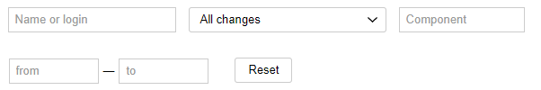

# Viewing the history of queue changes



Only the queue's owner can configure the queue by default.



The log includes records about the changes in queue settings. Each record includes the date, author, and contents of the change.

## Viewing changelogs {#show-log}

1. Open the queue page.

1. In the top-right corner of the page, click  **{{ ui-key.startrek.ui_components_PageQueue_header.settings }}**.

1. Go to the **Changelog** tab.

## Filtering entries {#filter-records}

To find a record in the log, use filters:

1. **By author**
    Find changes made by a certain user.

1. **By change type**
    View changes in settings belonging to a certain type.

1. **By component**
    View changes in components: creation, deletion, parameter changes, etc.

1. **By date**
    Find changes over a period. You can select an interval or set only the start or end date in a range.

1. **Reset filters**
    To cancel the filter action, click Reset.
