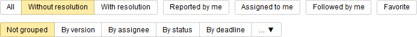

# Find issues in queues

By default, the [queue page](../user/queue.md) displays all issues included in the queue. To search for issues in the list, use [quick filters](#section_y5w_chh_11b) or the [filter builder](#section_kfq_2hh_11b). If necessary, you can save the resulting list of issues as a file.

## Quick Filters {#section_y5w_chh_11b}

You can use quick filters to filter and sort issues in a matter of seconds.

The quick filter buttons are located above the list of issues. They are grouped into several types:

1. Resolution filters. Select one of the options:

    - **All**: The page displays all issues, regardless of the resolution.

    - **Without resolution**: The page only shows issues that don't have a resolution.

    - **With resolution**: The page only shows issues that have a resolution.

1. Role-based filters. You can apply multiple filters at the same time:

    - **Reported by me**.

    - **Assigned to me**.

    - **Followed by me**.

1. **Favorite**: A filter for issues you added to Favorites.

1. Grouping issues by various criteria. Select one of the available criteria.

As a result, only issues that meet all the selected filter criteria will be shown in the list.

## Filter builder {#section_kfq_2hh_11b}

If the quick filters don't provide enough filtering options for you, use the custom filter designer. You can use the filter designer right on the queue page:

1. Go to the queue page.

1. In the upper-right page, click .

1. In the left pane, select options for filtering issues in the queue. If the settings you need are not in the list, add them by clicking ** Select fields**.

1. Click **Apply**.

## Display issue fields {#section_wbf_33h_11b}

Configure which fields to show in the list of issues, so that you only see the details that are important to you:

1. Go to the queue page.

1. Click ** Select fields** on the right of the page.

1. Select the fields you want to see in the list of issues.

1. Click **Save**.

Сhanges are applied immediately, and you don&apos;t need to refresh the page.

## Save a list in Wiki {#section_uy5_hds_3bb}

You can insert a list of issues on a Wiki page:

1. In the upper-left corner of the page, select  → **Get the Wiki code**.

1. Copy the code.

1. Insert the code on a Wiki page.

The list will be updated automatically. It will always show up-to-date information about the status of issues, their names, and assignees.

## Save the list in a file {#section_vjt_x3h_11b}

You can save the list of issues as a file in XML, CSV, or XLS format.



The list of issues is saved with all filters and field settings applied.



To save a list to a file:

1. Click  above the list of issues.

1. Select the format for saving the list.

1. Wait until the file is downloaded to your device.

[Contact support](../troubleshooting.md)

