# Trigger use cases in {{ tracker-name }}

Here are some examples of how triggers work in {{ tracker-name }}:

- How to [automatically pick assignees](#assign_ticket) based on their status or component.

- How to [automatically invite the assignee to comment](#summon_ticket) depending on the field status and value.

- How to [automatically change an issue status](#new-link) after adding a certain type of link to it.

- How to [automatically notify a user](#notify_mail) after an issue was created based on a request sent to the support team via email.

- How to [automatically notify a user](#notify_form) after an issue was created based on a request sent to the support team via {{ forms-full-name }}.

- How to [automatically add a form](#insert_form) to the issue comments.

- How to [automatically add issues to your board](#board).

- How to [set up notifications in messengers](#section_vsn_mb2_d3b) via HTTP requests.

- How to [automatically calculate the difference between dates](#tracker_data) in {{ tracker-name }}.


- How to [create a sub-issue and write field values from its parent issue to it](#create-ticket-with-params).


## Picking assignees automatically {#assign_ticket}

It might often be the case that different employees are assigned to perform specific work stages. When an employee has completed their part of the work, they hand over the issue to the next assignee. In {{ tracker-name }}, each issue stage has its own status. When the issue switches over to a certain status, you can use a trigger to automatically set the assignee for the next work stage.

Another way to organize the workflow is to set certain employees responsible for certain work areas. For example, each support employee is responsible for requests relating to their products. To manage this kind of workflow, you can [configure components](components.md) so that they correspond to specific products. When a certain component is added to the issue, you can use a trigger to automatically set the assignee responsible for the given product.

Let's set up a trigger to automatically assign the issue:


1. Make sure every employee you might want to assign has [full access to {{ tracker-name }}](../access.md).


1. Go to the queue settings, open the **Triggers** section, and click [**Create trigger**](../user/create-trigger.md).

1. Enter a name for the trigger.

1. Set the trigger to fire when the issue's <q>Status</q> or <q>Components</q> change:

   1. Select the option **Conditions to be met** → **All**.

   1. Add the condition **Event type** → **Issue changed**.

   1. If you want a new assignee to be picked after a status update, add the following condition: **System** → **Status** → **Field value became equal to** and specify the status. The available statuses depend on the [workflow](workflow.md) set up for the queue.

      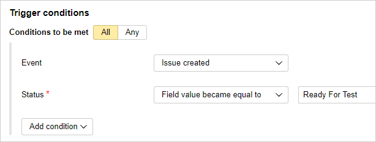

      If you want a new assignee to be picked after a component changes, add the following condition: **System** → **Components** → **Field value became equal to** and specify the components.

      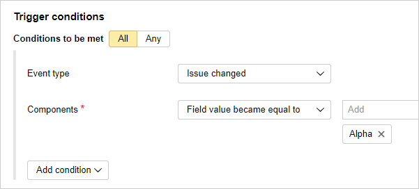

      

      The trigger with this condition will fire only if a single component is specified in the issue.

      

1. Set the action for the trigger:

   1. Add the action **Update fields**.

   1. Choose **System** → **Assignee** → **Set value** and specify who should be picked as the assignee after the trigger is fired.

      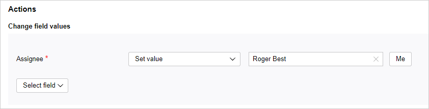

1. Save your trigger.
   To check the trigger operation, change the status or components for any issue from the queue that you set up the trigger for.

## Inviting assignees automatically {#summon_ticket}

Having completed the issue, the employee might forget to specify some important information, for example, the time spent. In this case, you can set up a trigger that will automatically invite the user to comment if the issue was closed, but the time spent wasn't specified.

1. Go to the queue settings, open the **Triggers** section, and click [**Create trigger**](../user/create-trigger.md).

1. Enter a name for the trigger.

1. Set up the criteria to fire the trigger on closing the issue in the case when the <q>Time spent</q> field is left empty.

   1. Select the option **Conditions to be met** → **All**.

   1. Add the condition **System** → **Status** → **Field value became equal to** → **Closed**. The available statuses depend on the [workflow](workflow.md) set up for the queue.

   1. Add the condition **Time Spent** → **Time spent** → **Field value is empty**.

1. Set the actions for the trigger:

   1. Add the **Add comment** action.

   1. Click 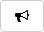 and in the **Invite users from field** line, enter <q>Assignee</q>.

   1. Enter the comment to be displayed to the issue assignee and choose **Send as robot**.

1. Click **Create** to save the trigger.

   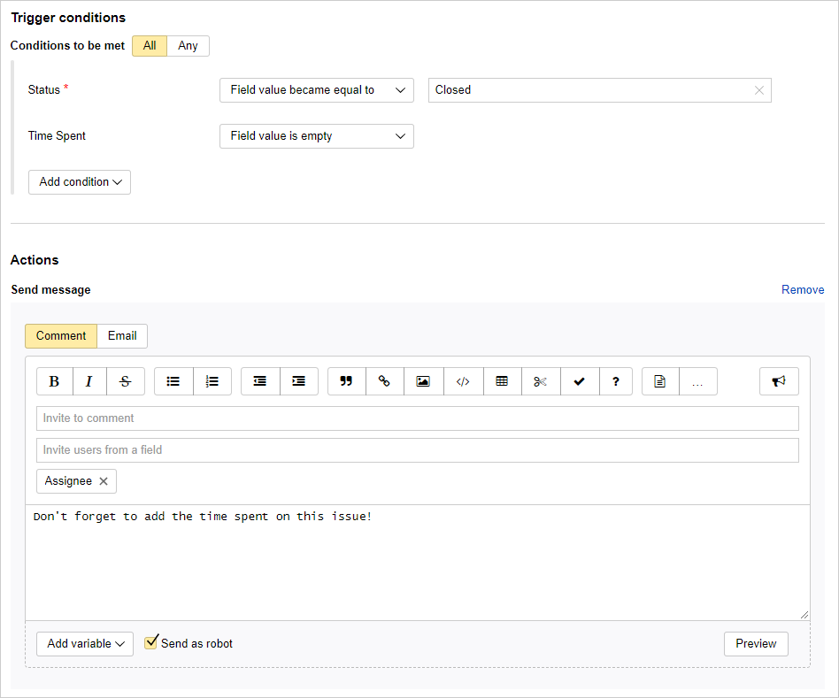

Whenever an issue is closed without specifying the time spent, the robot will create a comment and invite the assignee to comment.

## Changing an issue's status after creating a link {#new-link}

In many projects, issues depend on each other even if different people are working on them. If an issue affects the progress of one or more other issues, it's important to notify other team members if any problems arise. For example, you can link such issues to each other and set the [link type](../user/links.md) **Blocking issue**.

Let's set up a trigger that will change an issue's status and add a comment for its reporter when the **Blocking issue** to link is added:

1. Go to the queue settings, open the **Triggers** section, and click [**Create trigger**](../user/create-trigger.md).

1. Enter a name for the trigger.

1. Set the trigger to fire when the **Blocking issue** to link appears:

   1. Select the option **Conditions to be met** → **All**.

   1. Add the following condition: **Action with link** → **Link created** → **Blocking issue**.

   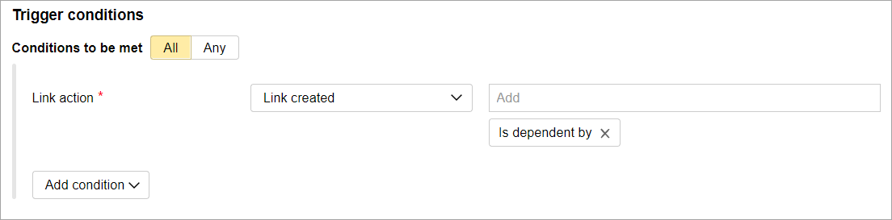

1. Set the actions for the trigger:

   1. Add the action **Change issue status**.

   1. In the **Next status field**, select the status to switch the issue to when the condition is met. For example, **Need info**. The available statuses depend on the [workflow](workflow.md) set up for the queue.

   1. Add the **Add comment** action.

   1. Click  and in the **Invite users from field** line, enter <q>Reporter</q>.

   1. Enter the comment to be displayed to the issue reporter and choose **Send as robot**. Otherwise, the comment is sent on behalf of the user who initiates the trigger action by adding the link.

   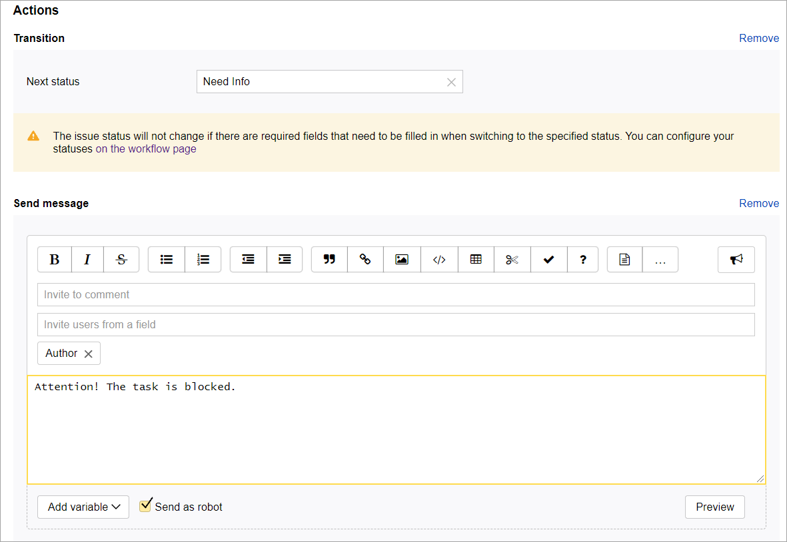

1. Click **Create** to save the trigger.

## Sending a notification when an issue is created from an email {#notify_mail}

Let's say the support team is processing user requests in {{ tracker-name }}. Users contact the support team via email, and those emails are used as the basis for issues in {{ tracker-name }}.

Let's set up a trigger that, once the issue is created, sends to the user an email that their request has been registered.

#### Step 1. Set up email integration

You need to set up email integration if you want to send emails right from {{ tracker-name }} and create issues from incoming emails:

1. [Set up an email address for the queue](queue-mail.md#section_gwv_hqb_hgb) to store issues created based on user requests.

   
   If you cannot add an address for the queue, it means that your organization does not have a domain. You need a domain to create mailboxes and newsletters, for example, to add an email address for your queue. You can [add a domain in {{ ya-360 }}]({{ support-business-domain }}) free of charge.


1. [Set up sender names and signatures](queue-mail.md#send_outside) if needed.


1. If the users aren't your company's employees:

   1. [Allow receiving emails from external addresses](queue-mail.md#mail_tasks).

   1. [Allow sending emails from issue pages to external addresses](queue-mail.md#send_outside).


#### Step 2. Setting up a trigger for sending emails

Set up a trigger that, whenever an issue created based on an email, will notify the user also by email:

1. Go to the queue settings, open the **Triggers** section, and click [**Create trigger**](../user/create-trigger.md).

1. Enter a name for the trigger.

1. Set up the conditions to fire the trigger when an issue is created based on an incoming email:

   1. Select the option **Conditions to be met** → **All**.

   1. Add the condition **Event type** → **Issue created**.

   1. Add the condition **Email** → **Created by email to** → **Equals string** and enter the email address to your queue.

   1. Enable **Ignore case** so that the queue address isn't case sensitive.

   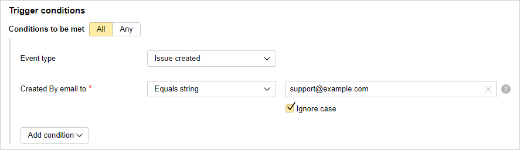

1. As a trigger action, set up sending an email:

   1. Choose the **Add comment** action.

   1. Enable the **Email** option.

   1. In the **To** field, add the variable with the address of the user who sent the request. To do this, select the **To** field, click **Add variable**, and choose **Email** → **From**.

   1. Write the text of your message. You can add [issue fields](../user/vars.md) to your message by clicking **Add variable**.

   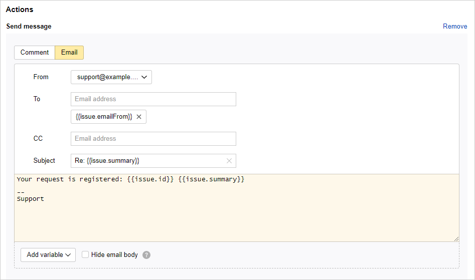

1. Save your trigger.

   To see if the trigger works, send an email to the queue address.

## Sending a notification when an issue is created based on a form {#notify_form}

Let's say the support team is processing user requests in {{ tracker-name }}. Users contact the support team via a feedback form created in [{{ forms-full-name }}]({{ link-forms }}). A {{ tracker-name }} issue is then created based on that form.

Let's set up a trigger that, once the issue is created, sends to the user an email that their request has been registered.

#### Step 1. Set up email integration

You need to set up email integration if you want to send emails from {{ tracker-name }}:

1. [Set up an email address for the queue](queue-mail.md#section_gwv_hqb_hgb) to store issues created based on user requests.

   
   If you cannot add an address for the queue, it means that your organization does not have a domain. You need a domain to create mailboxes and newsletters, for example, to add an email address for your queue. You can [add a domain in {{ ya-360 }}]({{ support-business-domain }}) free of charge.


1. [Set up sender names and signatures](queue-mail.md#send_outside) if needed.

1. If the users are not your company's employees, [allow sending emails from issue pages to external addresses](queue-mail.md#send_outside).

#### Step 2. Set up a form to register requests

To create issues based on requests submitted from a form:

1. Go to [{{ forms-full-name }}]({{ link-forms }}) and create a new form.

1. Add questions that allow users to provide relevant information that is required to register their request.

   If you want to know the user's email address, add the **Email** question and make it a required field.

   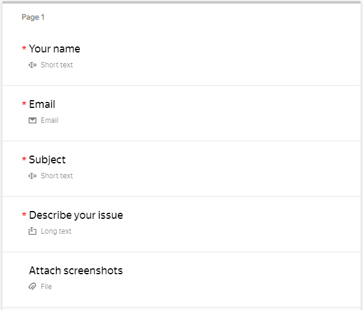

1. Set up [integration with {{ tracker-name }}](../../forms/create-task.md) for the form.

   1. Specify the queue and other issue parameters.

   1. Use the **Issue description** field to add answers to the questions included in your form.

   1. To save the user's email address in the issue settings, add the **From** field and select **Variables** → **Answer to question** → **Email**.

   1. Save your integration settings.

   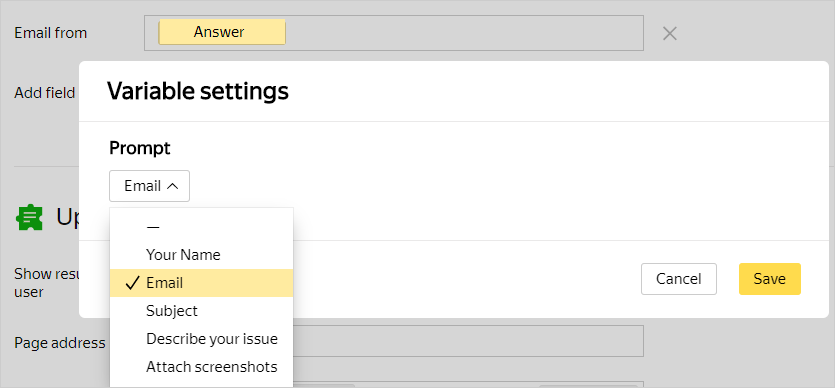

1. [Publish](../../forms/publish.md#section_link) the form.

#### Step 3. Setting up a trigger for sending emails

Set up a trigger that, whenever an issue created from a form, will notify the user by email:

1. Go to the queue settings, open the **Triggers** section, and click [**Create trigger**](../user/create-trigger.md).

1. Enter a name for the trigger.

1. Set up the conditions to fire the trigger when an issue is created based on an incoming email:

   1. Select the option **Conditions to be met** → **All**.

   1. Add the condition **Event type** → **Issue created**.

   1. Add the condition **Email** → **From** → **Field value became not empty**.

   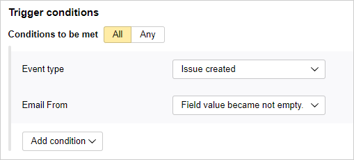

1. As a trigger action, set up sending an email:

   1. Choose the **Add comment** action.

   1. Enable the **Email** option.

   1. In the **To** field, add the variable with the address of the user who sent the request. To do this, select the **To** field, click **Add variable**, and choose **Email** → **From**.

   1. Write the text of your message. You can add [issue fields](../user/vars.md) to your message by clicking **Add variable**.

   

1. Save your trigger.

   To see if your trigger works, fill out the form you integrated with {{ tracker-name }}.

## Automatically adding a form to the issue comments {#insert_form}

You can choose a trigger to add a form with pre-populated fields to the issue comments. For this, add, as the comment text, a special code including a link to the form. Values can be passed to the form fields via [GET parameters](../../forms/get-params.md). For example, you can pass the issue's parameters using the [variables](../user/vars.md) available in the trigger.

Let's set up a trigger that, whenever an issue is closed, will add a feedback form to the comments and invite the assignee to comment.

#### Step 1. Creating a feedback form

1. Go to [{{ forms-full-name }}]({{ link-forms }}) and create a form. 

1. Add questions that let users provide necessary information.

#### Step 2. Creating a trigger for adding a form

1. Go to the queue settings, open the **Triggers** section, and click [**Create trigger**](../user/create-trigger.md).

1. Set the conditions so that the trigger fires when the issue is closed:

   1. Select the option **Conditions to be met** → **All**.

   1. Add the condition **Status** → **Field value became equal to** → **Closed**.

   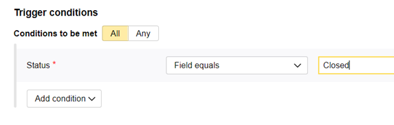

1. Add the **Add comment** action.

1. Use the following code as the comment's text:

   
   ```
   {{=<% %>=}}/iframe/(src="https://forms.yandex.ru/surveys/<form_id>/?iframe=1&<question_id>=<values>" frameborder=0 width=500)
   ```


   Where:
   - `<form id>`: ID of the form to add.

   - `<question_id>`: [ID of the question](../../forms/question-id.md#sec_question).

   - `<value>`: Value to use in the form's field.

      To transfer issue parameters to the form, use [variables](../user/vars.md) as values: at the bottom of the window, click **Add variable** and choose the issue parameter. Then replace the `not_var{{ }}` characters around the name of the variable with `<% %>`.

      For example, to pass the issue key, use the value `<%issue.key%>`. To pass the assignee's login, use `<%issue.assignee.login%>`.

   Here is an example of the code where the issue key is passed to a field of the form.

   
   ```
   {{=<% %>=}}/iframe/(src="https://forms.yandex.ru/surveys/68417/?iframe=1&answer_short_text_584943=<%issue.key%>" frameborder=0 width=100% height=660px scrolling=no)
   ```


1. Click  and in the **Invite users from field** line, enter <q>Assignee</q>.

1. Enable **Send as robot**.


1. Click **Create** to save the trigger.

#### Step 3. Add yndx-forms-cnt-robot@ to the queue

To ensure the form is inserted correctly, provide access to the queue for the yndx-forms-cnt-robot@ robot. To learn more about setting up access, see [Setting access rights for queues](queue-access.md).


When the issue is closed, the robot will create a comment with a form and invite the assignee to comment.

## Automatically adding issues to your board {#board}

The [new board version](agile-new.md) allows you to set up adding issues automatically by a filter or [trigger](trigger-examples.md#board).

Instead of a trigger, you can also [set up an auto action](../user/create-autoaction.md) with a similar condition and action. When using an auto action, the issues meeting the condition won't be added to the board immediately, but at a given periodicity.



Triggers and auto actions only work for issues from the queue where they have been set up.




Let's take an example of a trigger that will add an issue to the board when it's assigned to a certain user:

1. Go to the queue settings, open the **Triggers** section, and click [**Create trigger**](../user/create-trigger.md).

1. Enter a name for the trigger.

1. Set the condition: **Assignee** → **Field value became equal to** → `<Username>`.

   

   The trigger with this condition will also fire when an issue is created with the specified assignee.

   

1. Set up the action:

   1. Select the action **Update fields**.

   1. Select the **Boards** field.

   1. Select the action: **Add to list** and specify the board where do you need to add an issue.

   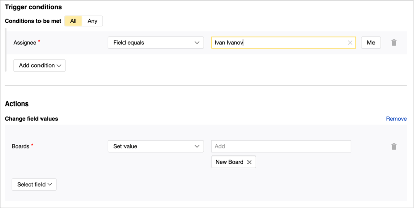

1. Save your trigger.

## Sending notifications to instant messengers {#section_vsn_mb2_d3b}

By using messengers, you can quickly notify your employees about important events. If a messenger has an API, you can use {{ tracker-name }} to set up a trigger that sends HTTP requests to the messenger API when certain events occur. For example, this might be handy when a severe error occurs in your queue.

To view examples for setting up triggers that send notifications to Slack and Telegram, see [{#T}](../messenger.md).

## Automatically calculating the difference between dates {#tracker_data}

Let's set up a trigger to automatically calculate the difference between dates in {{ tracker-name }}:

1. Go to the queue settings, open the **Triggers** section, and click [**Create trigger**](../user/create-trigger.md).

1. Enter a name for the trigger.

1. Select the option **Conditions to be met** → **All**.

1. Add the condition **Event** → **Formula fields changed**.

   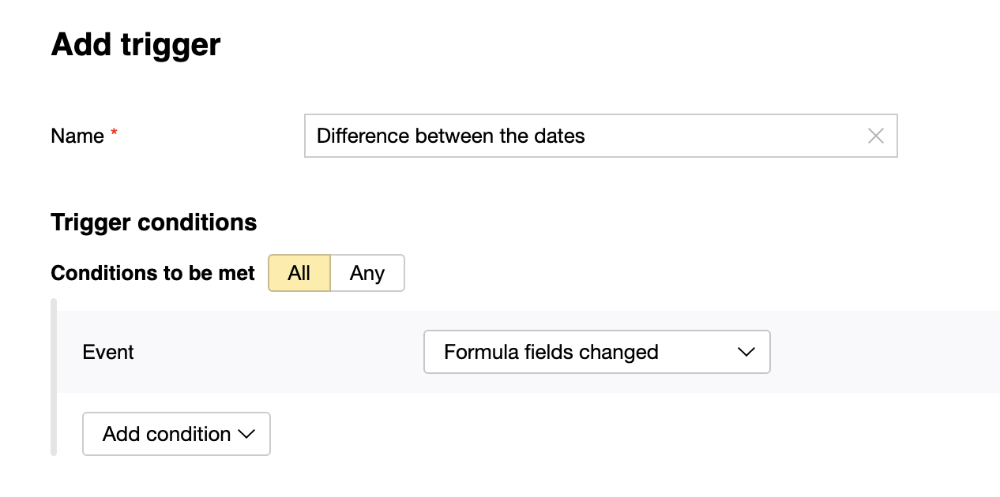

1. Set the actions for the trigger:

   1. Add the value **Calculate value**.

   1. To get the difference of dates, in days, specify the following in the **Enter a formula to calculate the value** field:

      ```
      (not_var{{issue.end.unixEpoch}}-not_var{{issue.start.unixEpoch}})/86400000
      ```

   1. Select **Calculated field** from the [list]({{ link-admin-fields}}).

      You can select one of the standard fields or [create a new](../user/create-param.md) one, such as **Duration**:

      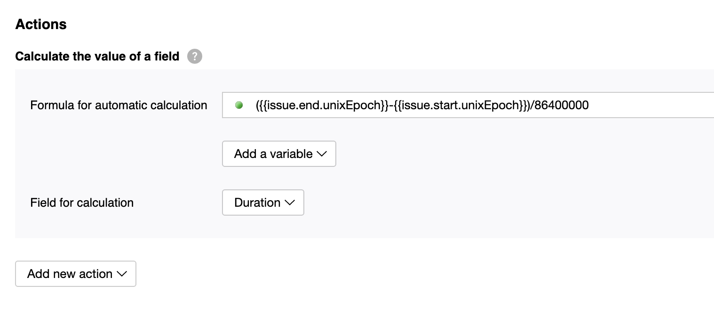

1. Click **Create** to save the trigger.

To test the trigger, change the values in the **Start date** and **End date** fields.


## Creating a sub-issue and writing field values from its parent issue to it {#create-ticket-with-params}

As an example, let's assume we need a trigger that creates a sub-issue and fills out its fields with values from the original issue. You can set up auto creation of issues like this using a trigger and [{{ api-name }}](../about-api.md):

1. Go to the queue settings, open the **Triggers** section, and click [**Create trigger**](../user/create-trigger.md).

1. Select [trigger conditions](../user/set-condition.md).

1. Select [**HTTP request**](../user/set-action.md#create-http) as a target action.

1. Specify the request parameters. In the **Request body** field, set the parameters of a new sub-issue. To substitute the values from the original issue, use [variables](../user/vars.md):

    #|
    || **Field** | **Content** ||
    || Method | POST ||
    || Address | `{{ host }}/{{ ver }}/issues` ||
    || Authorization method | OAuth 2.0 ||
    || Token | [How to get a token](../concepts/access.md#section_about_OAauth) ||
    || Authorization header | Authorization ||
    || Token type | OAuth ||
    || Content type | application/json ||
    || Request body |

    > Example: Creating a sub-issue and transmitting to it field values from the original issue, such as description, assignee, followers, and tags.
    >
    > ```
    > {
    >    "summary": "Issue name",
    >    "queue": "<Key of the queue to create a new issue in>",
    >    "description": not_var{{issue.description.json}},
    >    "links": [
    >        {
    >            "relationship": "is subtask for",
    >            "issue": "not_var{{issue.key}}"
    >        }
    >    ],
    >    "assignee": "not_var{{issue.assignee.login}}",
    >    "tags": not_var{{issue.tags.json}},
    >    "followers": not_var{{issue.followers.uid.json}}
    > }
    > ```
    For more information about the request, see [{#T}](../concepts/issues/create-issue.md) and [{#T}](../concepts/issues/link-issue.md). ||
    || Headers | Header: `X-Org-ID`.
    Value: Organization ID. The ID is shown in the **Organization ID for API** field on the [{{ tracker-name }} settings]({{ link-settings }}) page. ||
    |#

    

    Make sure the parameters you send to the request body using variables are set in the original issue; otherwise, the trigger will not work.

    

1. Click **Create**.
