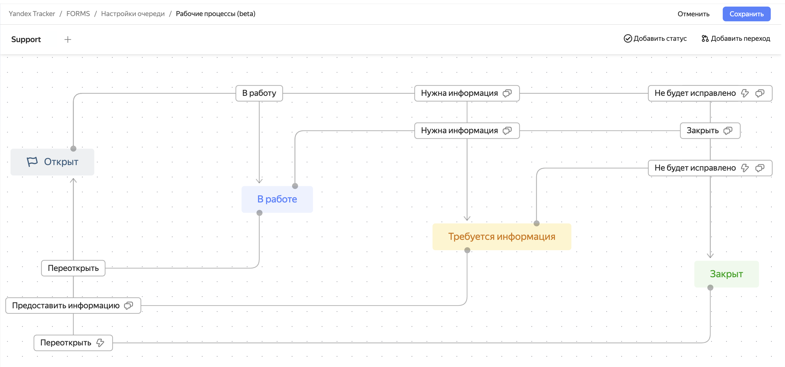

# Overview

A workflow in a queue is a set of statuses that change at different stages of issue progress and rules for making transitions between the statuses.

## Workflow components {#inside-the-workflow}

A workflow is characterized by the following {{ tracker-name }} entities:

* [Issue types](add-ticket-type.md): Queue may contain multiple issue types, such as **New feature**, **Improvement**, or **Bug**. Workflows are set up for specific issue types in the queue. This allows considering the specifics of issue types and creating a convenient workflow for each type.
* Issue [statuses](workflow-status-edit.md) and [resolutions](create-resolution.md): A workflow defines the statuses for the selected type of issues and the resolutions to close them with.
* [Transitions](workflow-action-edit.md) between statuses: Using transitions, you can set up both elementary rules for issue status updates and auto actions to be performed at status update, as well as transition screens for users to fill in some issue fields.

In the workflow visual editor's diagram, statuses are represented as blocks of a larger size filled in color matching the [status types](./workflow-status-edit.md#status-types), while small transparent blocks indicate transitions between the statuses.

## Where are queue workflows located? {#where-workflows}

Workflows are stored in queue settings, so they can only be accessed by the queue owner and users granted [permission to access the queue settings](queue-access.md).

To view the queue workflows:

1. In the {{ tracker-name }} panel on the left, click Queues and go to the queue page.

1. In the top-right corner, click  **{{ ui-key.startrek.ui_Queues_pages_PageQueue_header.settings }}**.

1. Go to the **{{ ui-key.startrek.ui_Queues_pages_page-queue-admin_QueueAdminPageContent.menu-item-workflows }}** tab.

It shows the list of all the queue workflows.

## Do I need to create a workflow immediately when creating a queue? {#first-process}

No, when [a queue is being created](create-queue.md), a [template with a standard workflow](workflows.md) is used. This workflow immediately applies to the queue issues. The queue owner can use the workflow editor's diagram to see the workflow components, adjust it, or create new workflows for new issue types.
