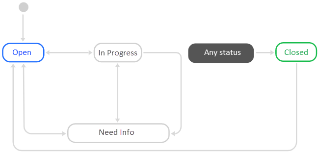
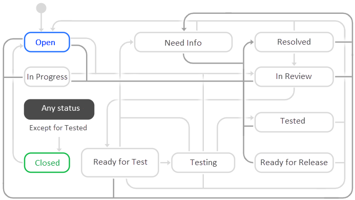
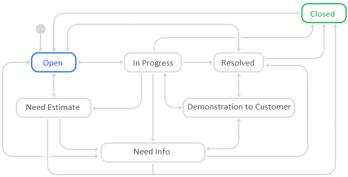
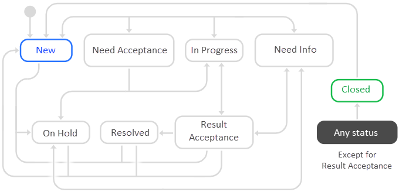
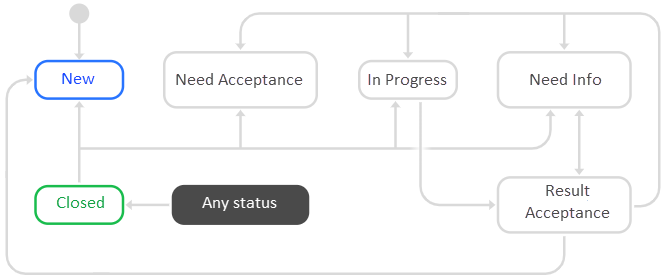
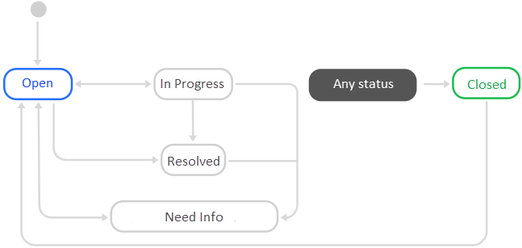
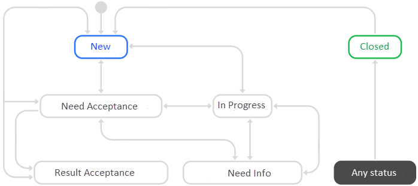
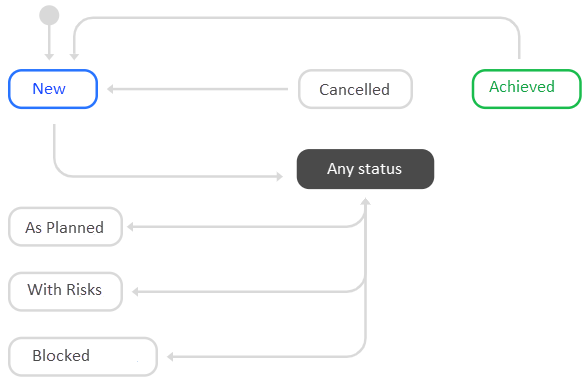

# Queue templates

{{ tracker-name }} offers multiple queue templates for common operations, which make it much easier to manage your issues in {{ tracker-name }}. Queue templates include a [workflow](workflow.md) with preset issue types and statuses. Some templates have an [issue board](agile.md#sec_boards) set up.

## Start now {#section_now}

A queue template with an easy-to-use workflow and a great choice for new {{ tracker-name }} users. If you select this template, later you can set up a workflow for your issues.

A [simple issue board](agile.md#sec_boards) is created when you select this template.

The workflow includes one issue type: **{{ ui-key.startrek.blocks-desktop_queue-new-presets.preset--task-type--task }}**.

Issues can have the following statuses:

- **{{ ui-key.startrek-backend.applinks.samsara.status.open }}**.
- **{{ ui-key.startrek-backend.applinks.samsara.status.in.progress }}**.
- **{{ ui-key.startrek-backend.applinks.samsara.status.need.info }}**.
- **{{ ui-key.startrek-backend.applinks.samsara.status.closed }}**.

Possible transitions between statuses:

When an issue is **{{ ui-key.startrek-backend.applinks.samsara.status.closed }}**, the user is asked to leave a comment and choose a resolution:

- **{{ ui-key.startrek-backend.applinks.samsara.resolution.resolved }}**.
- **{{ ui-key.startrek-backend.applinks.samsara.resolution.rejected }}**.
- **{{ ui-key.startrek-backend.applinks.samsara.resolution.duplicate }}**.

## Basic development model {#section_q5d_3rm_qz}

This queue template is optimized for in-house application development, when you do not have any external client for your application.

A [simple issue board](agile.md#sec_boards) is created when you select this template.

The workflow includes issue types:

- **{{ ui-key.startrek.blocks-desktop_queue-new-presets.preset--task-type--task }}**.
- **{{ ui-key.startrek.blocks-desktop_queue-new-presets.preset--task-type--improvement }}**.
- **{{ ui-key.startrek.blocks-desktop_queue-new-presets.preset--task-type--bug }}**.
- **{{ ui-key.startrek.blocks-desktop_queue-new-presets.preset--task-type--release }}**.

Issues can have the following statuses:

- **{{ ui-key.startrek-backend.presets.devPreset.board.column.open }}**.
- **{{ ui-key.startrek-backend.applinks.samsara.status.in.progress }}**.
- **{{ ui-key.startrek-backend.presets.developmentPreset.board.column.need.info }}**.
- **{{ ui-key.startrek-backend.presets.developmentPreset.board.column.review }}**.
- **{{ ui-key.startrek-backend.presets.developmentPreset.board.column.ready.for.test }}**.
- **{{ ui-key.startrek-backend.presets.developmentPreset.board.column.testing }}**.
- **{{ ui-key.startrek-backend.applinks.samsara.status.resolved }}**.
- **{{ ui-key.startrek-backend.presets.developmentPreset.board.column.tested }}**.
- **{{ ui-key.startrek-backend.presets.developmentPreset.board.column.release.candidate }}**.
- **{{ ui-key.startrek-backend.presets.devPreset.board.column.closed }}**.

Possible transitions between statuses:

When an issue is **{{ ui-key.startrek-backend.presets.devPreset.board.column.closed }}**, the user is asked to leave a comment and choose a resolution:

- **{{ ui-key.startrek-backend.applinks.samsara.resolution.resolved }}**
- **{{ ui-key.startrek-backend.applinks.samsara.resolution.rejected }}**
- **Can't reproduce**
- **{{ ui-key.startrek-backend.applinks.samsara.resolution.duplicate }}**
- **Later**

## Software development as a service {#sec_outsource_dev}

This queue template is optimized for developing applications for external customers.

The workflow includes issue types:

- **{{ ui-key.startrek.blocks-desktop_queue-new-presets.preset--task-type--task }}**
- **{{ ui-key.startrek.blocks-desktop_queue-new-presets.preset--task-type--improvement }}**
- **{{ ui-key.startrek.blocks-desktop_queue-new-presets.preset--task-type--bug }}**
- **{{ ui-key.startrek.blocks-desktop_queue-new-presets.preset--task-type--project }}**

Issues can have the following statuses:

- **{{ ui-key.startrek-backend.presets.devPreset.board.column.open }}**
- **{{ ui-key.startrek-backend.presets.developmentPreset.board.column.need.info }}**
- **Need estimate**
- **{{ ui-key.startrek-backend.presets.devPreset.board.column.in.progress }}**
- **{{ ui-key.startrek-backend.applinks.samsara.status.resolved }}**
- **Demonstration to customer**
- **{{ ui-key.startrek-backend.presets.developmentPreset.board.column.release.candidate }}**
- **{{ ui-key.startrek-backend.presets.devPreset.board.column.closed }}**

Possible transitions between statuses:

When an issue is **{{ ui-key.startrek-backend.presets.devPreset.board.column.closed }}**, the user is asked to leave a comment and choose a resolution:

- **{{ ui-key.startrek-backend.applinks.samsara.resolution.resolved }}**
- **{{ ui-key.startrek-backend.applinks.samsara.resolution.rejected }}**
- **Can't reproduce**
- **{{ ui-key.startrek-backend.applinks.samsara.resolution.duplicate }}**

## Scrum {#sec_scrum}

This queue template fits the [Scrum]({{ link-wiki-scrum }}) methodology.

A [<q>Scrum</q> issue board](agile.md#sec_boards) is automatically created when you select this template. It allows you to plan [sprints](create-agile-sprint.md), [estimate issues](planning-poker.md), and view [burn down charts](burndown.md).

The workflow includes issue types:

- **{{ ui-key.startrek.blocks-desktop_queue-new-presets.preset--task-type--task }}**
- **{{ ui-key.startrek.blocks-desktop_queue-new-presets.preset--task-type--bug }}**
- **{{ ui-key.startrek.blocks-desktop_queue-new-presets.preset--task-type--epic }}**
- **{{ ui-key.startrek.blocks-desktop_queue-new-presets.preset--task-type--story }}**

Issues can have the following statuses:

- **{{ ui-key.startrek-backend.presets.devPreset.board.column.open }}**
- **{{ ui-key.startrek-backend.presets.scrumDevelopmentPreset.board.column.in.progress }}**
- **{{ ui-key.startrek-backend.presets.scrumDevelopmentPreset.board.column.need.info }}**
- **{{ ui-key.startrek-backend.presets.scrumDevelopmentPreset.board.column.review }}**
- **{{ ui-key.startrek-backend.presets.scrumDevelopmentPreset.board.column.ready.for.test }}**
- **{{ ui-key.startrek-backend.presets.scrumDevelopmentPreset.board.column.testing }}**
- **{{ ui-key.startrek-backend.applinks.samsara.status.resolved }}**
- **{{ ui-key.startrek-backend.presets.scrumDevelopmentPreset.board.column.tested }}**
- **{{ ui-key.startrek-backend.presets.scrumDevelopmentPreset.board.column.release.candidate }}**
- **{{ ui-key.startrek-backend.presets.devPreset.board.column.closed }}**

Possible transitions between statuses:

When an issue is **{{ ui-key.startrek-backend.presets.devPreset.board.column.closed }}**, the user is asked to leave a comment and choose a resolution:

- **{{ ui-key.startrek-backend.applinks.samsara.resolution.resolved }}**
- **{{ ui-key.startrek-backend.applinks.samsara.resolution.rejected }}**
- **{{ ui-key.startrek-backend.applinks.samsara.resolution.duplicate }}**

## Kanban {#section_lnl_jrm_qz}

This queue template fits the [Kanban]({{ link-wiki-kanban }}) methodology.

A [<q>Kanban</q> issue board](agile.md#sec_boards) is created when you select this template.

The workflow includes issue types:

- **{{ ui-key.startrek.blocks-desktop_queue-new-presets.preset--task-type--task }}**
- **{{ ui-key.startrek.blocks-desktop_queue-new-presets.preset--task-type--bug }}**
- **{{ ui-key.startrek.blocks-desktop_queue-new-presets.preset--task-type--epic }}**
- **{{ ui-key.startrek.blocks-desktop_queue-new-presets.preset--task-type--story }}**

Issues can have the following statuses:

- **{{ ui-key.startrek-backend.presets.devPreset.board.column.open }}**
- **{{ ui-key.startrek-backend.presets.kanbanDevelopmentPreset.board.column.in.progress }}**
- **{{ ui-key.startrek-backend.presets.kanbanDevelopmentPreset.board.column.need.info }}**
- **{{ ui-key.startrek-backend.presets.kanbanDevelopmentPreset.board.column.review }}**
- **{{ ui-key.startrek-backend.presets.kanbanDevelopmentPreset.board.column.ready.for.test }}**
- **{{ ui-key.startrek-backend.presets.kanbanDevelopmentPreset.board.column.testing }}**
- **{{ ui-key.startrek-backend.applinks.samsara.status.resolved }}**
- **{{ ui-key.startrek-backend.presets.kanbanDevelopmentPreset.board.column.tested }}**
- **{{ ui-key.startrek-backend.presets.kanbanDevelopmentPreset.board.column.release.candidate }}**
- **{{ ui-key.startrek-backend.presets.devPreset.board.column.closed }}**

Possible transitions between statuses:

When an issue is **{{ ui-key.startrek-backend.presets.devPreset.board.column.closed }}**, the user is asked to leave a comment and choose a resolution:

- **{{ ui-key.startrek-backend.applinks.samsara.resolution.resolved }}**
- **{{ ui-key.startrek-backend.applinks.samsara.resolution.rejected }}**
- **{{ ui-key.startrek-backend.applinks.samsara.resolution.duplicate }}**

## Services {#section_service}

This queue template is good for the organizations that provide services to companies and private clients.

The workflow includes issue types:

- **{{ ui-key.startrek.blocks-desktop_queue-new-presets.preset--task-type--task }}**
- **{{ ui-key.startrek.blocks-desktop_queue-new-presets.preset--task-type--project }}**

Issues can have the following statuses:

- **{{ ui-key.startrek-backend.applinks.samsara.status.new }}**
- **{{ ui-key.startrek-backend.applinks.samsara.status.need.info }}**
- **Awaiting confirmation**
- **{{ ui-key.startrek-backend.applinks.samsara.status.in.progress }}**
- **Awaiting approval**
- **{{ ui-key.startrek-backend.applinks.samsara.resolution.resolved }}**
- **{{ ui-key.startrek-backend.applinks.samsara.status.on.hold }}**
- **{{ ui-key.startrek-backend.applinks.samsara.status.closed }}**

Possible transitions between statuses:

When an issue is **{{ ui-key.startrek-backend.applinks.samsara.status.closed }}**, the user is asked to leave a comment and choose a resolution:

- **{{ ui-key.startrek-backend.applinks.samsara.resolution.resolved }}**
- **{{ ui-key.startrek-backend.applinks.samsara.resolution.rejected }}**
- **{{ ui-key.startrek-backend.applinks.samsara.resolution.duplicate }}**

## Production {#section_production}

This queue template is good for the companies and departments that produce tangible products.

The workflow includes issue types:

- **{{ ui-key.startrek.blocks-desktop_queue-new-presets.preset--task-type--task }}**
- **{{ ui-key.startrek.blocks-desktop_queue-new-presets.preset--task-type--project }}**

Issues can have the following statuses:

- **{{ ui-key.startrek-backend.applinks.samsara.status.new }}**
- **{{ ui-key.startrek-backend.applinks.samsara.status.need.info }}**
- **Awaiting confirmation**
- **{{ ui-key.startrek-backend.applinks.samsara.status.in.progress }}**
- **Awaiting approval**
- **{{ ui-key.startrek-backend.applinks.samsara.status.closed }}**

Possible transitions between statuses:

When an issue is **{{ ui-key.startrek-backend.applinks.samsara.status.closed }}**, the user is asked to leave a comment and choose a resolution:

- **{{ ui-key.startrek-backend.applinks.samsara.resolution.resolved }}**
- **{{ ui-key.startrek-backend.applinks.samsara.resolution.rejected }}**
- **{{ ui-key.startrek-backend.applinks.samsara.resolution.duplicate }}**

## Marketing and advertising {#section_marketing}

This queue template is good for the companies and departments that run marketing campaigns.

A [simple issue board](agile.md#sec_boards) is created when you select this template.

The workflow includes issue types:

- **{{ ui-key.startrek.blocks-desktop_queue-new-presets.preset--task-type--task }}**
- **{{ ui-key.startrek.blocks-desktop_queue-new-presets.preset--task-type--project }}**

Issues can have the following statuses:

- **{{ ui-key.startrek-backend.applinks.samsara.status.open }}**
- **{{ ui-key.startrek-backend.applinks.samsara.status.in.progress }}**
- **{{ ui-key.startrek-backend.applinks.samsara.status.need.info }}**
- **{{ ui-key.startrek-backend.applinks.samsara.resolution.resolved }}**
- **{{ ui-key.startrek-backend.applinks.samsara.status.closed }}**

Possible transitions between statuses:

When an issue is **{{ ui-key.startrek-backend.applinks.samsara.status.closed }}**, the user is asked to leave a comment and choose a resolution:

- **{{ ui-key.startrek-backend.applinks.samsara.resolution.resolved }}**
- **{{ ui-key.startrek-backend.applinks.samsara.resolution.rejected }}**
- **{{ ui-key.startrek-backend.applinks.samsara.resolution.duplicate }}**

## Document flow {#section_docflow}

This queue template is designed for the document approval process.

The workflow includes one issue type: **{{ ui-key.startrek.blocks-desktop_queue-new-presets.preset--task-type--task }}**.

Issues can have the following statuses:

- **{{ ui-key.startrek-backend.applinks.samsara.status.new }}**
- **{{ ui-key.startrek-backend.applinks.samsara.status.need.info }}**
- **Awaiting confirmation**
- **{{ ui-key.startrek-backend.applinks.samsara.status.in.progress }}**
- **Documents ready**
- **{{ ui-key.startrek-backend.applinks.samsara.status.on.hold }}**
- **{{ ui-key.startrek-backend.applinks.samsara.status.closed }}**

Possible transitions between statuses:

When an issue is **{{ ui-key.startrek-backend.applinks.samsara.status.closed }}**, the user is asked to leave a comment and choose a resolution:

- **{{ ui-key.startrek-backend.applinks.samsara.resolution.resolved }}**
- **{{ ui-key.startrek-backend.applinks.samsara.resolution.rejected }}**
- **{{ ui-key.startrek-backend.applinks.samsara.resolution.duplicate }}**

## HR processes {#section_hr}

This queue template is designed for the HR department issues.

The workflow includes issue types:

- **{{ ui-key.startrek.blocks-desktop_queue-new-presets.preset--task-type--absence }}**
- **{{ ui-key.startrek.blocks-desktop_queue-new-presets.preset--task-type--mission }}**
- **{{ ui-key.startrek.blocks-desktop_queue-new-presets.preset--task-type--changes }}**
- **{{ ui-key.startrek.blocks-desktop_queue-new-presets.preset--task-type--documents }}**
- **{{ ui-key.startrek.blocks-desktop_queue-new-presets.preset--task-type--request }}**

Issues can have the following statuses:

- **{{ ui-key.startrek-backend.applinks.samsara.status.new }}**
- **{{ ui-key.startrek-backend.applinks.samsara.status.need.info }}**
- **Awaiting confirmation**
- **{{ ui-key.startrek-backend.applinks.samsara.status.in.progress }}**
- **Documents ready**
- **{{ ui-key.startrek-backend.applinks.samsara.status.on.hold }}**
- **{{ ui-key.startrek-backend.applinks.samsara.status.closed }}**

Possible transitions between statuses:

When an issue is **{{ ui-key.startrek-backend.applinks.samsara.status.closed }}**, the user is asked to leave a comment and choose a resolution:

- **{{ ui-key.startrek-backend.applinks.samsara.resolution.resolved }}**
- **{{ ui-key.startrek-backend.applinks.samsara.resolution.rejected }}**
- **{{ ui-key.startrek-backend.applinks.samsara.resolution.duplicate }}**

## Staffing and recruitment {#section_hire}

This queue template is designed for the recruitment process.

The workflow includes issue types:

- **{{ ui-key.startrek.blocks-desktop_queue-new-presets.preset--task-type--vacancy }}**
- **{{ ui-key.startrek.blocks-desktop_queue-new-presets.preset--task-type--candidate }}**

Issues can have the following statuses:
- **{{ ui-key.startrek-backend.applinks.samsara.status.new }}**
- **{{ ui-key.startrek-backend.applinks.samsara.status.need.info }}**
- **Awaiting confirmation**
- **{{ ui-key.startrek-backend.applinks.samsara.status.in.progress }}**
- **Awaiting approval**
- **{{ ui-key.startrek-backend.applinks.samsara.status.on.hold }}**
- **{{ ui-key.startrek-backend.applinks.samsara.status.closed }}**

Possible transitions between statuses:

When an issue is **{{ ui-key.startrek-backend.applinks.samsara.status.closed }}**, the user is asked to leave a comment and choose a resolution:

- **{{ ui-key.startrek-backend.applinks.samsara.resolution.resolved }}**
- **{{ ui-key.startrek-backend.applinks.samsara.resolution.rejected }}**
- **{{ ui-key.startrek-backend.applinks.samsara.resolution.duplicate }}**

## Goal management {#section_goals}

This queue template is designed for setting the corporate or departmental goals and controlling the goal achievement.

The workflow includes issue types:

- **{{ ui-key.startrek.blocks-desktop_queue-new-presets.preset--task-type--task }}**
- **{{ ui-key.startrek.blocks-desktop_queue-new-presets.preset--task-type--project }}**

Issues can have the following statuses:

- **{{ ui-key.startrek.lib_goals-info.status--NEW }}**
- **{{ ui-key.startrek.lib_goals-info.status--PLANNED }}**
- **{{ ui-key.startrek.lib_goals-info.status--RISK }}**
- **{{ ui-key.startrek.lib_goals-info.status--CANCELLED }}**
- **{{ ui-key.startrek.lib_goals-info.status--REACHED }}**
- **{{ ui-key.startrek.lib_goals-info.status--BLOCKED }}**

Possible transitions between statuses:

When an issue is **{{ ui-key.startrek-backend.applinks.samsara.status.closed }}**, the user is asked to leave a comment and choose a resolution:

- **Success**
- **Goal exceeded**
- **{{ ui-key.startrek-backend.applinks.samsara.resolution.duplicate }}**
- **Later**
- **Won't resolve**
