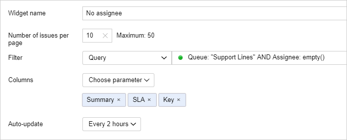
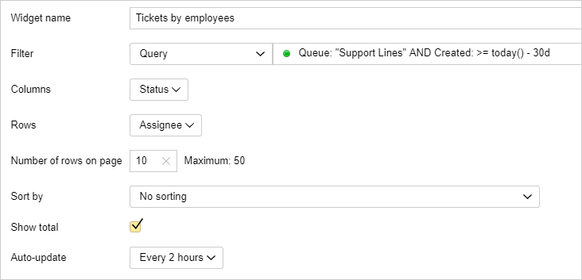
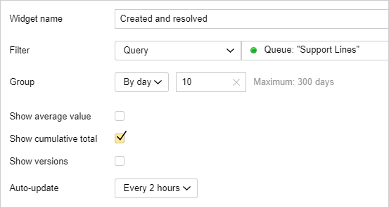
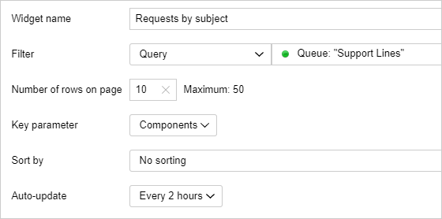

# Collecting request statistics

Managers and staff members of the support team often require various kinds of information about the ongoing issues as well as statistics on previously resolved requests. In {{ tracker-name }}, you can view all relevant information and statistics on a dashboard. First, [create a dashboard](user/create-dashboard.md#section_cv2_ck3_pz)and then add [widgets](user/widgets.md#section_ll1_zdp_pz). These may include issue lists, tables, and charts, all of which are created automatically based on filters.

For example, a manager can add to their dashboard a list of requests with no assignee and the statistics of opened and closed requests over a period. A support representative would probably need a list of issues assigned to them and a list of issues without an assignee that need to be accepted.

Let's look at the examples of widgets for support:

### My issues {#widget-my-tickets}

To the personal dashboard of a support representative, add the widget with a list of issues assigned to the representative:

1. On the dashboard page, click  → **Edit**.

1. Add an **Issues** widget.

1. In the **Filter** field, select **Query** and enter the [query text](user/query-filter.md#query-format):

   ```
   Queue: "<queue_name>" AND Assignee: me() AND Resolution: empty()
   ```

   In the selected queue, this filter will find non-closed issues assigned to you.

1. To display the [SLA rules timer](#sla) in the issue list, add the **{{ ui-key.startrek-backend.types.types.sla.settings }}** parameter to the **Columns** field.

   

1. Save your widget.

### List of unassigned issues {#widget-no-assignee}

To make sure that your support representatives can quickly find the requests without any assignee and accept them, add a list of such issues to the dashboard:

1. On the dashboard page, click  → **Edit**.

1. Add an **Issues** widget.

1. In the **Filter** field, select **Query** and enter the [query text](user/query-filter.md#query-format):

   ```
   Queue: "<queue_name>" AND Assignee: empty()
   ```

   This filter will find issues without an assignee within the selected queue.

1. To display the [SLA rules timer](#sla) in the issue list, add the **{{ ui-key.startrek-backend.types.types.sla.settings }}** parameter to the **Columns** field.

   

1. Save your widget.

### Table with number of issues per assignee {#widget-worker-tasks}

To get statistics about how many issues were assigned to your employees over the past 30 days, add the widget with the following table to your dashboard:

1. On the dashboard page, click  → **Edit**.

1. Add **Summary table** widget.

1. In the **Filter** field, select **Query** and enter the [query text](user/query-filter.md#query-format):

   ```
   Queue: "<queue_name>" AND Created: >= today() - 30d
   ```

   This filter will find all the issues created over the past 30 days within the selected queue.

1. In the **Columns** field, select **Status**, and in the **Rows** field, select **Assignee**. In this case, the table's cells will show the number of issues with a specific status for each assignee.

1. If you want to display the totals by columns and rows, select **Show total**.

   

1. Save your widget.

### Statistics on open and resolved requests {#widget-created-resolved}

To watch the dynamics of creation and resolution of requests, add the following chart to the dashboard:

1. On the dashboard page, click  → **Edit**.

1. Add a **"Created vs. Resolved" Chart** widget.

1. In the **Filter** field, select **Query** and enter the [query text](user/query-filter.md#query-format):

   ```
   Queue: "<queue_name>"
   ```

   This filter will find all the issues inside the selected queue.

1. In the **Group** field, select **By day** and specify the number of days to be displayed on the chart.

1. If you want to display the totals for created and resolved requests on the chart, select **Show total**.

   

1. Save your widget.

### Request statistics by topic {#widget-components}

If you use components to [group issues by topic](#group), you can create a chart that displays issue statistics by components:

1. On the dashboard page, click  → **Edit**.

1. Add an **Issue statistics** widget.

1. In the **Filter** field, select **Query** and enter the [query text](user/query-filter.md#query-format):

   ```
   Queue: "<queue_name>"
   ```

   This filter will find all the issues inside the selected queue.

1. In the **Key parameter** field, select **Components**.

   

1. Save your widget.