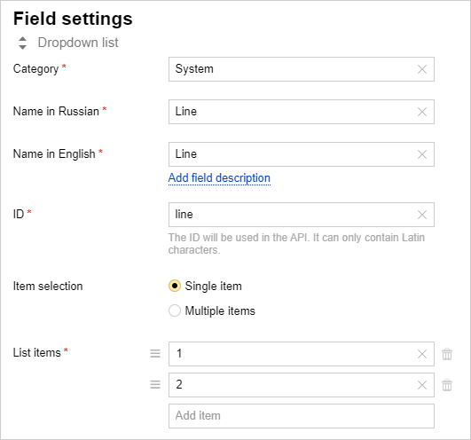
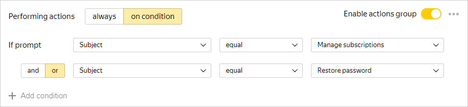
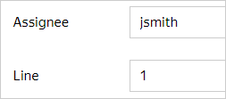
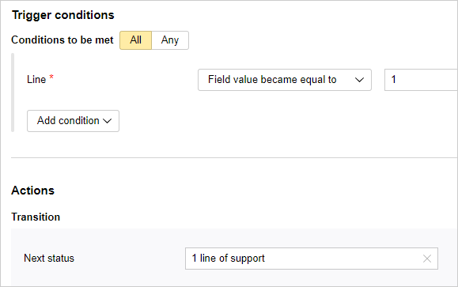

# Configuring multi-tiered support

Support services often use a multi-tiered organization:

- The first support line accepts user requests, collects relevant information, and handles relatively simple problems. The second support line tackles more complex issues.

- The second support line consists of qualified experts that handle complex technical problems.

- Sometimes a third support line can be organized to handle the most complex issues.

You can use {{ tracker-name }} issue statuses to distribute issues between support lines and determine which line they are assigned to. You can also use issue fields to specify support lines for each issue.

## Using statuses

A dedicated issue status can be assigned to each support line. For example, the [<q>Multi-tiered support</q>](manager/workflows.md#section_sup_lines) template includes issue statuses like <q>Support line 1</q> and <q>Support line 2</q>. If you need to set up a third support line, [configure an additional status](manager/workflow.md).

## Using issue fields

Sometimes it may be more convenient to [create a new issue field](user/create-param.md#section_pxn_fp4_xgb). Let's say you [receive user requests via forms](#form) and you want them to be automatically distributed between your two support lines based on the subject of the request. When you create an issue from a form, you can't assign an issue a status that corresponds to any of the support lines, because all new issues automatically have the <q>Open</q> status. However, you can assign values to issue fields provided the request has a specific subject. You can then automatically change issue statuses based on the value in that issue field.

To do this in {{ tracker-name }}:

### Step 1. Create a new issue field

Go to the {{ tracker-name }} settings and [create a new field](user/create-param.md#section_pxn_fp4_xgb) with the following parameters:

- Field type: **Drop-down list**.

- Category: **System**.

- Name: <q>Line</q>. You can specify any English name or issue key, such as Line.

- Item selection: **Single item**.

- List items: 1, 2 (for two-tier support).



### Step 2. Set up a request form

1. Go to [{{ forms-full-name }}]({{ link-forms }}) and create a new form.

1. Add questions that let users provide relevant information necessary to register their request.

    To distribute requests between support lines, add a drop-down list to the <q>Request subject</q> form and specify some common problems.

1. Configure [issue creation in {{ tracker-name }}](../forms/create-task.md) for the first support line in the integration settings:

    1. Configure [notification conditions](../forms/notifications.md). The <q>Request subject</q> list displays subjects that should be tackled by the first support line.

        

    1. Add the <q>Line</q> issue field and set the value to 1.

        

    1. If you want to assign the issue to the employee responsible for the specified support line, specify their username in the **Assignee** field.

    1. Save your integration settings.

1. Add a new notification group and set up the issue creation condition and issue parameters for the second support line in the same way.

1. Save your integration settings.

### Step 3. Set up a condition that triggers a status change

In the support team queue, create two triggers that will be fired if the **Line** field value changes and will update issue statuses:

1. Go to the queue settings, open the **Triggers** section, and click [**Create trigger**](user/create-trigger.md).

1. Add the condition **System** → **Line** → **Field value became equal to** → **1**.

1. Add the action **Change issue status** → **Support line 1**.

1. Save your trigger.

    

1. Create a similar trigger for the second support line.

Issues created via the form will now automatically be distributed between the two support lines based on their subject.

