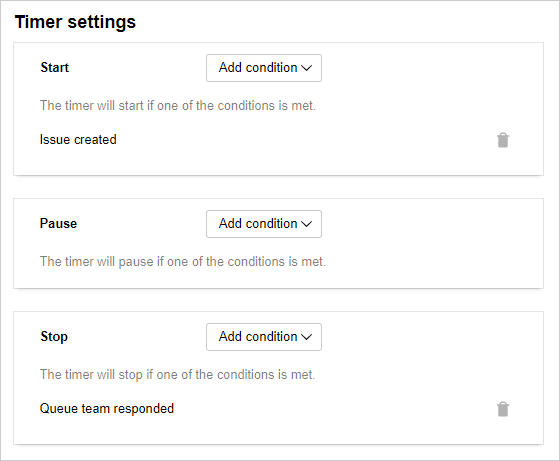
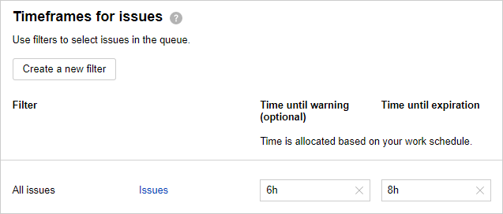
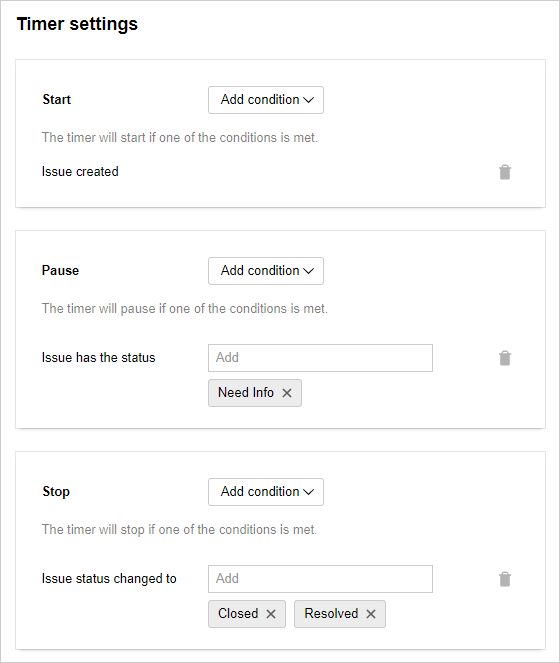

# Tracking the time it takes to process a request

To evaluate effectiveness of their support teams, companies measure their initial response time and the total time spent on request processing. The lower these indicators are, the faster are the user problems resolved.

To manage the response handling time in {{ tracker-name }}, [configure SLA rules](manager/sla.md) for your queue's issues. In the rule, you can specify the acceptable time allocated to resolve the issue and set up a timer to be started and paused on certain events: for example, when the issue is created, when its status changes, when an assignee is appointed, and so on.

Let's set up the SLA rules that will measure the support's initial response time and the total request processing time.

### Initial response time

To measure the support's initial response time, set up a timer that will be started when an issue has been created and stopped when an employee has sent a comment or email from the issue page.

1. Go to **{{ ui-key.startrek.blocks-desktop_b-page-queue-admin.tab-title--sla }}** in the queue settings and click [**{{ ui-key.startrek.blocks-desktop_b-page-queue-admin-tab_type_sla.add-sla }}**](manager/sla.md).

1. Set the rule's name and choose [Work schedule](manager/schedule.md) so that the timer is only active during business hours.

1. Under **{{ ui-key.startrek.blocks-desktop_sla-editor.thresholds--title }}**, set the following parameters for all issues in the queue:

   - Set the time limit for the first response in the **{{ ui-key.startrek.blocks-desktop_sla-editor.thresholds--max }}** field. For example, if you want to set the time to 2 hours and 30 minutes, write `2h 30m`.

   - In the **Time until warning field**, choose a time limit which triggers an automatic email reminder after expiring.

   

   If you want different issue groups to have different time limits, click **{{ ui-key.startrek.blocks-desktop_sla-editor.thresholds--new }}** and set grouping parameters for these issues.

   

   

1. Set up the criteria for starting and stopping the timer:

   1. Under **{{ ui-key.startrek.blocks-desktop_sla-editor.timers--start }}**, add the condition **{{ ui-key.startrek-backend.messages.sla.issue.created.timer.trigger.condition.type }}**.

   1. Under **{{ ui-key.startrek.blocks-desktop_sla-editor.timers--stop }}**, add the condition **{{ ui-key.startrek-backend.messages.sla.team.commented.timer.trigger.condition.type }}**.

   

1. If you want to automatically email the employee responsible for the issue once the first response time expires, under **Notification** → **Overdue time limit**, select **{{ ui-key.startrek-backend.messages.sla.send.mail.threshold.excess.function.type }}**, then specify that employee's name or username.

1. Save the rule.

Now, when an issue has been created in the support queue, a timer will get started. It will count down until a support staff member from the [queue team](manager/queue-team.md) sends a comment or email from the issue page.

### Total request processing time

If you want to measure the total request processing time, set up a timer that triggers during issue creation and stops once the issue status is updated to <q>{{ ui-key.startrek-backend.applinks.samsara.status.resolved }}</q> or <q>{{ ui-key.startrek-backend.applinks.samsara.status.closed }}</q>. You can pause the timer while the issue is in the <q>{{ ui-key.startrek-backend.applinks.samsara.status.need.info }}</q> status to prevent the waiting time from counting towards the total processing time.

1. Go to **{{ ui-key.startrek.blocks-desktop_b-page-queue-admin.tab-title--sla }}** in the queue settings and click [**{{ ui-key.startrek.blocks-desktop_b-page-queue-admin-tab_type_sla.add-sla }}**](manager/sla.md).

1. Set the rule's name and choose [Work schedule](manager/schedule.md) so that the timer is only active during business hours.

1. Under **{{ ui-key.startrek.blocks-desktop_sla-editor.thresholds--title }}**, set the following parameters for all issues in the queue:

   - Set the time limit for resolving the issue in the **{{ ui-key.startrek.blocks-desktop_sla-editor.thresholds--max }}** field. For example, specify `8h` if you want the limit to be 8 working hours.

   - In the **Time until warning field**, choose a time limit which triggers an automatic email reminder after expiring. For example, specify `6h` if you want the limit to be 6 working hours.

   

   If you want different issue groups to have different time limits, click **{{ ui-key.startrek.blocks-desktop_sla-editor.thresholds--new }}** and set grouping parameters for these issues.

   

   

1. Set up the criteria for starting and stopping the timer:

   1. Under **{{ ui-key.startrek.blocks-desktop_sla-editor.timers--start }}**, add the condition **{{ ui-key.startrek-backend.messages.sla.issue.created.timer.trigger.condition.type }}**.

   1. Under **{{ ui-key.startrek.blocks-desktop_b-page-queue-admin-tab_type_sla.sla-condition-pause }}**, add the condition **{{ ui-key.startrek-backend.messages.sla.issue.on.status.timer.trigger.condition.type }}** → **{{ ui-key.startrek-backend.applinks.samsara.status.need.info }}**.

   1. Under **{{ ui-key.startrek.blocks-desktop_sla-editor.timers--stop }}**, add the condition **{{ ui-key.startrek-backend.messages.sla.status.changed.timer.trigger.condition.type }}** and select the **{{ ui-key.startrek-backend.applinks.samsara.status.resolved }}** and **{{ ui-key.startrek-backend.applinks.samsara.status.closed }}** statuses.

   

1. Under **{{ ui-key.startrek.blocks-desktop_sla-editor.excesses--title }}**, set up notifications that trigger once the time limit expires:

   - If you specified the warning time limit under **{{ ui-key.startrek.blocks-desktop_sla-editor.thresholds--title }}**, choose **{{ ui-key.startrek-backend.messages.sla.send.mail.threshold.excess.function.type }}** in the **{{ ui-key.startrek.blocks-desktop_b-page-queue-admin-tab_type_sla.notification-condition-min }}** field and specify the name or username of the employee responsible for the issue. This way, they will receive a notification once the set time limit expires.

   - If you want to automatically email the employee responsible for the issue once the resolution time limit expires, under **Overdue time limit**, select **{{ ui-key.startrek-backend.messages.sla.send.mail.threshold.excess.function.type }}**, then specify that employee's name or username.

1. Save the rule.

Now, when an issue has been created in the support queue, a timer will get started. The timer will be active until the issue status changes to <q>{{ ui-key.startrek-backend.applinks.samsara.status.resolved }}</q> or <q>{{ ui-key.startrek-backend.applinks.samsara.status.closed }}</q>. If a support specialist asks the requester for additional information and updates the issue status to <q>{{ ui-key.startrek-backend.applinks.samsara.status.need.info }}</q>, the timer will be paused and can only be unpaused after another status change.