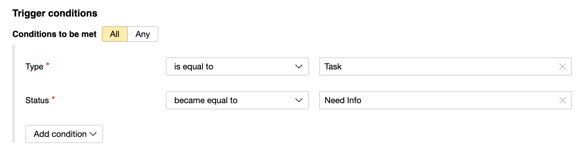
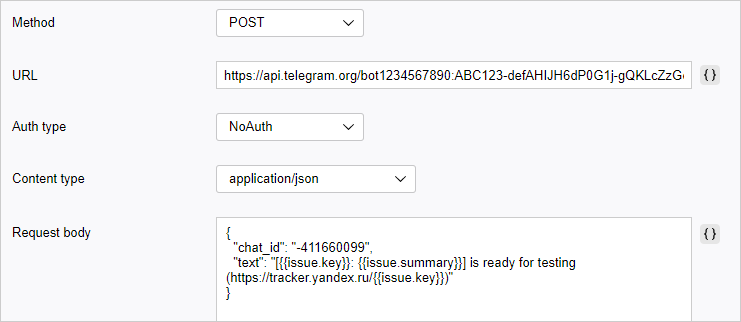

# Telegram

Let's assume that you need to automatically send notifications to the messenger whenever an issue changes its status. You may need it to see when your releases are ready for testing. To do this, [create a trigger](user/trigger.md) that monitors the statuses of issues of the **Issue** type and sends an HTTP request when the issue status changes to **Need info**.

The Telegram messenger uses bots to automatically send messages to group chats and individual users. If you want to transmit {{ tracker-name }} notifications to Telegram, create a Telegram bot and set up a trigger that will send messages through the bot via HTTP requests.

## Step 1. Setting up a Telegram bot {#bot-setup}

1. Create a new Telegram bot:

   1. Add the `@BotFather` bot to your contacts in Telegram and send it a message saying `/start`.

   1. Send the message `/newbot` and follow the instructions: make up a display name for the bot (e.g., `My Company`) and an account name (e.g., `MyCompanyBot`). The account name must end with `bot`.

   In response, you will get a message that the bot has been created successfully. The message will include the token: a secret code that you will need to access your bot over the API. The token follows the `1234567890:ABC123-defHIJ...` format.

1. Add the bot you created to the Telegram group chat you want to send {{ tracker-name }} notifications to.
   If you want to receive {{ tracker-name }} notifications privately, start a chat with the bot.

1. Find out the ID of the Telegram chat where you want to post notifications. You can view this ID by using a dedicated bot, such as `@myidbot`:
   - To find out the ID of a group chat, add the bot to this chat and send it a message saying `/getgroupid`. Please keep in mind that group chat IDs start with a minus sign `-`.
   - You can send private messages using your account ID. To do this, send the bot a private message saying `/getid`.


To learn more about setting up a Telegram bot, please visit [https://core.telegram.org/bots](https://core.telegram.org/bots).

## Step 2. Set up {{ tracker-name }} {#tracker-setup}

1. Log in to {{ tracker-name }}. You must have administrator privileges for the queue for which you want to configure the trigger.

1. 

1. In the top-right corner, click  **Queue settings**.

1. On the left-hand panel, select **Automation** → **Triggers** and click **Create trigger**.

1. Name the trigger, for example, <q>Telegram notifications</q>.

1. Configure trigger conditions so that the trigger is fired when the status of an issue of the **Issue** type changes to **Need info**:

   1. Select the option **Conditions to be met** → **All**.

   1. [Add the condition:](https://cloud.yandex.ru/docs/tracker/user/set-condition) **Type** → **{{ ui-key.startrek-backend.messages.trigger.condition.type.fieldEquals }}** → **Issue**.

   1. Add the condition: **Status** → **{{ ui-key.startrek-backend.messages.trigger.condition.type.fieldBecameEqual }}** → **Need info**.

   

1. Click **Add new action** and choose **HTTP request**.

1. Set up the request:
   - Method: **POST**.
   - Address: `https://api.telegram.org/bot<token>/sendMessage`.
      Where `<token>` is the value of the token you got when [setting up the Telegram bot](#bot-setup).
   - Authorization method: **NoAuth**.
   - Content type: **application/json**.
   - Request body:
      ```
      {
          "chat_id": "<chat_ID>",
          "text": "Need info for issue [not_var{{issue.key}}: not_var{{issue.summary}}]({{ link-tracker }}not_var{{issue.key}})"
      }
      ```
      Where `<chat_ID>` is the chat ID you obtained when [setting up the Telegram bot](#bot-setup).
      To add the issue field values to the request body, click **{ }** to the right of the field and choose the field name.
   - Leave the headers empty.

   

   If you want to use other methods and parameters in your HTTP requests, please refer to the Telegram bot API guide at [https://core.telegram.org/bots/api](https://core.telegram.org/bots/api).

   

   

1. Save your trigger.

To test the trigger in action, change the status of an issue of the **Issue** type to **Need info**. The trigger will send a message to your Telegram chat saying: <q>Need info for issue [TEST-123: Configure triggers]({{ link-tracker-example-1 }})</q>.
