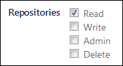

# Bitbucket

In [{{ tracker-name }} issues](../about-tracker.md#zadacha), you can automatically add links to commits from Bitbucket. To do this, specify the appropriate issue's [key](../glossary.md#key) in the commit comment. The links will be placed on the **{{ ui-key.startrek-backend.fields.issue.commits-key-value }}** tab.

## Connecting a repository {#repo}

To connect your repository on [Bitbucket](https://bitbucket.org) to {{ tracker-name }}:

1. 

1. 

1. Choose Bitbucket in the **{{ ui-key.startrek.blocks-desktop_repository-modal.platform }}** field.

1. Create a {{ tracker-name }} password in Bitbucket. {{ tracker-name }} will use this password to connect to your repositories.
   - Log in to Bitbucket.
   - Click on your picture in the lower-left corner and select **Bitbucket settings**.
   - Choose **App passwords** under **Access management**.
   - Click **Create app password**.
   - Think up a name for your password, e.g., `Tracker integration password`.
   - Configure the password's access right. For {{ tracker-name }} to operate properly, make sure to enable the **read** option under **Repositories**:
      
   - Click **Create**.
   - Copy a password to the clipboard.

      

      The password value is displayed only once. If you close the page, you will not be able to view it again.

      

1. Enter the repository address in the `https://bitbucket.org/<repository_owner's_login>/<repository_name>` format and specify your Bitbucket login.

1. Enter the password you used when linking {{ tracker-name }} to Bitbucket. You cannot use your Bitbucket password for this purpose.

1. Click **{{ ui-key.startrek.blocks-desktop_repository-modal.button--connect }}**.

1. Make sure that the repository status in {{ tracker-name }} is **{{ ui-key.startrek.blocks-desktop_page-admin-tab_type_repositories.status--success }}**.



## Own server {#on-premise}


