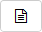

# Add comments to issues

You can use comments to leave notes about progress, ask for additional information, or ask colleagues to join the discussion.



If you keep all your discussions about an issue in the comments section, you will always have access to the full history of what was discussed.



## Leave a comment {#section_c5n_vlv_tz}

To comment on an issue, enter text in the box at the bottom of the page. In the comments section, you can use [wiki markup](wiki-markup.md) and attach images and files.

You can use the comments section to specify a key for a different issue. {{ tracker-name }} will then link the issue automatically.



If you need to paste a link to another issue in your comment without actually linking the issues together, include the `st:` parameter before the issue key (for example: `st:TEST-1234`). If you do this, a [magic link](wiki.md#magic-link-descr) will be displayed in the text field, but you won't link issues together.
You can disable automatic linking for issues from different queues in the [queue settings](../manager/edit-queue-general.md).



If you close or refresh the page without sending your comment, it is still stored in drafts. You can restore the comment text by clicking  in the toolbar above the comment box and choosing the draft.

## Reply to comments {#section_lw4_3mv_tz}

To respond to someone's comment, hover over it and click **Reply**.

## Edit comments {#section_m3y_3pv_tz}

1. Hover over the comment and click **Edit**.

1. Make your changes and click **Save**.

All changes to comments are stored in the [History](history.md).

## Invite to comment {#section_nl2_1qv_tz}

To invite other users to discuss the issue:

1. Above the comment box, click  .

1. Enter the login or name of the user you want to invite in the comments. You can invite multiple users at once.

1. Enter the comment text.

1. Click **Submit**.

Users invited to comment are notified by mail, with their names added to the **Pending reply from** issue field.



If you add a user in the **Pending reply from** field without inviting them when sending your comment, that user won't receive an email notification.



## Attaching a file {#sec_file}

Drag files to the comment box or click **Choose files**.

To insert images attached to an issue in the comment text, click .



## Send comments to a user's email address {#section_zpd_ph5_wdb}

You can send emails to in-house and outside users directly from the issue page. The message text is attached to the issue as a comment.



Comments can only be sent to **outside users** if the [queue settings](../manager/edit-queue-general.md) allow it.



To send an email from the issue page:

1. Click **Email** under the issue name.

1. Choose an address to send your email from:

    

    - Queue address

        You can use this option if the queue has [a dedicated email address](../manager/queue-mail.md).

        The <q>From</q> field will only display the queue address. Responses to such emails are turned into comments for the corresponding issue.

        You can set up a **Nickname** to communicate with outside users. Create one or more nicknames in the [queue email address](../manager/queue-mail.md) settings.

    - Your own address

        The <q>From</q> field will display your name and address.

    

1. Specify your recipient and write your message.

1. Click **Submit**.

Responses to such emails are turned into comments for the corresponding issue automatically.



## Share a comment {#section_cc2_rm1_wz}

You can share a direct link to a specific comment with colleagues. To get the link, click on the date in the top right corner of the comment and copy the contents of the browser address bar.



## Convert a comment into an email message {#section_zmr_mxt_52b}

Respond to any notification about the change in an issue's status to create a comment via email:

1. Open an email with a notification about a change with an issue.

1. Write the comment text in the message body.

1. Click **Submit**.

The comment will be created automatically after the message has been sent.



## Use templates {#section_pt4_qmv_tz}

#### Creating a template

If you frequently leave similar comments, make a template for them. You can create a template on the [special page](ticket-template.md) or from the comment text:

1. Enter the comment that you want to make a template.

1. Click .

1. Select **Create template using this comment** in the drop-down list.

1. Enter a name for the template.

1. If you want the template to only be available in this queue, select the option **Only for this queue**.

1. Click **Create**.

#### Use a template

To create a comment from a template:

1. Make sure that the comments field does not contain any text.

1. Click .

1. Select a template from the drop-down list and click **Choose**.

1. If necessary, edit the comment. To publish it, click **Submit**.

## Create an issue based on a comment {#section_wtn_jsv_tz}

If the discussion of an issue leads to creating a new issue, you can create it directly from the comment:

1. Click the comment that the new issue will be based on.

1. Click **Create issue** and choose the type of relationship between the two issues.

1. Fill in the fields the same way as when [creating an issue](create-ticket.md#section_bh1_44f_mz).

1. Click **Create**.

## Sort comments {#section_nw1_435_xgb}

Comments are listed chronologically by default. If you want to place the most recent comments at the start of the chain, do the following:

1. On the {{ tracker-name }} top panel, click  → **Personal settings**.On the {{ tracker-name }} top panel, click on your profile picture and select **Personal settings** or follow the link: [https://st.yandex-team.ru/settings]({{ link-settings-ya }})

    

    

    You can also follow this link: [https://tracker.yandex.ru/settings]({{ link-settings }}).

    

    

1. In the **Message order in issues** section, select **Newest first**.

1. Click **Save**.

All issue changelogs on the **History** tab will also change their order to newest first.



[Contact support](../troubleshooting.md)



