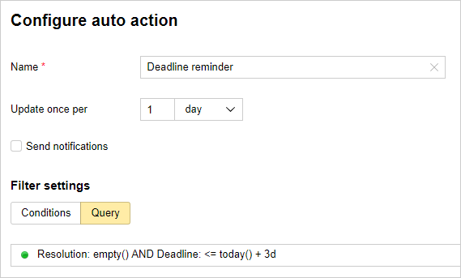
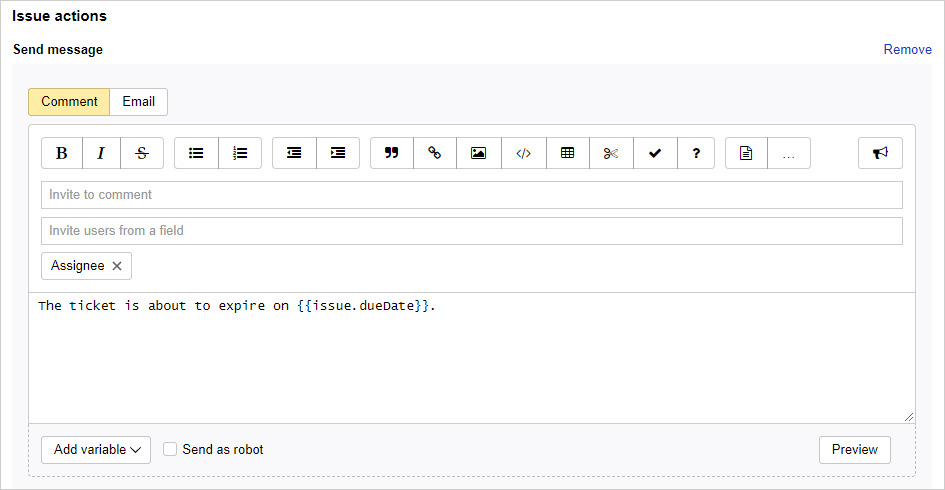

# Automatic issue updates

You can use {{ tracker-name }} to automatically update issues that match a certain filter. For example, you can use an auto action to check issues with specific components once every hour and set an assignee for them if the assignee is missing. You can also invite responsible employees to comment if the issue hasn't been updated for a long time.



When an auto action is triggered, only the first 100 issues that meet the specified criteria are processed.



## Configuring automatic issue updates {#section_eh1_zlr_kgb}

1. 

1. In the top-right corner, click  **{{ ui-key.startrek.ui_components_PageQueue_header.settings }}**.

1. In the left-hand panel, select **Automation** → **Auto actions** and click **Create auto action**.

1. Select the **Update issues** type.

1. Set the name for the auto action.

1. Set the interval of automatic update of issues in hours or days.

1. To select the issues that the auto action will apply to, set up the filter parameters using one of the methods:
   - Click **Add condition**, choose your issue's field, and specify its value.

      You can add multiple conditions if needed. The auto action will trigger if all the conditions hold at the same time.
   - Click **Query** and set a condition using the [query language](query-filter.md).

1. Set one or several actions on the issue.

   - **Change issue status**

      Set a new issue status. The available statuses depend on the [workflow](../manager/workflow-status-edit.md) settings.


      

      Auto actions are performed by a service robot named `yndx-tracker-cnt-robot@`. To enable the robot to update issue statuses:

      - If certain [conditions are set up](../manager/workflow-action-edit.md#section_jrk_hmb_wbb) for status transitions and they restrict user permissions to change a status, add the `yndx-tracker-cnt-robot@` robot to the list of users.

      - If you set up a [transition screen](../manager/workflow-action-edit.md#section_uf2_sks_gcb) for a status update, make sure it doesn't have required fields.

      

   - **Update fields**

      To change values in one or more fields, select the fields and [set their new values](set-action.md#section_mod_fields).

   - **Add comment**

      Write the comment text that will be added to an issue.

      You can insert [values of issue fields](vars.md) into the comment text. To do this, click **Add variable**.

   - **Calculate value**

      You can [set up a special field](set-action.md#section_calc_field) whose values are calculated automatically based on values entered in other fields.

   - **HTTP request**

      You can [send HTTP request](set-action.md#create-http) each time an auto action is triggered.

1. To save an auto action, click **Create**.

## Auto update example {#autoaction_example}

If you want an issue to be completed by a particular date, you can specify it in the **{{ ui-key.startrek-backend.fields.issue.dueDate-key-value }}** field. To make sure that assignees don't forget to complete issues on time, you can use auto updates to remind the assignees a few days before the deadline.

Let's set up a daily auto update to invite the assignee to comment if the deadline is in 3 days or less.

1. Go to the settings of the queue where you want to create an automatic deadline reminder.

1. Under **Auto actions**, click [**Create auto action**](create-autoaction.md#section_eh1_zlr_kgb).

1. Select **Update issues** and name the auto action.

1. Set up the update period of once a day.

1. Set up the condition so that the auto action is triggered on non-resolved issues (without a resolution) if the deadline is in 3 days or less. To do this, go to **Filter settings**, select **Query**, and set a condition using the [query language](query-filter.md):

    ```
    Resolution: empty() AND Deadline: <= today() + 3d
    ```

   

1. Set up the auto action — Inviting the issue assignee to comment:

   1. Click **Add new action** and select **{{ ui-key.startrek-backend.types.types.trigger.action.create.comment }}**.

   1. In the field saying **Invite users from a field**, click  and enter **Assignee**.

   1. Write the text of your comment. You can add issue fields to your comment by clicking **Add variable**.

   

1. Save an auto action.

This auto action will check issues in the queue once a day. If the issue is not resolved and the deadline is less than in 3 days, the assignee will be invited to comment.


