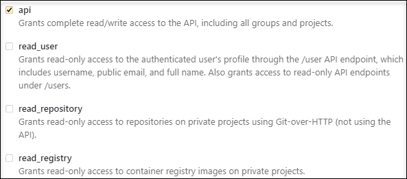

# {{ GL }}

## Setting up a link {#relation}

In [{{ tracker-name }} issues](../about-tracker.md#zadacha), you can automatically add links to [Merge Requests]({{ gl.docs }}/ee/user/project/merge_requests/) from {{ GL }}. To do this, specify the appropriate issue's [key](../glossary.md#key) in the name or description of a new Merge Request. The links will be placed in [{{ ui-key.startrek.ui_components_issue-links_ExternalLinksCollapse.external-relations}}](../external-links.md).

You can also enable automatic creation of issue comments with information about Merge Requests. Auto comments are only available for [{{ mgl-name }}](../../managed-gitlab/).





### See also {#see-also}

* [Manual for integrating {{ GL }} with {{ tracker-full-name }}](../../managed-gitlab/tutorials/tracker-integration.md)

## Connecting a repository {#repo}

To connect your repository on [GitLab](https://gitlab.com) to {{ tracker-name }}:



Private repositories can only be accessed by users logged in to GitLab (**Internal project**) or the project team (**Private project**).



1. 

1. 

1. Choose GitLab in the **Platform** field.

1. Get an OAuth token for your repository on GitHub:

   - Log in to GitLab.

   - Click on your picture in the upper-right corner and choose **Settings**.

   - On the left-hand panel, select **Access Tokens**.

   - Enter a name for the token in the **Name** field.

   - Set the token expiration date in the **Expires at** field.

   - Configure the token's access rights. For {{ tracker-name }} to operate properly, make sure to enable the **api** option.

      

   - Click **Create personal access token**.

   - Copy a token to the clipboard.

      

      The token value is displayed only once. If you close the page, you will not be able to view it again.

      

1. Enter the repository address in the `https://gitlab.com/<repository owner login>/<repository name>` format and specify the access token.

1. Click **Connect**.

1. Make sure that the repository status in {{ tracker-name }} is **Connected**.



## Own server {#on-premise}



