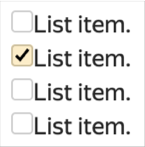

# Formatting text in issues

Use the {{ yfm }} syntax when formatting text in issue descriptions or comments. For example, you can format text with italics or bold, as well as add lists and tables.

If you want to see a preview of how the issue description or comment would look after formatting, click **Preview**. Click **Edit** to resume formatting.

## Lowercase formatting {#line}

| Element | Markup | Result |
| ----- | ----- | ----- |
| Bold | ```**Bold**``` | **Bold** |
| Italics | ```_Italics_``` | _Italics_ |
| Bold italics | ```**_Bold italics_**``` | **_Bold italics_** |
| Also bold italics | ```_**Also bold italics**_``` | _**Also bold italics**_ |
| Strikethrough | ```~~Strikethrough~~``` | ~~Strikethrough~~ |
| Underline | ```++Underlined++``` | <u>Underlined</u> |
| Superscript | ```Super^script^``` | Super^script^ |
| Subscript | ```Subvvscriptvv``` | Sub<sub>script</sub> |
| Monospaced text | ```##Monospaced text##``` | <samp>Monospaced text</samp> |
| Colored text:<br/><ul><li>`red`;<li>`green`;<li>`blue`;<li>`gray`;<li>`yellow`. | ```{blue}(Blue text)``` | <font color="blue">Blue text</font> |
| Source code | ``` `code snippet` ``` | `code snippet` |
| Escaping markup elements | ```\*\*escaping** _markup elements_``` | \*\*escaping** _markup elements_ |

## Headers {#headers}

```
## Second-level heading 

#### Fourth-level heading

##### Fifth-level heading
```



## Second-level heading {#second-header}

#### Fourth-level heading {#fourth-header}

##### Fifth-level heading {#fifth-header}



## Links {#links}

| Element | Markup | Result |
| ----- | ----- | ----- |
| Link | ```[link_text]({{ link-yandex }})``` | [link_text]({{ link-yandex }}) |
| URL | To convert a URL or email<br/>address into a link,<br/>add angle brackets on both sides `<>`:<br/>```<{{ link-yandex }}>``` | <{{ link-yandex }}> |
| Issue link | ``` TEST-123 ``` |  |

## Lists {#lists}

#|
|| **Element** | **Markup** | **Result** ||
|| Numbered list |

```
1. List item.
1. List item:
    1. Nested list item.
    1. Nested list item.
1. List item.
```

|

1. Nested list item.
1. List item:
    1. Nested list item.
    1. Nested list item.
1. List item. ||
||Bulleted list |

```
* List item.
* List item:
    * Nested list item.
    * Nested list item.
* List item.
```

|

* Nested list item.
* List item:
    * Nested list item.
    * Nested list item.
* List item. ||
|| Issue list |

```
[ ] List item.
[x] List item.
[ ] List item.
[ ] List item.
```

|
 ||
|#

## Block formatting {#blocks}

#|
|| **Element** | **Markup** | **Result** ||
|| Quotation |

```
> Quotations
>> Nested quote
```

|

> Quotations
>> Nested quote ||
|| Multiple-line code block |

````
```php
<?
phpinfo();
$s = "Hello, World!\n";
print $s;
``` 
````

|

```php
<?
phpinfo();
$s = "Hello, World!\n";
print $s;
```

||
|| Collapsed text |

```


Text displayed
on click


```

| 

Text displayed on click

 ||
|#

## Tables {#tables}

### Simple table {#simple-table}

The cells of this table type can only include one line of text or one image.

```
| Header1 | Header2 |
| ---------- | ---------- |
| Text     | Text      |
| Text     | Text      |
```



| Header1 | Header2 |
| ---------- | ---------- |
| Text | Text |
| Text | Text |



### Multiple-line table {#multiline-table}

The cells of this table type can include multiple lines of text, an image, lists, tables, or source code.

```
#|
|| **Header1** | **Header2**||
|| Text
on two lines | Text ||
|| Text | Text ||
|#
```



#|
|| **Header1** | **Header2** ||
|| Text
on two lines | Text ||
|| Text | Text ||
|#



