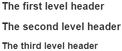
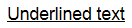
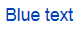
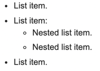

# Formatting text in issues

To format text in issue descriptions or comments, use Yandex Flavored Markdown syntax. For example, you can format text with italics or bold, as well as add lists and tables.

If you want to see a preview of how the issue description or comment would look after formatting, click **Preview**. Click **Edit** to resume formatting.

The basic markup options are listed below.

| Element | Markup | Result |
| ----- | ----- | ----- |
| Headings | ```# First level header```<br/>```## Second level header```<br/>```### Third level header``` |  |
| Bold | ```**Bold**``` | **Bold** |
| Italics | ```_Italics_``` | _Italics_ |
| Bold italics | ```**_Bold italics_**``` | **_Bold italics_** |
| Also bold italics | ```_**Also bold italics**_``` | _**Also bold italics**_ |
| Strikethrough | ```~~Strikethrough~~``` | ~~Strikethrough~~ |
| Underline | ```++Underlined text++``` |  |
| Superscript | ```Super^script^``` | Super^script^ |
| Monospaced text | ```##Monospaced text##``` |  |
| Colored text.<br/><br/>Supported colors:<br/><br/>`red`;<br/>`green`;<br/>`blue`;<br/>`gray`;<br/>`yellow`. | ```{blue}(Blue text)``` |  |
| Numbered list | ```1. List item.```<br/>```1. List item.```<br/>&nbsp;&nbsp;&nbsp;&nbsp;`1. Nested list item.`<br/>&nbsp;&nbsp;&nbsp;&nbsp;`1. Nested list item.`<br/>&nbsp;&nbsp;&nbsp;&nbsp;`1. Nested list item.`<br/>```1. List item.``` |  |
| Bulleted list | ```* List item.```<br/>```* List item:```<br/>&nbsp;&nbsp;&nbsp;&nbsp;`* Nested list item.`<br/>&nbsp;&nbsp;&nbsp;&nbsp;`* Nested list item.`<br/>```* List item.``` |  |
| Link | ```[link_text]({{ link-yandex }})``` | [link_text]({{ link-yandex }}) |
| URL | To convert a URL or email address into a link, add angle brackets on both sides <>.<br/>```<{{ link-yandex }}>``` | <{{ link-yandex }}> |
| Issue link | ``` TEST-123 ``` |  |
| Quoted text | ```> Quoting```<br/>```>> Nested quotes``` |  |
| Collapsed text | ``````<br/>```The content that's displayed on click.```<br/>`````` |  |
| Table | ```\| Heading1 \| Heading2  \|```<br/>```\| ---------- \| ---------- \|```<br/>```\| Text       \| Text       \|```<br/>```\| Text       \| Text       \|``` |  |
| Multiple-line table | ```#\|```<br/>```\|\| **Heading1** \| **Heading2** \|\|```<br/>```\|\| Text ```<br/>```on two lines```<br/>```\| Text \|\|```<br/>```\|#``` |  |
| Source code | ``` `code snippet` ``` | `code snippet` |
| Multiple-line code block | ` ```php`<br/>`<?`<br/>`phpinfo();`<br/>`$s = "Hello, World!\n";`<br/>`print $s;`<br/>` ``` ` |  |
| Escaping markup elements | ```\*\*escaping** _markup elements_``` | \*\*escaping** _markup elements_ |

