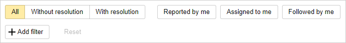
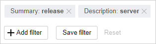

# My issues

To find issues you're working on, choose **Issues** → **All issues** on the top panel in {{ tracker-name }}. This opens the [filter page](default-filters.md), where you can see issues that list you as the reporter, assignee, or follower.

To search for issues in the list, use [quick filters](#q-filters) or [add search parameters](default-filters.md#add-condition).

## Quick filters {#q-filters}

You can use quick filters to filter out your issue list, leaving only the issues that include the selected parameters. Quick filter buttons are located above the issue list:

1. Resolution filters. Select one of the options:
    - **All**: The page displays all issues, regardless of the resolution.
    - **Without resolution**: The page only displays issues that aren't resolved.
    - **With resolution**: The page only displays resolved issues.
1. Role-based filters. You can apply multiple filters at the same time:
    - **Reported by me**.
    - **Assigned to me**.
    - **Followed by me**.

As a result, only the issues that meet the selected filter parameters are shown in the list.

## Searching for issues by name or description {#search-name}

If you want to find an issue using its name or description, click **Add parameter** above the issue list and set your parameters:

- To find issues that contain a particular phrase in their name, add the **Issue** parameter to your search and enter the text to search for.
- To find issues that contain a particular phrase in their description, add the **Description** parameter to your search and enter the text to search for.



If you define multiple parameters, only issues that contain all of them are found.



## Configure issue display {#manage-list}

You can configure how issues are displayed in the list or download the list as a file:

- If you want to hide or display certain issue fields, click **Configure columns**, select the fields, and click **Save**.
- To group issues by a certain field, click **Not grouped** to the right of the list and select the field.
- If you want to create a [Gantt chart](../manager/gantt.md) for your issue list, in the upper-right corner, click .
- To save the issue list, click  to the right above the list and select the format of the file to download or simply copy the list to the clipboard.

