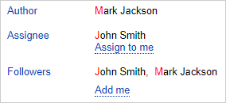
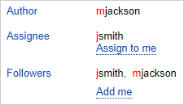
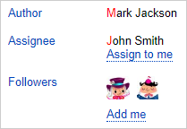

# Personal settings

You can manage your issues more easily by adjusting the {{ tracker-name }} interface.

## Customizing your home page {#sec_my_page}

You can set up your [start page](startpage.md) in the old interface to show one of the selected options:

* [**{{ ui-key.startrek.ui_components_page-my_PageMy.page-title }}**](startpage.md#my-page).
* [filter](create-filter.md).
* [dashboard](dashboard.md).
* [issue board](../manager/create-agile-board.md).

1. Click the link [{{ link-settings }}]({{ link-settings }}).

1. Under **{{ ui-key.startrek.ui_components_NavigationBar.start-page-title }}**, choose the filter, dashboard, or issue board you want to see on the home page. To use **My page** as the startup page, select it in the list.

1. Click **{{ ui-key.yacloud.common.save }}**.

## Setting the interface language {#choose-language}

You can use {{ tracker-name }} in English or Russian. To do this:

1. 

1. Select a language under **{{ ui-key.yacloud.settings.switch_lang }}**.

## Setting up the layout {#choose-theme}

To set up the interface theme and how the issues will be opened on the page:

1. 

1. Select a theme under **{{ ui-key.yacloud.settings.switch_appearance }}**.

1. To open an issue in the right-hand panel when you click its name or key (e.g., **TEST-123**), select **{{ ui-key.startrek.ui_components_Confirm.ok-button-text }}**.

## Setting the user display type {#sec_display}

By default, the **Reporter**, **Assignee**, and **Followers** fields display the first and last name of the users. If you want to display their usernames or profile pictures instead, change the user display mode.





To change the method of display:

1. Click the link [{{ link-settings }}]({{ link-settings }}).

1. Under **User display**, choose the display method you prefer:
   - Select **Display login instead of name** to show usernames instead of real names in system fields within issues.

      

      

      

   - Select **Show avatars instead of names** to show only avatars in user list fields. This setting does not affect the **Reporter** and **Assignee** fields.

      

      

      

1. Click **{{ ui-key.yacloud.common.save }}**.

## Setting the date display format {#sec_display_date}

The parameters that include the date and time in the issue can be shown in the full format (day, month, year, and time) or brief format (day and month).

To change the display format for such parameters:

1. Click the link [{{ link-settings }}]({{ link-settings }}).

1. Select a format under **Date format**.

1. Click **{{ ui-key.yacloud.common.save }}**.

## Configuring notifications {#sec_notifications}

{{ tracker-name }} uses email to send notifications about changes in the issues you're subscribed to. On the personal settings page, you can set up the notification parameters:

1. Click the link [{{ link-settings }}]({{ link-settings }}).

1. Set notification settings:
   - Enable or disable [regular update reports for issues you're subscribed to](notification-digest.md).
   - Set up [username and event type display in emails](notification-settings.md#section_u1f_3w5_xgb).
   - Enable or disable [notifications about changes to issues](subscribe.md#sec_self).

1. Click **{{ ui-key.yacloud.common.save }}**.

To learn more about notifications, see the following sections:

- [{#T}](subscribe.md)
- [Notification settings](notification-settings.md)

## Setting comment display order {#sec_mssg_sort}

By default, issue comments are sorted from oldest to newest. You can change the sorting order of comments from newest to oldest on the personal settings page:

1. Click the link [{{ link-settings }}]({{ link-settings }}).

1. Under **Message order in issues**, enable the **Newest first** option.

1. Click **{{ ui-key.yacloud.common.save }}**.

## New interface {#sec_beta}

To enable the new {{ tracker-name }} interface:

1. Click the link [{{ link-settings }}]({{ link-settings }}).

1. Under **{{ ui-key.startrek.ui_components_NavigationBar.appearance-title }}**, enable the **{{ ui-key.startrek.ui_components_NavigationBar.new-ui }}** option.
