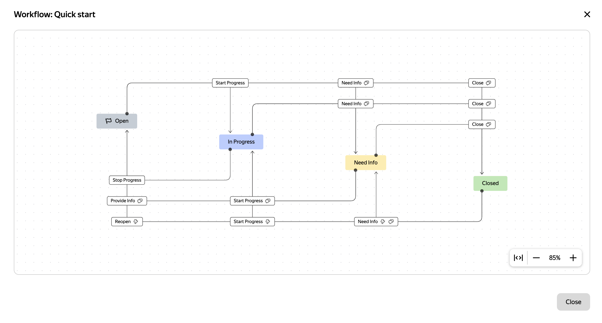

# Viewing a workflow on the issue page

{{ tracker-name }} allows you to view the queue [workflow](../manager/workflow.md) directly on the issue page. If the user has permission to [view queue issues](../manager/queue-access.md#acces-types), they will be able to see a set of statuses, as well as view transitions, but only those that are available within the configured process.

To view the workflow on the issue page, click  → **View workflow** in the right-hand panel in the **Status** field.

