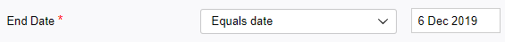
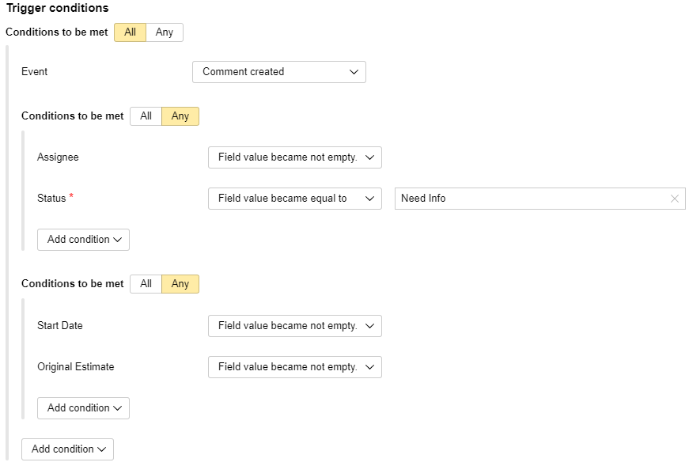

# Setting trigger conditions

## Adding a condition {#section_set_condition}

To specify issue updates that will fire the trigger, set a condition:

1. Under **{{ ui-key.startrek.blocks-desktop_b-page-queue-admin-tab_type_trigger-editor.label_conditions }}**, click **{{ ui-key.startrek.blocks-desktop_b-page-queue-admin-tab_type_autoaction-editor.action_add-condition }}** and select one from the list.

   | Condition type | Description |
   ----- | -----
   | {{ ui-key.startrek.blocks-desktop_trigger-condition.condition-type--event }} | The trigger is fired when the specified event occurs. For example, when creating an issue, making any issue changes, or editing the fields that are used for [calculating values with formulas](set-action.md#section_calc_field). |
   | {{ ui-key.startrek.blocks-desktop_trigger-condition.condition-type--checklist }} | The trigger is fired when all [checklist](checklist.md) items in an issue are completed. |
   | {{ ui-key.startrek.blocks-desktop_trigger-condition.condition-type--comment }} | The trigger is fired if a comment contains a specific text fragment. |
   | {{ ui-key.startrek.blocks-desktop_trigger-condition.condition-type--comment-author }} | The trigger is fired if a comment is added by the specified user. |
   | {{ ui-key.startrek.blocks-desktop_trigger-condition.condition-type--comment-type }} | The trigger is fired: <ul><li>**{{ ui-key.startrek-backend.messages.trigger.condition.type.CommentMessage.Internal }}**: If a comment is made using the {{ tracker-name }} interface.</li><li>**{{ ui-key.startrek-backend.messages.trigger.condition.type.CommentMessage.External }}**: If a comment is created via email.</li></ul> |
   | {{ ui-key.startrek.blocks-desktop_trigger-condition.condition-type--links }} | The trigger is fired if issue links are changed. |
   | Issue fields | The trigger is fired if changes are made to a field that belongs to any of the following field groups: **{{ ui-key.startrek-backend.fields.issue.fields.system }}**, **{{ ui-key.startrek-backend.fields.issue.fields.timetracking }}**, **{{ ui-key.startrek-backend.fields.issue.fields.agile }}**, or **{{ ui-key.startrek-backend.fields.issue.fields.email }}**. |

1. Choose an event or [comparison operation](#section_cdn_d4j_wfb) depending on the condition type.

1. If a comparison operation is selected, specify the value to be compared.

   

1. Add multiple conditions to the trigger if needed. By default, the trigger fires if all conditions are met at the same time. If you want your trigger to fire as soon as at least one of the conditions is met, click **{{ ui-key.startrek.blocks-desktop_trigger-condition.condition-type--or_short }}**.

   You can add a group of conditions (two or more) that will match the logical AND or logical OR.

> **Example**
>
> 
>
> The trigger will fire if a group of conditions is met: Comment is created AND (one out of the two conditions is met: Issue has an assignee OR Issue has changed to the Need info status) AND (one out of the two conditions is met: Start date is set OR Original estimate is made).

## Comparison operators {#section_cdn_d4j_wfb}

- If the trigger's condition includes a comparison operation, the condition will be checked each time the issue changes. If the condition is met, the trigger fires.
- Different comparison operations are available for different field types.
- You can specify additional options for certain comparison operations:

   - **{{ ui-key.startrek-backend.fields.trigger.condition.property.noMatchBefore }}**: The trigger is fired if a field value changes after a comparison is made.
   - **{{ ui-key.startrek-backend.fields.trigger.condition.property.ignoreCase }}**: Treat uppercase characters as matching the same lowercase characters.
   - **{{ ui-key.startrek-backend.fields.trigger.condition.property.removeMarkup }}**: Ignore markup in text.

Examples of the available comparison operations are listed in the table.

| Comparison operators | Description |
----- | -----
| Equal to, greater than, less than, less than or equal to, and greater than or equal to. | Comparison operations for fields with numerical values. |
| Became equal to, became greater than, became greater than or equal to, became less than, became less than or equal to | The trigger is fired if a field value changes after a comparison is made. |
| Later than date, Later or equals date, Before date, Before or equals date | Comparison operations for date fields. |
| Field value is empty, field value is not empty | Operations check whether the field is filled in. |
| Field value set, field value changed, or field value deleted | Operations check whether a field value was added, updated, or deleted. |
| Elements quantity is equal, Elements quantity is greater, Elements quantity is less | Comparison operations for fields that may contain multiple elements, such as **{{ ui-key.startrek-backend.fields.issue.tags-key-value }}**. |
| Contains none of items, Contains all items, Contains any of items | Comparison operations for fields that may contain multiple elements, such as **{{ ui-key.startrek-backend.fields.issue.tags-key-value }}**. |
| Contains none of given strings, Does not contain substring, Matches string, Contains any from given strings, Contains substring | Comparison operations for the **{{ ui-key.startrek-backend.fields.trigger.condition.field.comment }}** condition, which check comments for specified text fragments. |