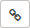

# Using shared templates

To be sure that other users can use your template:

1. [Set up shared access to the template](share-template.md#section_nmn_prs_zz). You can set up access for specific users, or your entire organization.

1. Tell your colleagues to [enable your template in their personal settings](share-template.md#section_vkg_trs_zz).

## Setting up access to a template {#section_nmn_prs_zz}

To change the template's access settings:

1. Select the desired option:
   - [Issues]({{ link-settings }}/templates/issues) to edit issue templates.
   - [Comments]({{ link-settings }}/templates/comments) to edit comment templates.

1. You can filter out the templates you don't need by clicking .

1. Next to the template you need, click **Access control**.

1. Configure the **Read**, **Write**, and **Grant** permissions for the following categories:
   - **Users and robots**: Individual settings for individual users. To add a user to this category, enter their login or name in the search bar located at the top of the table.
   - **Groups**: Settings for all employees.

   - **Roles**: Settings for users who have specific roles for the template:
      - **{{ ui-key.startrek-backend.roles.templateRole.name.OWNER }}**: Template owner. By default, the owner is the person who created the template. They are the only ones with the **Write** and **Grant** permissions.
      - **{{ ui-key.startrek-backend.roles.templateRole.name.QUEUE_TEAM_MEMBER }}**: Users who are members of the queue team the issue is assigned to.

Shared templates are available to all users on the **Select** tab.

## Sharing a template {#section_ucr_rrs_zz}

To share a template with a colleague, send them a link to the template:

1. 

1. In the top-right corner, click  **{{ ui-key.startrek.ui_components_PageQueue_header.settings }}**.

1. In the {{ tracker-name }} top panel, click  → **Manage templates**.

1. Select the desired option:
   - **Issues** to edit issue templates.
   - **Comments** to edit comment templates.

1. You can filter out the templates you don't need by clicking .

1. Next to the appropriate template, select  → **Link to template**.

1. Copy the text from the browser's address bar and send it to the user you want to share the link with.



The user will only be able to see the template if they have [read access](#section_nmn_prs_zz) to it.



## Enabling a shared template {#section_vkg_trs_zz}

If you have [read access](#section_nmn_prs_zz) to the desired template, you can use it to create issues and comments. To do this, add a template:

1. 

1. In the top-right corner, click  **{{ ui-key.startrek.ui_components_PageQueue_header.settings }}**.

1. In the {{ tracker-name }} top panel, click  → **Manage templates**.

1. Select the desired option:
   - **Issues** to edit issue templates.
   - **Comments** to edit comment templates.

1. You can filter out the templates you don't need by clicking .

1. Find the switch next to the desired template and set it to .

