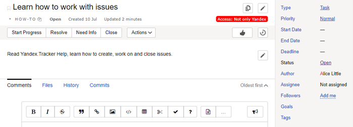

# Working with issues

By default, your issues are listed on the [home page](startpage.md) or in **Issues** → **All issues**. To start working with an issue, go to its page.



@[youtube](pdlYiijjn70)



## Start work on an issue {#section_qpp_5rn_jz}

When you start working on an issue, switch it to a new status (usually "In progress"). The status shows what state the issue is in and helps other {{ tracker-name }} users track its progress. The current status is shown under the issue title and in the panel on the right.

While you are working on it, don&apos;t forget to update the status so that you and your colleagues know what the current state is for the issue.



The available statuses and transitions depend on the [queue settings](../manager/workflow.md).



> Your issue has the <q>Open</q> status. When you start working on it, switch the status to <q>In progress</q>. When it is completed, change the status to <q>Closed</q>. If you need to return to the issue later, you can switch it back to the <q>Open</q> status.

## Work on an issue {#section_c3t_l53_d1b}

{{ tracker-name }} helps you keep track of progress on issues and communicate with colleagues. When you are working on an issue, you can:

- [Create a checklist for your issue](checklist.md).
List the steps needed to solve the issue and make a note in the checklist once you complete one.
- [Edit issue details](edit-ticket.md).
If the details for the issue have changed, you can edit them.
- [Comment on issues](comments.md).
Leave comments on issues, make notes, and invite colleagues to add their input.
- [Register time spent](time-spent.md).
Register the time spent on an issue.

## Close an issue {#section_kyj_gbm_2z}

When you finish working on an issue, switch it to the final status (usually <q>Closed</q>) and select a **resolution** (the reason the issue is closed). The list of possible resolutions depends on the [queue settings](../manager/add-ticket-type.md).

> The issue you are working on was canceled. To register this in {{ tracker-name }}, switch the issue to the <q>Closed</q> status and select the resolution <q>Canceled</q>.

