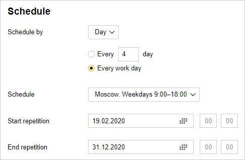

# Scheduled issue creation

You can use {{ tracker-name }} to set up scheduled issue creation using a template. For example, every week you can create an issue for data backup.

Such issues are only created in queues where auto updates are configured. The reporter for these issues is the Tracker robot.



Make sure that the robot has rights for creating issues in the selected queue.



To schedule creation of issues:

1. 

1. In the top-right corner, click  **{{ ui-key.startrek.ui_Queues_pages_PageQueue_header.settings }}**.

1. In the left-hand panel, select **Auto actions**.

   

   Scheduled issue creation is currently not supported in the new interface. The following steps are performed in the old interface.

   

1. On the **Auto actions** page, click **Create auto action**.

1. Choose **Create issues**.

1. Set up a period for creating issues:

   1. Select the unit for the issue creation period: hours, days, or weeks.

   1. Specify the period of creating issues in the selected units. To do this, enter a number between 1 and 1000 in the **Every** field.

      For example, if you specify **Every 4 days**, a new issue will be created every 4 days.

      

      If your schedule is based on days, you can also choose **Every work day** and [work schedule](../manager/schedule.md).

      If you set your issue creation period in weeks, select the days of the week when your issues will be created.

   1. Enter the start and end date/time when your automatic issue creation will be valid. If you omit the start and end dates, automatic issue creation will run permanently.

1. Under **Action**, click **Create issue**.

1. Fill in the fields of the automatic issue creation template in the **Create issue** window and click **Save**.

1. If you want to include multiple issues in one auto action, click **Create issue** again and fill in the fields for the new issue.

1. To save an auto action, click **Create**.

