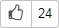

# Voting for an issue



Voting is available only if it is enabled in the queue settings.



{{ tracker-name }} users can vote for issues to help teams decide which issues are highest priority. The number of votes is displayed under the issue title next to the icon: .

To vote for an issue, click . If you want to remove your vote, click it again.



To find issues that you have voted for, use the [query language](query-filter.md):

1. On the {{ tracker-name }} top panel, select **Issues** → **Find issues**.

1. Click **Query language** in the upper-right corner.

1. Enter the query:

    ```
    "Voted By": me()
    ```



#### How voting works

- You can view the list of votes by clicking the button with the number of votes.

- All users who have access to the issue can vote.

- If an issue that received votes is closed as a duplicate, all the votes will be transferred to the original issue.

