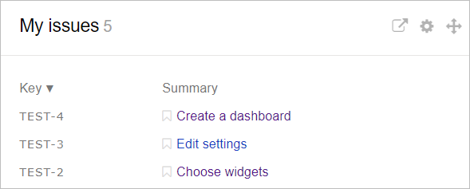
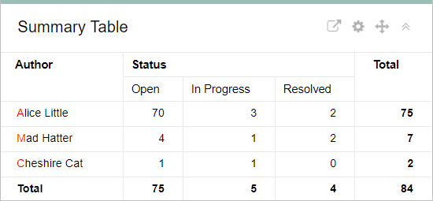
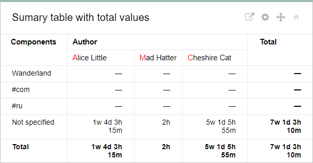
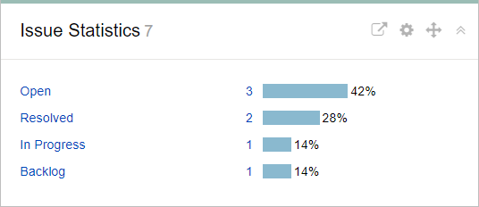
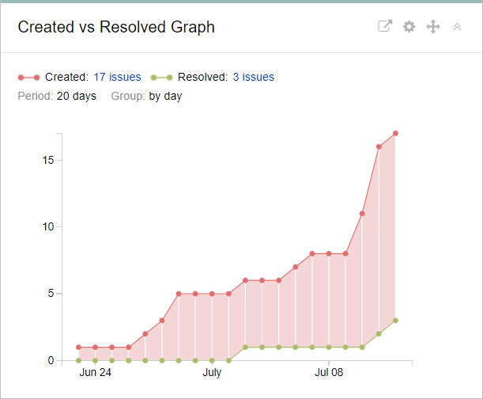
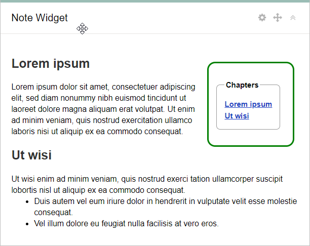
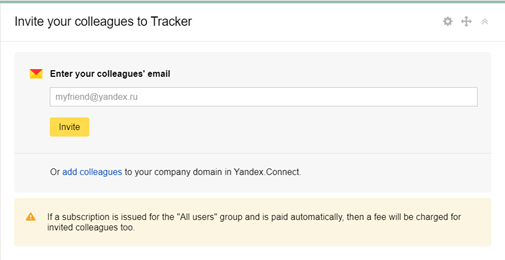

# Widgets

Widgets are small cards with useful information. They can show issue lists, statistics on issue completion, pivot tables, or notes. Widget content is generated automatically. The list of issues used to form a widget is set using [filters](create-filter.md). You can go to [{#T}](../support-process-dashboards.md) to find sample widgets for the support service dashboard.

## Issue lists {#section_ll1_zdp_pz}

This widget allows you to view a list of issues that meet a specific filter. For example, you can use these widgets to set up a page where you can see both the issues in a particular queue and the issues that you are currently working on.

To configure a widget, set the following:

- **Name**: The name to display in the widget title.
- **Issues per page**: The number of issues to display on a single widget page. If there are more issues, you can navigate between pages at the bottom of the widget.
- **Filter**: The filter used for creating the issue list. You can set filters using [direct links, names](create-filter.md), or the [query language](query-filter.md).
- **Columns**: The issue fields to show in the list. You can add multiple fields. To remove a field, click **x**.
- **Auto-update**: How often to refresh the data in the widget.

## Summary tables {#section_esm_vjp_pz}

Summary tables automatically collect statistics on issues and display them in a table. {{ tracker-name }} supports several types of summary tables:

#### Simple pivot table

A simple pivot table that allows you to view statistics for any two parameters. The number of issues that meet the parameters is shown at intersections in the table. You can use this type of table, for instance, to track the quantity and status of issues for a specific group of assignees.

To configure a widget, set the following:

- **Widget name**: The name to display in the widget title.

- **Filter**. Statistics are gathered for issues that correspond to a specific filter. You can set filters using [direct links, names](create-filter.md), or the [query language](query-filter.md).

- **Columns**: The parameter to use for table columns.

- **Rows**: The parameter to use for table rows.

- **Number of rows on page**: The maximum number of table rows to display in the widget. If there are more rows, you can use the **Show all** button at the bottom of the widget.

- **Sort by**: The order for sorting table rows.

- **Show total**: If this option is selected, the table contains the sum of values for rows and columns.

- **Auto-update**: How often to refresh the data in the widget.



We don't recommend using the **Issue** value in **Columns** and **Rows**, as widgets using those settings will soon be disabled. [Learn more](../faq.md#section_del_widget).



#### Summary table with totaled values

A special type of pivot table with two parameters. In contrast to a simple pivot table, the intersections show the sum of the values of a third parameter, instead of the number of issues. For instance, you can use this table to track the time spent by assignees working on various components in the queue.

To configure a widget, set the following:

- **Widget name**: The name to display in the widget title.

- **Filter**. Statistics are gathered for issues that correspond to a specific filter. You can set filters using [direct links, names](create-filter.md), or the [query language](query-filter.md).

- **Columns**: The parameter to use for table columns.

- **Rows**: The parameter to use for table rows.

- **Cells**: The parameter to show totals for in the intersections.

- **Number of rows on page**: The maximum number of table rows to display in the widget. If there are more rows, you can use the **Show all** button at the bottom of the widget.

- **Sort rows**: The sort order in table rows.

- **Sort columns**: The sort order in table columns.

- **Show total**: If this option is selected, the table contains the sum of values for rows and columns.

- **Auto-update**: How often to refresh the data in the widget.



We don't recommend using the **Issue** value in **Columns** and **Rows**, as widgets using those settings will soon be disabled. [Learn more](../faq.md#section_del_widget).



## Statistics {#section_htb_kvp_pz}

Statistics widgets automatically gather information on issues and display it in graphs and charts. {{ tracker-name }} supports multiple statistics widgets:

#### Issue statistics

The widget displays the distribution of issues by the values of a specific parameter.

To configure the widget, make these settings:

- **Name**: The name to display in the widget title.

- **Filter**. Statistics are gathered for issues that correspond to a specific filter. You can set filters using [direct links, names](create-filter.md), or the [query language](query-filter.md).

- **Number of rows on page**: The maximum number of chart rows to display in the widget. If there are more rows, you can use the **Show all** button at the bottom of the widget.

- **Key parameter**: The issue field to gather statistics for.

- **Sort by**: The sort order in chart columns.

- **Auto-update**: How often to refresh the data in the widget.



We don't recommend using the **Issue** value in the **Key parameter** field, as widgets using those settings will soon be disabled. [Learn more](../faq.md#section_del_widget).



#### Events

The chart displays statistics for _events_ in issues over a certain period of time. You can choose one of the events:

- Work on the issue was completed. This event is defined by **End date**.

- Work on the issue has started. This event is defined by **Start date**.

- Last update to the issue.

- Last comment on the issue.

- Issue was switched to the **Resolved** status.

- Issue created.

To configure the widget, make these settings:

- **Name**: The name to display in the widget title.

- **Filter**. Statistics are gathered for issues that correspond to a specific filter. You can set filters using [direct links, names](create-filter.md), or the [query language](query-filter.md).

- **Key parameter**: Select the event to track in the statistics.

- **Group**: Select the step and specify the period for collecting statistics.

- **Show cumulative total**: If this option is enabled, data collected from previous steps is included in each subsequent step.

- **Auto-update**: How often to refresh the data in the widget.

#### <q>Created vs. Resolved chart</q>

This chart allows you to compare the number of created issues to the number of resolved issues. You can specify the period and step for collecting statistics.

To configure the widget, make these settings:

- **Name**: The name to display in the widget title.

- **Filter**. Statistics are gathered for issues that correspond to a specific filter. You can set filters using [direct links, names](create-filter.md), or the [query language](query-filter.md).

- **Group**: Select the step and specify the period for collecting statistics.

- **Show average value**: If this option is enabled, a trend line is displayed under the chart.

- **Show cumulative total**: If this option is enabled, data collected from previous steps is included in each subsequent step.

- **Show versions**: If this option is enabled, the chart shows the versions that issues belong to.

## Notes {#section_rtw_3gr_pz}

Write down your ideas and make notes right on the dashboard. You can enter notes in plain text or use [YFM markup](markup.md).



## Invitation form {#invite_form}

Invite your employees to {{ tracker-name }} using a widget. To log in, they need a Yandex account. The employees you invited can use {{ tracker-name }} for free in [<q>Read only</q>](../access.md#readonly) mode.



