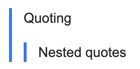

# Format text in issues

Use wiki markup when formatting text in issue descriptions or comments. For example, you can format text with italics or bold, as well as add lists and tables.

If you want to see the preview of how the issue description or comment will look after formatting, click **Preview** under the text input field. Click **Edit** to continue formatting.

The basic markup options are listed below.

| Element | Markup | Result |
| ----- | ----- | ----- |
| Headings | ``` == First-level header ```<br/>```=== Second-level header
```<br/>```==== Third-level header``````== The first level header```<br/>```=== The second level header```<br/>```The third level header``` |  |
| Horizontal line | ``` ---- ``` |  |
| Bold | ``` **Bold text**``````**Bold text**``` |  |
| Italics | ```* Italics*````*Italic text*` |  |
| Underline | ``` __Underlined text__``````__Underlined text__``` |  |
| Strikethrough | ``` --Strikethrough text--``````--Strikethrough text--``` |  |
| Small text | ``` ++Small font++``````++Small font++``` |  |
| Highlighted text | ```??Highlighted text??``````??Highlighted text??``` |  |
| Colored text.<br/><br/>Colors supported:<br/><br/>`red` / `red` / `red`;<br/>`green` / `green` / `green`;<br/>`blue` / `blue` / `blue`;<br/>`grey` / `gray` / `gray`;<br/>`yellow` / `yellow` | ```!!(blue)Blue text!!``````!!(blue)Blue text!!``` |  |
| Numbered list | ```1. List item.```<br/>```2. List item.```<br/>&nbsp;&nbsp;&nbsp;&nbsp;`1. Nested list item.`<br/>&nbsp;&nbsp;&nbsp;&nbsp;`2. Nested list item.`<br/>&nbsp;&nbsp;&nbsp;&nbsp;`3. Nested list item.`<br/>```3. List item.``````1. list item;```<br/>```2. list item;```<br/>&nbsp;&nbsp;&nbsp;&nbsp;`1. nested list item;`<br/>&nbsp;&nbsp;&nbsp;&nbsp;`2. nested list item;`<br/>&nbsp;&nbsp;&nbsp;&nbsp;`3. nested list item;`<br/>```3. list item.``` |  |
| Bulleted list | ```* list item;```<br/>```* list item:```<br/>&nbsp;&nbsp;&nbsp;&nbsp;`* nested list item;`<br/>&nbsp;&nbsp;&nbsp;&nbsp;`* nested list item;`<br/>```* list item.``````* list item;```<br/>```* list item:```<br/>&nbsp;&nbsp;&nbsp;&nbsp;`* nested list item;`<br/>&nbsp;&nbsp;&nbsp;&nbsp;`* nested list item;`<br/>```* list item.``` |  |
| Link | ```((http://example.com / link text))``````((http://example.com/ link text))``` |  |
| Issue link | ``` TEST-123 ``` |  |
| Quoted text |  ``` <[Quoting long,``` <br/> ``` text,```<br/>``` with linebreaks]>```  ``` <[Quoting long```<br/>``` text```<br/>```with linebreaks]>``` |  |
| Single-line quote | ``` >Single-line quoting```<br/>```>>Second-level quote``````>Single-line quoting```<br/>```>>Second-level quote``` |  |
| Collapsed text | ```<{Read the entire text```<br/>```This text can be seen by clicking```<br/>```the link "Read the entire text".```<br/>```}>``````<{Read the entire text```<br/>```This text can be seen by clicking```<br/>```the link "Read the entire text".```<br/>```}>``` |  |
| Table | ```#|```<br/>```||cell 11|cell 12|cell 13||```<br/>```||cell 21|cell 22||```<br/>```#|``` |  |
| Source code | ```%%code fragment%%``````%%code fragment%%``` |  |
| Escaping wiki markup | ``` ""**Escaping all markup**```<br/>```//elements in this text//""```<br/>```~**Escaping a single** //markup element//``````""**Escaping all markup**```<br/>```//elements in this text//""```<br/>```~**Escaping a single** //markup element//  ``` |  |

[Contact support](../troubleshooting.md)

