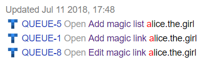

# {{ wiki-full-name }}

You can insert _magic links_ on Wiki pages to individual issues and issue lists. Such links always contain the issue key, name, status, and the assignee's username.

## Inserting a link to an issue {#section_hws_qzr_3bb}

To insert a link to an issue, copy the issue key and paste it into the page text:

| Example | Result |
| ----- | ----- |
| ``` TEST-123 ``` |  |

Magic links to issues aren't just for Yandex.Wiki pages. They also work in other internet services that support Wiki markup.

## Inserting a list of issues {#section_oj5_scs_3bb}

In {{ wiki-full-name }}, you can insert a list of issues from any queue or filter:

1. Open the queue or filter page.

1. In the upper-left corner of the page, select  → **Get the Wiki code**.

1. Copy the code.

1. Insert the code on a Wiki page.

| Example | Result |
| ----- | ----- |
| ``` {{tasks url="{{ link-tracker }}filters/<filter>}} ``` |  |

