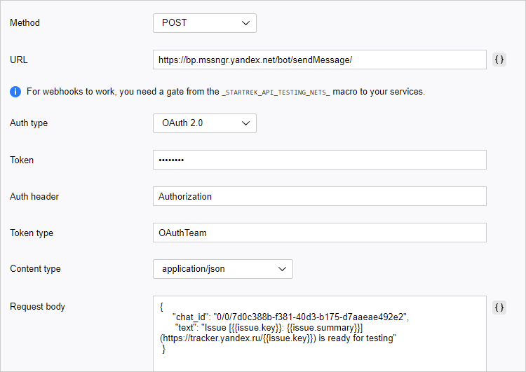

# Yandex.Messenger

Let's say we need to send an automatic notification to the messenger each time the issue status is changed. This could be used, for example, to track whether releases are ready for testing. To do this, we need to [create a trigger](user/trigger.md) that keeps track of issue statuses like <q>Release</q> and sends an HTTP request when the issue status changes to <q>Ready for testing</q>.

To send notifications from {{ tracker-name }} to Yandex.Messenger, you'll need a robot account that messages will be sent under. Register the robot in Yandex.Messenger, add it to the chat, and set up a trigger that sends messages on behalf of the robot using HTTP requests.

## Step 1. Register the robot in Yandex.Messenger {#robot-setup}

1. If you don't have a robot account that you can manage, [create one](https://staff.yandex-team.ru/preprofile/create/robot/).

1. Log in to your robot account on [https://passport.yandex-team.ru](https://passport.yandex-team.ru/).

1. To get a token for the robot's authorization in Yandex.Messenger, follow the link using the robot account: [https://oauth.yandex-team.ru/authorize?response_type=token&client_id=f45aca80c81144dd95dc150319c327a3](https://oauth.yandex-team.ru/authorize?response_type=token&client_id=f45aca80c81144dd95dc150319c327a3)
Save the token value that will be displayed on the page that opens.

1. To register your robot in Yandex.Messenger, send a POST request to `https://bp.mssngr.yandex.net/team/register/` with the token in the header:

    ```
    curl -X POST 'https://bp.mssngr.yandex.net/team/register/' -H 'Authorization: OAuthTeam <token_value>'
    ```

## Step 2. Add your robot to the chat {#add-chat}

1. In Yandex.Messenger, add your robot to the chat to send notifications from {{ tracker-name }}.

1. After adding the robot, send a message to the chat.

1. Find out the chat ID that you'll need to send notifications from {{ tracker-name }}:

    1. Open the [Yandex.Messenger web version](https://q.yandex-team.ru/) and find your chat.

    1. On the chat page, go to the address bar. You'll see the chat URL. For example:

        ```
        https://q.yandex-team.ru/#/chats/0%2F0%2F3d0c333b-f333-33d3-b333-d3aaeae333e3
        ```

    1. Copy the last part of the URL and replace the `%2F` characters with the forward slash `/`. You'll get the chat ID. For example:

        ```
        0/0/3d0c333b-f333-33d3-b333-d3aaeae333e3
        ```

## Step 3. Configure a trigger in  {{ tracker-name }} {#tracker-setup}

1. Log in to {{ tracker-name }}. You must have administrator privileges for the queue you'll set up a trigger for.

1. Go to the queue settings, open the **Triggers** section, and click [**Create trigger**](user/create-trigger.md).

1. Enter the trigger name, such as <q>Yandex.Messenger notifications</q>.

1. Configure trigger conditions so that the trigger is fired when the status of a **Release** issue changes to **Ready for testing**:

    1. Choose **Conditions to be met** → **All**.

    1. Add the condition **Type** → **Field equals to** → **Release**.

    1. Add the condition **Status** → **Field value became equal to** → **Ready for testing**.

     

1. Click **Add new action** and choose **HTTP request**.

1. Configure the request:
    - Method: **POST**.
    - Address: `https://bp.mssngr.yandex.net/bot/sendMessage/`
    - Auth type: **OAuth 2.0**.
    - Token: The value of the token you received when [registering your robot](#robot-setup).
    - Token type: `OAuthTeam`.
    - Content type: **application/json**.
    - Request body:

        ```
        {
            "chat_id": "<chat ID>",
            "text": "Issue [not_var{{issue.key}}: not_var{{issue.summary}}](https://tracker.yandex.ru/not_var{{issue.key}}) is ready for testing"
        }
        ```

        As the `chat_id` parameter, specify the chat ID that you [got from the chat URL](#add-chat).
To add issue field values to the request body, click **{ }** to the right of the field and choose the field name.
    - Leave the headers empty.

     

1. Save your trigger.

To test the trigger in action, change the issue status from **Release** to **Ready for testing**. The trigger sends a message to Yandex.Messenger with the following text: <q>Ready to test TEST-123: Trigger setup</q>.
