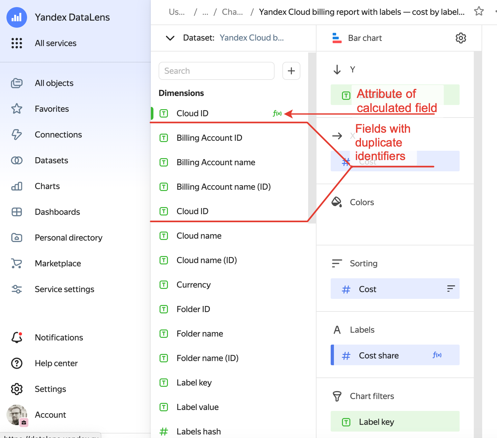

# Fixing the ERR.DS_API.FIELD.TITLE.CONFLICT error in DataLens

## Issue description {#issue-description}
When validating a dataset, you get the error:
```
Failed to validate dataset.
```

## Troubleshooting and reproducing issues {#issue-diagnostics-and-reproduction}
In the case of this error, under "Additional information", you can see the `"Field title conflicts with another field"` and `"ERR.DS_API.FIELD.TITLE.CONFLICT"` messages.

## Solution {#issue-solution}

The issue is due to field name conflicts. The name of the added field must not coincide with any existing field in the dataset.
Check that you set a unique name for this field in your dataset.

A field with this name was probably first added to the chart and then to its source dataset.
In this situation, rename the field added to the chart.

