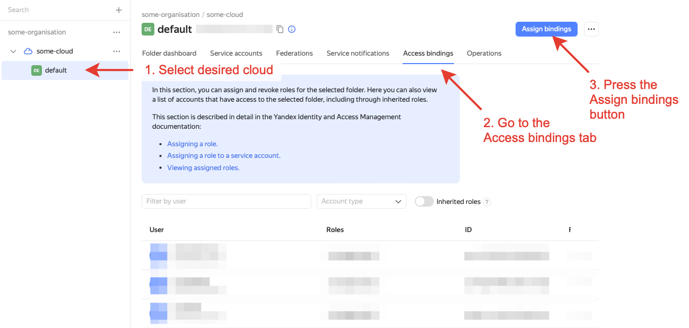

# Error when assigning the `resource-manager.clouds.owner` role to the cloud user

## Issue description {#issue-description}
When you try to assign the resource-manager.clouds.owner role to an account, you see this error:
```
Couldn't update access rights
Role 'resource-manager.clouds.owner' is only applicable to resources of type 'resource-manager.cloud'
```

## Solution {#case-resolution}
You are probably trying to assign your user a role from the "Access rights" tab at the folder or organization level.
Make sure to assign the `resource-manager.clouds.owner` role on the "Access rights" tab at the cloud level:

