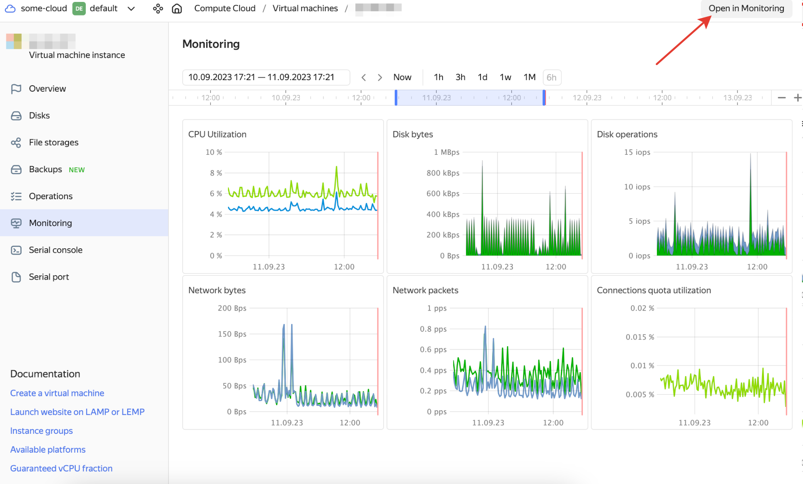
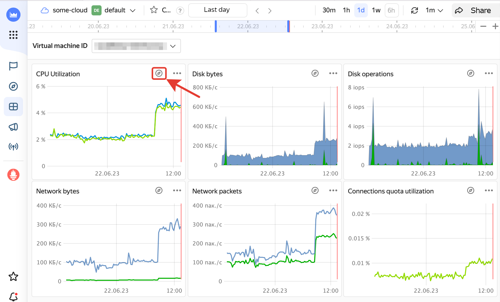
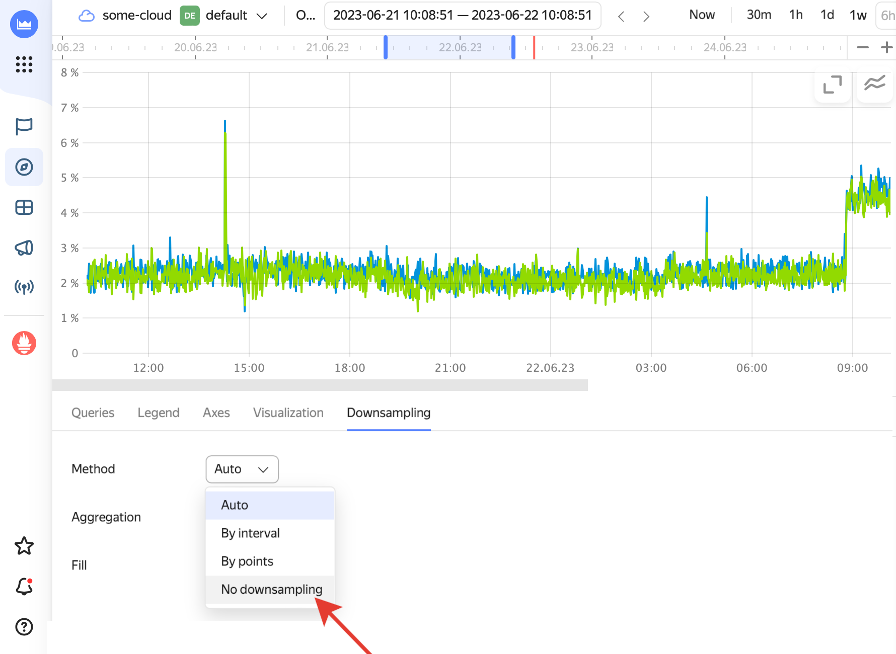

# Your cloud resources are running normally, but you see gaps in monitoring charts

## Issue description {#issue-description}

On the monitoring page of your cloud resource, you see gaps and voids in one or more charts; however, your cloud resource is running okay.

## Solution {#issue-resolution}

Gaps in monitoring charts depend on the specifics of chart display for certain cloud resource types.
This might be the case if you enabled downsampling in the chart settings.

This substantially accelerates rendering of pages that aggregate many monitoring metrics.
However, if Yandex Monitoring receives low values for certain metrics (plotted against the Y-axis), you might see gaps in the chart lines with enabled downsampling. Such gaps usually do not mean you have issues with the cloud resource.

You can disable downsampling for a chart in Yandex Monitoring:

1. Open the page of your cloud resource, then click Monitoring.

2. Click **Open in Monitoring** in the upper-right corner of the page:
   

3. Click the button on the right of the chart name:
   

4. Click **Downsampling**, then select **No downsampling** in the **Method** field:
   
