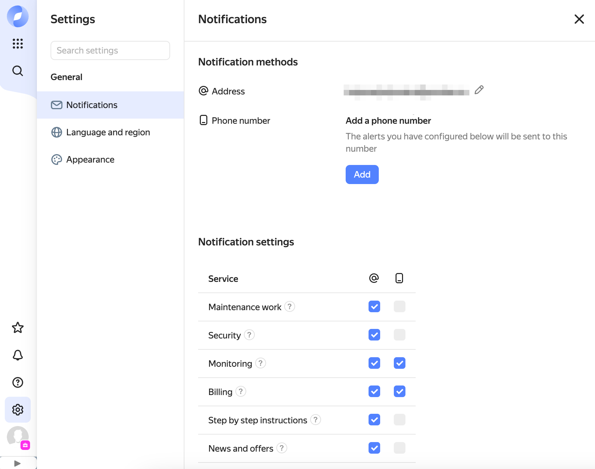

# You set up a notification channel in Yandex Monitoring, but you don't receive any event alerts

## Issue description {#issue-description}

You set up alerts with the **SMS** or **Email** notification methods in Yandex Monitoring.
However, when an alert triggers, you do not get notified on the phone number or at the email specified in the channel settings.

## Solution {#issue-resolution}

1. Notification contacts are missing.
   Go to [**Settings**](https://console.cloud.yandex.ru/settings) in the management console and double-check your account's email address and phone number under **Notifications**.
   Make sure the **Monitoring**:
    option is enabled in the **Phone number settings** and **Email settings** sections.

   For more information, see [Alerts/notifications](../../../monitoring/qa/alerts.md#alert-receive-failed) in the Yandex Monitoring documentation.

2. Check that you specified a valid email address in your Yandex ID profile or federated account.

3. The phone number exceeded the limit of 50 SMS, that's why the alert has not been sent to this number.
   To learn about limits in Yandex Monitoring, see [Quotas and limits](../../../monitoring/concepts/limits.md#monitoring-alerting-limits) in the Yandex Monitoring documentation.

4. Check SMS messages in the Spam folder on your phone, as well as the blacklisted numbers. To receive the notifications, disable your antispam filter if you are using it. We also recommend deleting old messages, restarting your device, and requesting inbound SMS itemization from your mobile operator.

5. To receive notifications from Yandex Monitoring, your account needs minimum rights for viewing metrics in Yandex Monitoring. This is the `monitoring.viewer` role for the folder the notification channel is set up in.
   To learn more about the list of roles in the service, see [Access management in Yandex Monitoring](../../../monitoring/security/index.md#monitoring-viewer) in the Yandex Monitoring documentation.
   