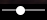

# Managing the video player

## Control buttons {#buttons}



- PC version

   To start playback, hover over the player.

   Use the timeline at the bottom of the player to move around the video.

   #|
   || **Button** | **Action** ||
   || / | Starting or stopping playback. ||
   ||  | Turning the sound on. ||
   ||  | Changing volume. ||
   ||  | Turning the sound off. ||
   ||  | Customizing the video:
   * **Quality**: Changing video quality (by default it depends on the internet speed).
   * **Speed**: Changing playback speed.
   * **Subtitles**: Turning subtitles on and off.
   * **Language**: Selecting subtitle language.
   * **Audio**: Selecting audio track. ||
   ||  | Full screen playback. ||
   ||  | Collapsing the player. ||
   || / **From beginning** (for live videos) | Watching the broadcast from the beginning. ||
   || **Back to live stream** (for live videos) | Continue watching the video live. ||
   |#

- Mobile version

   Click on a video in the player to start playback.

   Use the timeline at the bottom of the player to move around the video. You can change the volume using the buttons on your device.

   #|
   || **Button** | **Action** ||
   || / | Starting or stopping playback. ||
   ||  | Turning the sound on. ||
   ||  | Turning the sound off. ||
   ||  | Customizing the video:
   * **Quality**: Changing video quality (by default it depends on the internet speed).
   * **Speed**: Changing playback speed.
   * **Subtitles**: Turning subtitles on and off.
   * **Language**: Selecting subtitle language.
   * **Audio**: Selecting audio track. ||
   ||  | Full screen playback. ||
   ||  | Collapsing the player. ||
   || / **From beginning** (for live videos) | Watching the broadcast from the beginning. ||
   |#



## Hotkeys {#hot-keys}

You can manage the video player on the active tab using hotkeys:

| Key | Action |
------------- | -------------
| **↑** and **↓** | Changing the volume. |
| **←** and **→** | Moving 5 seconds backward or forward. |
| **Space** | Stopping or starting playback. |
| **F** | Expand the player to full screen or collapse it. |

## Selecting audio track {#audio}

Some videos can be watched in multiple languages or using different voiceovers. To select a different audio track, click  and select **Audio**.

If there is no **Audio** option, no additional audio tracks are available for this video.

## Enabling subtitles {#subtitles}

Some videos can be watched with subtitles. To enable subtitles, click  and select **Subtitles**.

If there is no **Subtitles** option, no subtitles are available for this video.

