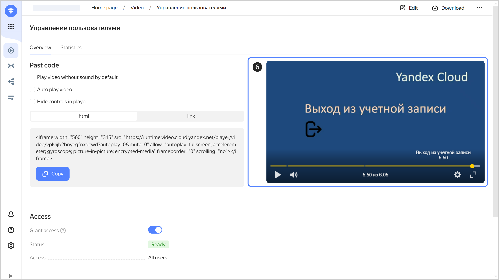

# Adding timecodes to a video

To add timecodes to a video:



- {{ video-name }} interface {#console}

  1. Open the {{ video-name }} [home page]({{ link-video-main }}).
  1. Select a channel.
  1. On the  **{{ ui-key.yacloud_video.videos.title_videos }}** tab, in the row with the video you need, click  and select **{{ ui-key.yacloud_video.common.action_edit }}**.
  1. Under **{{ ui-key.yacloud_video.videos.label_description }}**, specify the timecodes for your video in the following format:
   
      

      Example:

      ```
      00:00 Greeting
      00:30 Configuring the management console
      02:45 Adding users
      05:50 Logging out from account
      ```

  1. Click **{{ ui-key.yacloud_video.common.action_accept }}**.
  1. Start playback on the video preview page.

     
     
  1. Fast-forward your video to check timecodes and chapter headers.

