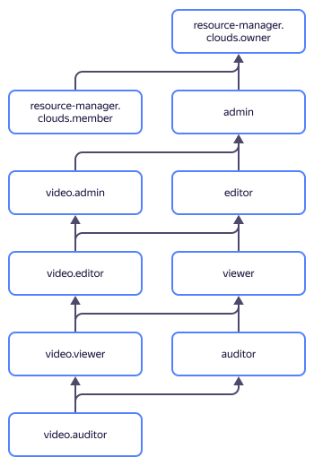

# Access management in {{ video-full-name }}

User access to {{ video-name }} depends on relevant permissions granted within an organization. Organizations are managed using [{{ org-full-name }}](../../organization/).

The operations available to {{ video-name }} users are determined by their roles. You can assign roles to a Yandex account, [federated users](../../iam/concepts/federations.md), [user group](../../organization/operations/manage-groups.md), [system group](../../iam/concepts/access-control/system-group.md), or [public group](../../iam/concepts/access-control/public-group.md). For more information about managing access to {{ yandex-cloud }}, see [{#T}](../../iam/concepts/access-control/index.md).

Roles for a resource can be assigned by users who have the `video.admin` role or one of the following roles for that resource:



You can add users to {{ video-name }} as follows:
* Send an invitation from the {{ video-name }} [interface]({{ link-video-main }}) by specifying the email address that the user used to register in the organization.
* [Grant](../../organization/security/index.md) access permissions through the {{ org-name }} interface.

## Which roles exist in the service {#roles-list}



### Service roles {#service-roles}

#### video.auditor {#video-auditor}



#### video.viewer {#video-viewer}



#### video.editor {#video-editor}



#### video.admin {#video-admin}



### Primitive roles {#primitive-roles}



