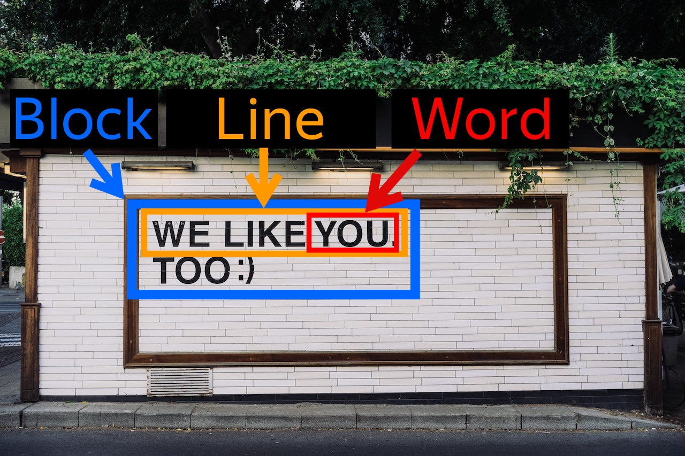

# About {{ vision-full-name }}

OCR stands for optical character recognition. {{ vision-full-name }} is a computer vision service that enables image text and PDF recognition.

{{ vision-name }} provides its features through API. You can integrate {{ vision-name }} features into your app written in any language or send requests using [cURL](https://curl.haxx.se) or similar utilities. {{ vision-name }} provides API in REST and gRPC notations. You can generate your own API for your programming language using [this API specification](https://github.com/yandex-cloud/cloudapi/tree/master/yandex/cloud/ai/ocr/v1).

## {{ vision-name }} operating modes {#modes}

{{ vision-name }} can process image recognition requests both synchronously and asynchronously.

* In synchronous mode, {{ vision-name }} will process your request once it gets it and will provide you with the result in the response. This mode is good for apps that need to communicate with the user. However, you cannot use {{ vision-name }} synchronous mode to process large pieces of information.
* In asynchronous mode, {{ vision-name}} will get your request and immediately return the operation ID you can use to get the recognition result. Recognizing text in asynchronous mode takes more time but allows processing large volumes of information in a single request. Use asynchronous mode if you do not need an urgent response.

## Recognition models {#models}

{{ vision-name }} provides various models to recognize different types of image and PDF text. In particular, there are models for normal text, multi-column text, tables, handwritten text, or [common documents](template-recognition.md), such as passport or license plate number. With a more suitable model, you get better recognition result. To specify the model you need, use the `model` field in your request.

See below for the list of available recognition models:
* `page` (default): Suitable for images with any number of text lines within a single column.
* `page-column-sort`: Use it to recognize multi-column text.
* `handwritten`: Use it to recognize a combination of typed and handwritten text in English or Russian.
* `table`: Use it to recognize tables in English or Russian.



### Language model detection {#detect-model}

For text recognition, {{ vision-name }} uses [language models](supported-languages.md) trained based on specific languages. {{ vision-name }} selects a suitable model automatically from the list you provide in your request.

Only a single model is used each time you recognize a text. For example, if an image contains text in Chinese and Japanese, only one language will be recognized. To recognize both, send another request specifying the other language.



If your text is in Russian and English, the [English-Russian model](supported-languages.md#engrus) works best. To use this model, specify one of these languages or both in `text_detection_config`, but do not specify any other languages.



### Image requirements {#image-requirements}

An image in a request must meet the following requirements:



## Response with recognition results {#response}

The service highlights the text characters found in the image and groups them by level: words are grouped into lines, lines into blocks, and blocks into pages.

As a result, {{ vision-full-name }} returns an object with the following properties:
* For `pages[]`: Page size.
* For `blocks[]`: Position of the text on the page.
* For `lines[]`: Position of lines.
* For `words[]`: Position of words, text, and language used for recognition.

To show the position of the text, {{ vision-full-name }} returns the coordinates of the rectangle that frames the text. Coordinates are the number of pixels from the top-left corner of the image.



Here is an example of a recognized image with coordinates:



### Response format {#response-format}

{{ vision-full-name }} provides recognition results in [JSON Lines](https://jsonlines.org) format, where each line of a JSON file corresponds to one recognized page or image.

### Errors in determining coordinates {#coordinate-definition-issue}

Coordinates returned by the service may in some cases mismatch the text displayed in the user's image processor. This is due to incorrect handling of `exif` metadata by the user's image processor.

During recognition, {{ vision-full-name }} considers data about image rotation set by the `Orientation` attribute in the `exif` section. Some tools used for viewing images may ignore the rotation values set in `exif`. This causes a mismatch between the obtained results and the displayed image.

To fix this error, do one of the following:

* Change the image processor settings so that the rotation angle specified in the `exif` section is considered while viewing images.
* Remove the `Orientation` attribute from the image `exif` section or set it to `0` when providing the image to {{ vision-full-name }}.

#### What's next {#what-is-next}

* [See the list of supported languages](supported-languages.md)
* [Learn about known issues in the current version](known-issues.md)
* [Try recognizing text in an image](../../operations/ocr/text-detection-image.md)