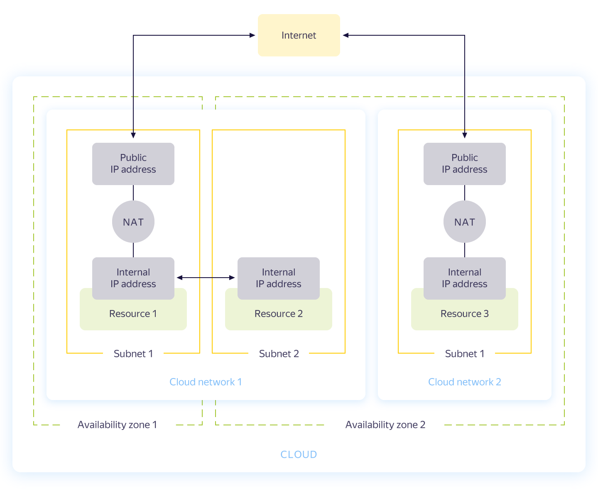

# {{ vpc-short-name }} concepts

{{ vpc-full-name }} ({{ vpc-short-name }}) is a service for creating cloud networks that are used for transmitting information within your cloud and connecting cloud resources to the internet.

Use {{ vpc-short-name }} to:

- Create subnets and connect cloud resources to them.
- Enable the transfer of information between the cloud resources.
- Connect the cloud resources to the internet.
- Create static routes and manage traffic using security groups.
- Route traffic to the internet via a NAT gateway.

For more information about cloud networks, see:
- [Cloud networks and subnets](network.md)
- [Cloud resource addresses](address.md)
- [Static routing](static-routes.md)
- [Security groups](security-groups.md)
