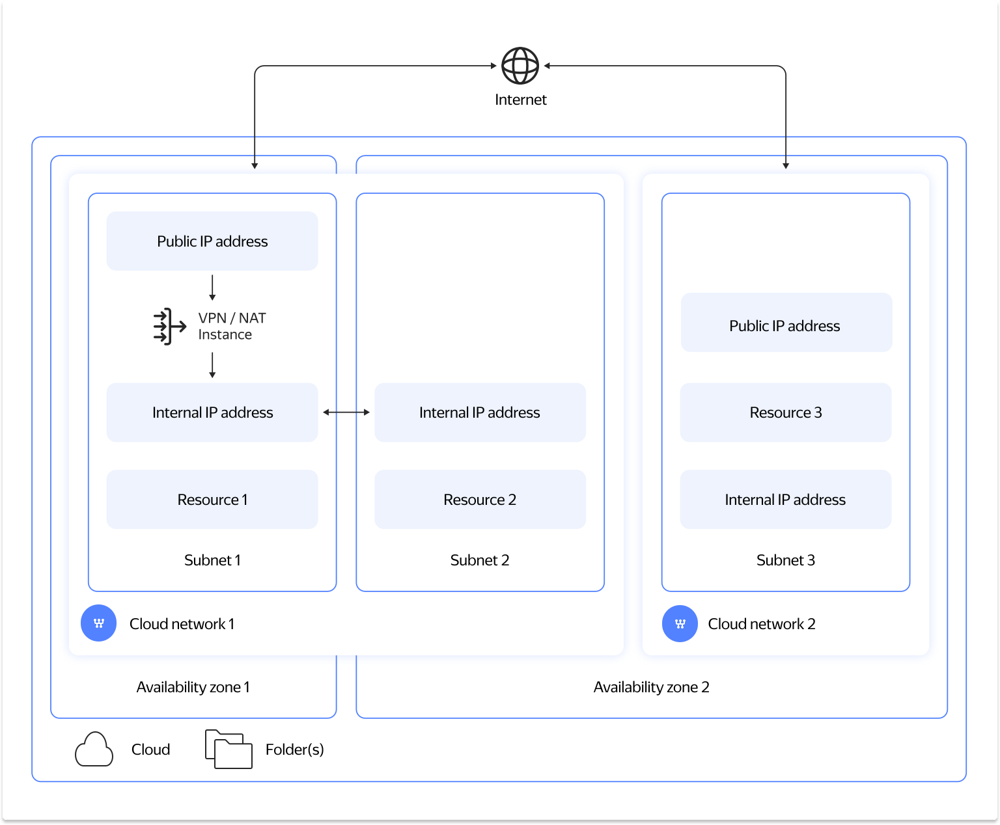

# {{ vpc-short-name }} concepts

{{ vpc-full-name }} ({{ vpc-short-name }}) is a service for creating cloud networks that are used for transmitting information within your cloud and connecting cloud resources to the internet.

With {{ vpc-short-name }}, you can:

- Create subnets and connect cloud resources to them.
- Enable information transfer between the cloud resources.
- Connect the cloud resources to the internet.
- Create static routes and manage traffic using security groups.
- Route traffic to the internet via a NAT gateway.

The diagram above provides a general overview of how {{ yandex-cloud }} networks, subnets, and resources are related. In the management console, you can open the [infrastructure map](../../console/concepts/infrastructure-map.md), which, similarly to the diagram above, shows the relationships between your resources in the selected folder.

For more information about cloud networks, see:
- [Cloud networks and subnets](network.md)
- [Cloud resource addresses](address.md)
- [Static routing](routing.md)
- [Security groups](security-groups.md)
