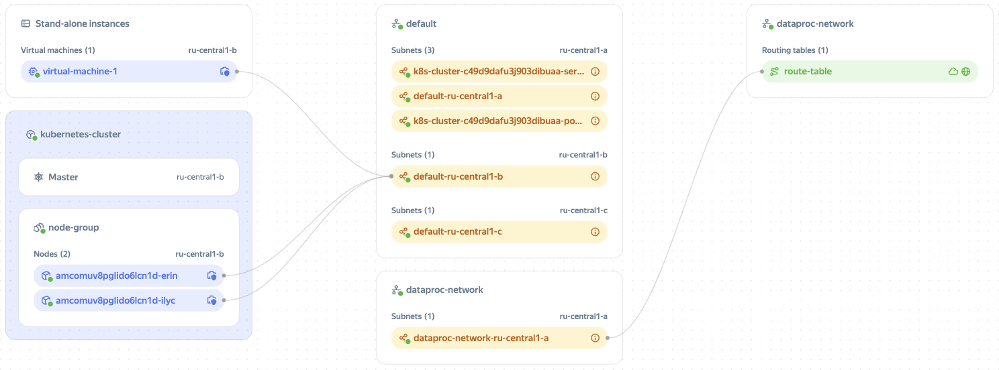

# Cloud networks and subnets

## Cloud networks {#network}

_A cloud network_ is similar to a traditional LAN in a data center. Cloud networks are [created](../operations/network-create.md) in folders and used for transmitting information between cloud resources and connecting resources to the internet.

Internet access to and from {{ compute-full-name }} VMs and database hosts is provided through [public IP addresses](address.md#public-addresses).

You can manage cloud network and subnet traffic using [security groups](security-groups.md). They contain rules that define the protocols and IP addresses for receiving and sending traffic.

## Subnets {#subnet}

A _subnet_ is a range of IP addresses in a cloud network. Addresses from this range can be assigned to cloud resources, such as VMs and DB clusters. You can only [create subnets](../operations/subnet-create.md) in the folder the cloud network belongs to.

The size of a subnet is set using the Classless Inter-Domain Routing (CIDR) method. Subnets can only use private IPv4 addresses from the ranges defined by [RFC 1918](https://tools.ietf.org/html/rfc1918):
* `10.0.0.0/8`
* `172.16.0.0/12`
* `192.168.0.0/16`

The maximum CIDR size in these ranges is `/16`, while the minimum is `/28`.

Subnet IP address ranges cannot overlap within the same cloud network. The first two addresses from any range are allocated to the gateway (x.x.x.1) and DNS server (x.x.x.2).

Traffic can be transmitted between subnets of the same network, but not subnets of different networks. To transfer traffic between subnets of different networks, use public IP addresses.

To have a resource connected to a subnet, make sure it resides in the same availability zone as the subnet.

You can [move](../operations/network-move.md) a network and subnet between folders within a single [cloud](../../resource-manager/concepts/resources-hierarchy.md). You cannot move subnets between networks and availability zones.

## Cloud network map {#map}

A cloud network map shows the connections between resources in a folder, as well as the networks and subnets that include these resources. Here is an example of such a map:

You can use the map to visualize networks. For example, with the map, you can identify the subnets with the highest loads or with configured route tables. The map shows the following resources:

* [Instance groups](../../compute/concepts/instance-groups/index.md).
* [Virtual machines](../../compute/concepts/vm.md).
* [{{ managed-k8s-full-name }}](../../managed-kubernetes/concepts/index.md#kubernetes-cluster) clusters.
* [{{ managed-k8s-name }} node groups](../../managed-kubernetes/concepts/index.md#node-group).
* {{ managed-k8s-name }} nodes.
* [Cloud networks](#network).
* [Subnets](#subnet).
* [Route tables](routing.md).

You have the option to only map network connections for specific resources. This can be useful if you have a large network with a vast number of resources. In addition, you can use the map to navigate to resource pages with just one click. To learn more about using the map, see [this guide](../operations/network-map.md).

#### See also {#see-also}

* [{#T}](software-accelerated-network.md)