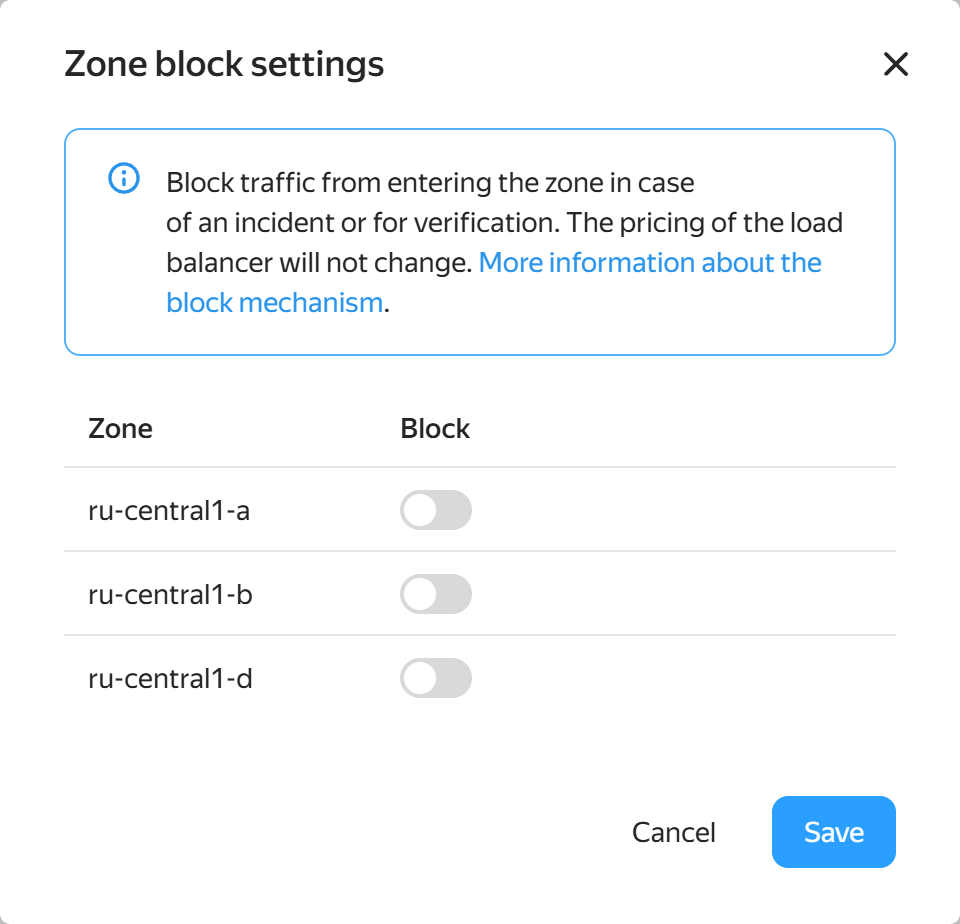

# {{ vpc-full-name }} release notes

<!-- Changelog begin -->


```
date: 2025-03
index: 1
```

### Precise availability zone control



Reduce the load on an availability zone during local incidents and test load balancer fault tolerance by disabling zones, either one at a time or multiple zones at once.

### Protection against VM creation without a network

Ensure the reliability of your resources: VMs are now created only when a functional network is guaranteed.

### {{ interconnect-name }} for {{ vpc-name }} and {{ baremetal-name }}


Connect your cloud and dedicated infrastructure into a single private network using {{ interconnect-name }}.



<!-- Changelog end -->

## Q1 2025 {#q1-2025}

* Data plane in a virtual network now deploys faster. The network unavailability time for data plane updates was reduced from 60 seconds to 1 second or less.
* Implemented the option to disconnect an availability zone from network load balancers.
* Virtual machines are no longer created if guaranteed not to be networked when they start.
* Implemented connectivity between {{ vpc-name }} and {{ baremetal-name }} via {{ interconnect-name }}.
* Optimized the gRPC API and accessing the control plane database of network load balancers: increased the speed of load balancer status updates and instance group response to problems. Enabled faster balancing rule updates, e.g., in case of network problems or when modifying target groups.

## Q3 2024 {#q3-2024}

* You can now create [service connections](./concepts/private-endpoint.md). The feature is at the Preview stage; [contact support](../support/overview.md) for access. 
* Implemented integration with {{ dns-name }} to state DNS records in public IP address specifications.

## Q2 2024 {#q2-2024}

* Increased network connection [limits](../compute/concepts/limits.md).
* Added validation of resource names and labels.

## Q1 2024 {#q1-2024}

* Added network connection metrics.
* Added the `vpc.publicUser` role.
