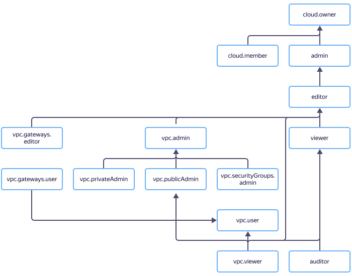

# Access management in {{ vpc-name }}

{{ vpc-name }} uses [roles](../../iam/concepts/access-control/roles.md) to manage access rights.

In this section, you will learn:
* [Which resources you can assign a role for](#resources).
* [Which roles exist in the service](#roles-list).
* [Which roles are required](#choosing-roles) for particular actions.





## Which resources you can assign a role for {#resources}



## Which roles exist in the service {#roles-list}



### Service roles {#service-roles}

#### vpc.auditor {#vpc-auditor}



#### vpc.viewer {#vpc-viewer}



#### vpc.user {#vpc-user}



#### vpc.externalAddresses.user {#vpc-externalAddresses-user}



#### vpc.admin {#vpc-admin}



#### vpc.bridgeAdmin {#vpc-bridge-admin}



#### vpc.privateAdmin {#vpc-private-admin}



#### vpc.publicAdmin {#vpc-public-admin}



#### vpc.gateways.viewer {#vpc-gw-viewer}



#### vpc.gateways.user {#vpc-gw-user}



#### vpc.gateways.editor {#vpc-gw-editor}



#### vpc.securityGroups.user {#vpc-sg-user}



#### vpc.securityGroups.admin {#vpc-sg-admin}



#### vpc.privateEndpoints.viewer {#vpc-privateEndpoints-viewer}



#### vpc.privateEndpoints.editor {#vpc-privateEndpoints-editor}



#### vpc.privateEndpoints.admin {#vpc-privateEndpoints-admin}



### Primitive roles {#primitive-roles}





## What roles do I need {#choosing-roles}

The table below lists the roles required to perform a particular action. You can always assign a role offering more permissions than the one specified. For example, you can assign the `editor` role instead of `viewer`, or `vpc.admin` instead of `vpc.publicAdmin`.

Action | Methods | Required roles
----- | ----- | -----
**Viewing data** | |
Viewing information about any resource | `get`, `list`, `listOperations` | `vpc.viewer` or `viewer` for the resource
List subnets in the network | `listSubnets` | `vpc.viewer` or `viewer` for the network
**Use of resources** | |
Assign {{ vpc-short-name }} resources to other {{ yandex-cloud }} resources (for example, assigning an address to an interface or connecting a network interface to a subnet) | Various | `vpc.user` for the resource, and the permission to change the receiving object if the resource assignment operation is mutating
Assign or delete the public address of an interface | various | `vpc.publicAdmin` for the network
Creating a VM connected to multiple networks | `create` | `vpc.publicAdmin` for each network the VM connects to
**Managing resources** | |
[Create networks in a folder](../operations/network-create.md) | `create` | `vpc.privateAdmin` or `editor` for the folder
[Update](../operations/network-update.md), and [delete networks](../operations/network-delete.md) | `update`, `delete` | `vpc.privateAdmin` or `editor` for the network
[Create subnets in a folder](../operations/subnet-create.md) | `create` | `vpc.privateAdmin` or `editor` for the folder and network
[Update](../operations/subnet-update.md) and [delete subnets](../operations/subnet-delete.md) | `update`, `delete` | `vpc.privateAdmin` or `editor` for the folder
[Creating a route table](../operations/static-route-create.md) | `create` | `vpc.privateAdmin` or `editor` for the folder
Update or delete a route table | `update`, `delete` | `vpc.privateAdmin` or `editor` for the route table
[Create public addresses](../operations/get-static-ip.md) | `create` | `vpc.publicAdmin` or `editor` for the folder
[Delete public addresses](../operations/address-delete.md) | `delete` | `vpc.publicAdmin` or `editor` for the address
[Create a gateway](../operations/create-nat-gateway.md) | `create` | `vpc.gateways.editor`
Enable the gateway in a route table | `create`, `update` |  `vpc.gateways.user`
Create security groups | `create` | `vpc.securityGroups.admin` or `editor` for the folder and network
Update and delete security groups | `update`, `delete` | `vpc.securityGroups.admin` or `editor` for the network and security group
**Resource access management** | |
[Granting a role](../../iam/operations/roles/grant.md), [revoking a role](../../iam/operations/roles/revoke.md), and viewing roles granted for the resource | `setAccessBindings`, `updateAccessBindings`, `listAccessBindings` | `admin` for the resource

To create a [NAT gateway](../concepts/gateways.md) and connect it to a route table, the `vpc.gateways.editor` and `vpc.gateways.user` roles are required. Currently, you cannot use reserved public IP addresses for gateways, so the `vpc.admin` role will not be enough.

#### What's next {#what-is-next}

* [How to assign a role](../../iam/operations/roles/grant.md).
* [How to revoke a role](../../iam/operations/roles/revoke.md).
* [Learn more about access management in {{ yandex-cloud }}](../../iam/concepts/access-control/index.md).
* [Learn more about inheriting roles](../../resource-manager/concepts/resources-hierarchy.md#access-rights-inheritance).
