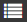

# Table of contents

[{{ wiki-name }} pages](../pages-types.md#page) created in the old editor may automatically generate a table of contents based on headings. This is done using a dynamic block named `toc`.

To add an automatically compiled table of contents to a page:

1. Make sure your page is created in the [old editor](../create-page.md).
1. Make sure the page headings are [marked up properly](../basic-markup.md#markup). To quickly view the table of contents for a page, click  in the right-hand panel.
   If there are matching headers on the page, the links in the table of contents may not work correctly.

1. Create a table of contents using a dynamic block:

   ```
   not_var{{toc}}
   ```

By default, all headings of the current {{ wiki-name }} page are added to the table of contents. You can configure the additional TOC settings using the [advanced parameters](#toc-params).

> Here is an example of a table of contents that includes first (`h1`) to third (`h3`) level headings:
>
> ```
> {{toc from="h1" to="h3"}}
> ```

## Block parameters (optional) {#toc-params}

| Parameter | Description |
--- | ---
| `from` | The highest level of headings, which are the first to be included in the table of contents. |
| `to` | The lowest level of headings, which are the last to be included in the table of contents. |
| `page` | Relative address of the table of contents source page, e.g., `userName/pageName/`. By default, this is the address of the page where the `toc` block is added. |