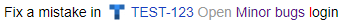

# Issues from {{ tracker-full-name }}



[{{ tracker-full-name }}]({{ link-tracker }}) is a service for managing your projects and activities. You can read more about the service features in the [{{ tracker-full-name }} documentation](../../tracker/).

{{ tracker-full-name }} users can place a link to an issue or a list of issues on {{ wiki-name }} pages.


## Issue link {#ticket}

You can place _magic links_ to specific issues on the [pages created in the new or old editor](../pages-types.md). These links always include the key, name, status of the issue, and the assignee's username. To insert a link to an issue, copy its key and paste it in the text of the page.

For example:

| Markup | Result |
----- | -----
| ``` Fix a mistake in TEST-123 ``` |  |

## List of issues {#ticket-list}

Using the `not_var{{tasks}}` block, you can add an automatically generated list of issues to a page created in the old editor. For example:

```
{{tasks url="URL of the filter or the queue"}}
```

* To display all the issues in the queue, in the `url` parameter, specify its [key](../../tracker/manager/create-queue.md#key) or a link copied from the browser's address bar.

* To display [filtered](../../tracker/user/create-filter.md) issues, in the `url` parameter, specify a link to the filter copied from the browser's address bar.

   

   The `url` parameter of the `tasks` block does not support the `"` character. If this character is present in the filter's URL copied from the address bar, replace it with `%22`.

   

### Issue lists with parameters {#tasks-vars}

Using dynamic tables, you can add a list of issues and their main parameters to your {{ wiki-name }} page:

1. [Create](../create-grid.md) a dynamic table.

1. Create a column with the  **{{ tracker-name }} issue** data type.

1. Add the required number of rows and list the issue keys in them.

1. Create additional columns. As the data type, select  **Issue parameters**, such as the issue's **{{ ui-key.beta-wiki.blocks_common_newgrid.blocks_b-grid-table-head.title }}**, **{{ ui-key.beta-wiki.blocks_common_newgrid.blocks_b-grid-table-head.author }}**, or **{{ ui-key.beta-wiki.blocks_common_newgrid.blocks_b-grid-table-head.type }}**.

1. Save the table.

As a result, the columns with the issue parameters are filled in automatically. The resulting table can be [embedded in a {{ wiki-name }} page](../add-grid.md).

For example:


